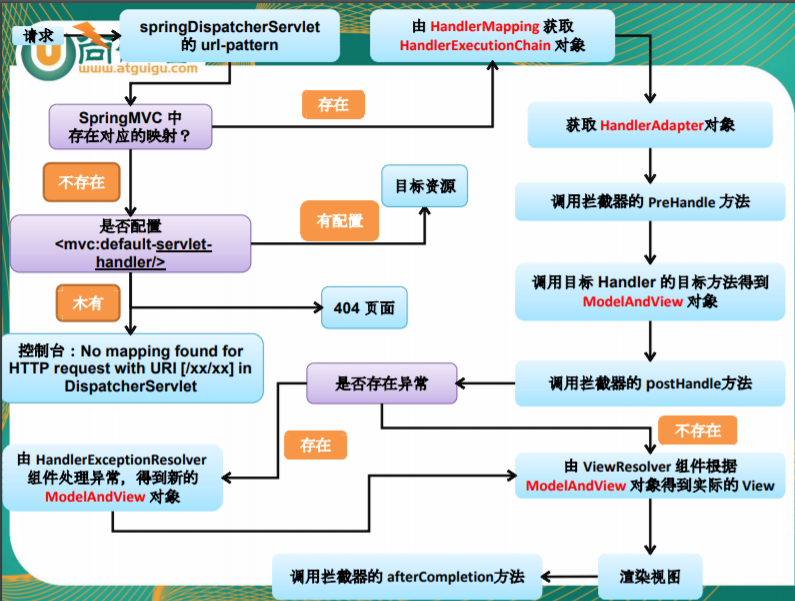

# java基本面试题

## 自增运算

```java
package basic;

public class increment {
    /***
     * 总结， 1. 赋值=，最后计算
     *       2. =右边的从左到右加载值依次压入操作数栈
     *       3. 实际先算哪个看运算符优先级
     *       4. 自增自减操作都是直接修改变量的值，不经过操作数栈
     *       5. 最后赋值之前，临时结果也是存储再操作数栈中
     * @param args
     */
    public static void main(String[] args) {
        int i = 1;
        i = i++; // 先压栈 再++， 第一步先把i的值压入操作数栈，第二部i变量自增1，第三步把操作数栈中(栈中的值此时是1)的值赋值给i 最终i=1
        int j = i++; // 过程同上但是i自增之后赋值给了j 最终结果j=1 i=2(因为i自增了并且没有赋值所以是2)
        // 1. 先把i的值压入操作数栈(数栈i=2),
        // 2. i变量自增1，
        // 3. ++i把i的值压入操作数栈(数栈i=3),
        // 4.i++把i的值压入操作数栈(数栈i=3)
        // 5.i自增1
        // 6.把操作数栈中前两个弹出求乘积结果再压入栈
        // 7.把操作数栈中的值弹出求和再赋值给k
        int k = i + ++i * i++;
        System.out.println("i=" + i);
        System.out.println("j=" + j);
        System.out.println("k=" + k);
    }
}
```

## 单例模式

### 饿汉式

直接创建对象，不存在线程安全问题

​	直接实例化饿汉式（简洁直观）

​	枚举式(最简洁)

 	静态代码块饿汉式(适合复杂实例化)

```java
package basic;

/***
 * 饿汉式：直接创建实例对象，不管你是否需要这个对象
 *    (1) 构造器私有化
 *    (2) 自行创建，并且静态变量保存
 *    (3) 向外提供这个实例
 *    (4) 强调这是一个单例，我们可以用final修饰
 */
public class Singleton1 {
    public static final Singleton1 INSTANCE = new Singleton1();
    private Singleton1(){}

   privie static void main(String[] args) {
        System.out.println(INSTANCE);
    }
}

```

```JAVA

/***
 * 枚举类型，表示该类型的对象是有限的几个
 * 我们可以限定为一个，就成了单例
 */
public enum  Singleton2 {
    INSTANCE
}

```


```java

public class Singleton3 {
    public static Singleton3 instance;
    static {
        instance = new Singleton3();
    }
    private Singleton3(){}
}

```

### 懒汉式

延迟创建对象

​	线程不安全（适用于但线程）

​	线程安全(适用于多线程)

​	静态内部类形式(适用于多线程)

```java
/***
 * 懒汉式：
 *   延迟创建这个实例对象
 *      (1) 构造器私有化
 *      (2) 同一个静态变量保存这个唯一的实例
 *      (3) 提供一个静态方法获取这个实例对象
 */
public class Singleton4{
    private static Singleton4 instance;
    private Singleton4(){}
    public static Singleton4 getInstance(){
        if (instance == null){
            instance = new Singleton4();
        }
        return instance;
    }
}

```

```java
// double-check
public class Singleton5 {
    private static volatile Singleton5 instance;
    private Singleton5(){}
    public static Singleton5 getInstance(){
        if (instance == null){
            synchronized (Singleton5.class){
                if (instance == null){
                    instance = new Singleton5();
                }
            }
        }
        return instance;
    }
    
}

```

```java
/***
 * 在内部类被加载和初始化时才创建INSTANCE实例对象
 * 静态内部类不会自动随外部类的加载和初始化而初始化，它是要单独去加载和初始化的
 * 因为是在内部类加载和初始化创建的，因此线程是安全的
 */
public class Singleton6 {
    private Singleton6(){};
    private static class Inner{
        private static Singleton6 instance = new Singleton6();
    }
    public static Singleton6 getInstance(){
        return Inner.instance;
    }
}

```

## 类初始化过程

1 一个类要创建实例需要先加载并初始化该类

​	main方法所在的类需要先加载和初始化

2 一个子类要初始化需要先初始化父类

3 一个类初始化就是执行\<clinit>()方法

​	\<clinit>()方法由静态类变量显示赋值代码和静态代码块组成

实例初始化

 1. 实例初始化就是执行\<init>()方法

    \<init>()方法可能重载有多个，有几个构造器就有几个\<init>方法

```java
package basic;

public class Father {
    private int i = test();
    private static int j = method();
    static {
        System.out.println("(1)");
    }
    Father(){
        System.out.println("(2)");
    }
    {
        System.out.println("(3)");
    }
    public int test(){
        System.out.println("(4)");
        return 1;
    }
    public static int method(){
        System.out.println("(5)");
        return 1;
    }
}

class Son extends Father{
    private int i = test();
    private static int j = method();
    static {
        System.out.println("(6)");
    }
    Son(){
        System.out.println("(7)");
    }
    {
        System.out.println("(8)");
    }
    public int test(){
        System.out.println("(9)");
        return 1;
    }
    public static int method(){
        System.out.println("(10)");
        return 1;
    }
    public static void main(String[] args){
        Son s1 = new Son();
        System.out.println();
        Son s2 = new Son();
    }
}
```


## 方法的参数传递机制

形参是基本数据类型：传递数据值

引用数据类型：地址值

特殊类型：String 包装类等对象不可变性


```java
package basic;

import java.util.Arrays;

public class Exam4 {
    public static void main(String[] args) {
        int i = 1;
        String str = "hello";
        Integer num = 200;
        int[] arr = {1,2,3,4,5};
        MyDate my = new MyDate();
        change(i,str,num,arr,my);
        System.out.println("i="  + i);
        System.out.println("str=" + str);
        System.out.println("num=" + num);
        System.out.println("arr=" + Arrays.toString(arr));
        System.out.println("my.a="+ my.a);
    }
    public static void change(int j, String s, Integer n, int[] a, MyDate m){
        j += 1;
        s += "world";
        n += 1;
        a[0] += 1;
        m.a += 1;
    }
}
class MyDate{
    int a = 10;
}

```


## 递归与迭代

```java
public class TestStep {
    public static void main(String[] args) {
        System.out.println(recursion(5));
        System.out.println(loop(40));
    }
    public static int recursion(int n){
        if (n <1){
            return -1;
        }
        if (n == 1 || n == 2){
            return n;
        }
        return recursion(n-2) + (n -1);
    }

    public static int loop(int n){
        if (n <1){
            return -1;
        }
        if (n == 1 || n == 2){
            return n;
        }
        int one = 2; // 初始化走到第二级台阶的走法
        int two = 1; // 初始化走到第一级台阶的走法
        int sum = 0;
        for (int i = 3; i <=n ; i++) {
            sum = one + two;
            two = one;
            one = sum;
        }
        return sum;
    }
}

```

## 成员变量与局部变量

区别：

​	1 声明的位置

​		局部变量：方法体{}中， 形参， 代码块{}中

​        成员变量：类中方法外

​				类变量：有static修饰

​				实例变量：没有static修饰

​	2 修饰符

​		局部变量： final

​		成员变量： public/protected/private/final/static/volatile/transien

​	3 值存储的位置

​		局部变量：栈

​		实例变量：堆

​		类变量： 方法区


​	4 作用域

​		局部变量：从声明处开始，到所属的}结束

​		实例变量：在当前类中"this"(有时this可以缺省)，在其他类中"对象名."访问

​		类变量：在当前类中"类名."（有时类名可以省略），在其他类中"类名."或"对象名."访问

​	5 生命周期 

​		局部变量：每一个线程，每一次调用执行都是新的生命周期

​		实例变量：随着对象的创建而初始化，随着对象的被回收而消亡，每一个对象的实例变量是独立的

​	    类变量：随着类的初始化而初始化，随着类的卸载而消亡，该类的所有对象的类变量是共享的

```java
package basic;

public class Exam5 {
    static int s;
    int i;
    int j;
    {
        int i = 1;
        i++;
        j++;
        s++;
    }
    public void test(int j){
        j++;
        i++;
        s++;
    }
    public static void main(String[] args){
        Exam5 obj1 = new Exam5();
        Exam5 obj2 = new Exam5();
        obj1.test(10);
        obj1.test(20);
        obj2.test(30);
        System.out.println(obj1.i + "," + obj1.j + "," + obj1.s);
        System.out.println(obj2.i + "," + obj2.j + "," + obj2.s);
    }
}

```

## JVM垃圾回收机制


GC是什么(分代收集算法)

​	次数上频繁收集Young区 Minor GC

​	次数上较少收集Old区 Full GC

​	基本不同Perm区

GC四大算法
	1. 引用计数法
		一个对象，每有一个应用时计数就会+1，如果引用为0时就会被回收
		缺点：每次对对象赋值时均要维护引用计数器，且计数器本身也有一定的消耗
			  较难处理循环引用

2. 复制算法
	年轻代中使用的是Minor GC， 这种GC算法采用的是复制算法
	Minor GC 会把Eden中的所有活的对象都移动到Survivor区域中， 如果Survivror区中放不下，那么剩下的活的对象就被移动到Old generation中，也即一旦收集后，Eden是就变成空的了。
	当对象在Eden(包括一个Survivor区域，这里假设是from区域)出生后，在经过一次Minor GC后，如果对象还存活，并且能够被另外一块Survivor区域所容纳(上面已经假设为from区域，这里应为to区域，即to区域有足够的内存空间来存储Eden和grom区域存活的对象)，
	则使用复制算法将这些仍然还存活的对象复制到另外一块Survivor区域(即to区域)中，然后清理所使用过的Eden以及Survivor区域(即from区域), 并且将这些对象年龄设置为1，以后对象在Survivor区每熬过一次Minor GC，就将对象的年龄+1，当对象的年龄达到某个值时(默认15)这些对象就会成为老年代

	-XX:MaxTenuringThreshold -- 设置对象在新生代中存活的次数
	
	复制算法流程：
		HotSpot JVM把年轻代分为了三部分：1个Eden区和2个Survivor区(分别叫from和to)。默认比例为8:1:1,一般情况下，新创建的对象都会被分配到Eden区(一些大对象特殊处理)，这些对象经过第一次Minor GC后，如果仍然存活，将会移动到Survivor区。
		对象在Survivor区中每熬过一次MinorGC， 年龄就会增加1岁，当它的年龄增加到一定程度时，就会被移动到老年代中。
		因为年轻代中的对象基本都是朝生夕死的(90%以上)，所以年轻代的垃圾回收算法使用的是复制算法，复制算法的基本思想就是将内存分为两块，每次只用其中一块，当一块内存用完，就将还活着的对象复制到另外一块上面。 复制算法不会产生内存碎片。
	
	复制算法它的缺点也是相当明显的
		1 它浪费了一半的内存空间
		2 如果对象的存活率很高，我们可以极端一点，假设是100%存活，那么我们需要将所有对象都复制一遍，并将所有引用地址重置一遍。 复制这一工作所花费的时间，在对象存活率达到一定程度时，将会变的不可忽视
		
	
		所有从以上描述可以看出，复制算法要想使用，最起码对象的存活率要非常低才行，而且最重要的是，我们必须要克服50%内存浪费
	
	
	
3. 标记清除法
	
	老年代一般是由标记清除或者标记清除与标记整理的混合
	用通俗的话解释一下标记清除算法，就是当程序运行期间，若可以使用的内存被耗尽的时候，GC线程就会被触发并将程序暂停，随后将要回收的对象标记一遍，最终统一回收这些对象，完成标记清理工作接下来便让应用程序恢复运行。
	优点：节约内存空间
	缺点：两次扫描耗时严重， 会产生内存碎片

	
	
4. 标记压缩法
	与标记-清除一样，多了一个压缩的步骤，会再次扫描并向一端滑动存活对象
	优点：没有内存碎片，可以利用bump
	缺点: 需要移动对象的成本 耗时长


## 58同城的java字符串常量池

面试题Code

```java
package com.hhf.study.javase;

public class StringPool58Demo {
    public static void main(String[] args) {

        String str1 = new StringBuilder("58").append("tongcheng").toString();
        System.out.println(str1);
        System.out.println(str1.intern());
        System.out.println(str1 == str1.intern());

        System.out.println("------------");

        String str2 = new StringBuilder("ja").append("va").toString();
        System.out.println(str2);
        System.out.println(str2.intern());
        System.out.println(str2 == str2.intern());


    }
}
```

### intern()方法


**调用intern方法时，如果该字符串已经存在于常量池中，则将常量池中的引用直接返回；如果不存在，则在常量池中生成一个对原字符串的引用**

按照代码结果，java字符串答案为false 必然是两个不同的java，那另外一个java字符串如何加载进来的? 

因为：有一个初始化的java字符串(JDK出娘胎自带的)， 在加载sun.misc.Version这个类的时候进入常量池

### OpenJDK8底层源码说明

#### System代码解析


#### 类加载器和rt.jar

根加载器提前部署加载rt.jar


#### OpenJDK8源码

http://openjdk.java.net/

openjdk8\jdk\srclshare\classes\sun\misc

#### 总结


## == 与 equals(重要)

== : 它的作用是判断两个对象的地址是不是相等。即，判断两个对象是不是同一个对象。(基本数据类型==比较的是值，引用数据类型==比较的是内存地址)
	equals() : 它的作用也是判断两个对象是否相等。但它一般有两种使用情况：
		情况 1：类没有覆盖 equals() 方法。则通过 equals() 比较该类的两个对象时，等价于通过“==”比较这两个对象。
		情况 2：类覆盖了 equals() 方法。一般，我们都覆盖 equals() 方法来两个对象的内容相等；若它们的内容相等，则返回 true (即，认为这两个对象相等)。
		String 中的 equals 方法是被重写过的，因为 object 的 equals 方法是比较的对象的内存地址，而 String 的 equals 方法比较的是对象的值。
		当创建 String 类型的对象时，虚拟机会在常量池中查找有没有已经存在的值和要创建的值相同的对象，如果有就把它赋给当前引用。如果没有就在常量池中重新创建一个 String 对象。

## hashCode 与 equals（重要）

面试官可能会问你：“你重写过 hashcode 和 equals 么，为什么重写 equals时必须重写 hashCode 方法？”
	hashCode() 的作用是获取哈希码，也称为散列码；它实际上是返回一个 int 整数。这个哈希码的作用是确定该对象在哈希表中的索引位置。hashCode() 定义在 JDK 的 Object.java 中，这就意味着 Java 中的任何类都包含有 hashCode() 函数。
		散列表存储的是键值对(key-value)，它的特点是：能根据“键”快速的检索出对应的“值”。这其中就利用到了散列码！（可以快速找到所需要的对象）

为什么要有 hashCode
		我们以“HashSet 如何检查重复”为例子来说明为什么要有 hashCode：
			当你把对象加入 HashSet 时，HashSet 会先计算对象的 hashcode 值来判断对象加入的位置，同时也会与其他已经加入的对象的 hashcode 值作比较，
			如果没有相符的 hashcode，HashSet 会假设对象没有重复出现。但是如果发现有相同 hashcode 值的对象，这时会调用 equals（）方法来检查 hashcode 相等的对象是否真的相同。
			如果两者相同，HashSet 就不会让其加入操作成功。如果不同的话，就会重新散列到其他位置。（摘自我的 Java 启蒙书《Headfirst java》第二版）。这样我们就大大减少了 equals 

hashCode（）与 equals（）的相关规定
		如果两个对象相等，则 hashcode 一定也是相同的
		两个对象相等,对两个对象分别调用 equals 方法都返回 true
		两个对象有相同的 hashcode 值，它们也不一定是相等的
		因此，equals 方法被覆盖过，则 hashCode 方法也必须被覆盖
		hashCode() 的默认行为是对堆上的对象产生独特值。如果没有重写hashCode()，则该 class 的两个对象无论如何都不会相等（即使这两个对象指向相同的数据）


# Spring框架篇

## SpringBean的作用域

在 Spring 中, 可以在\<bean> 元素的 **scope** 属性里设置 Bean 的作用域.

**默认**情况下, Spring **只为每个在** **IOC** **容器里声明的** **Bean** **创建唯一一个实例,** **整个** **IOC** **容器范围内都能共享该**实例**：所有后续的 getBean() 调用和 Bean 引用都将返回这个唯一的 Bean 实例.该作用域被称为 **singleton, 它是所有 Bean 的默认作用域.


## Spring事务的传播属性和隔离级别

当事务方法被另一个事务方法调用时, 必须指定事务应该如何传播. 例如: 方法可能继续在现有事务中运行, 也可能开启一个新事务, 并在自己的事务中运行.

事务的传播行为可以由传播属性指定. Spring 定义了 7  种类传播行为.


REQUIRED 传播行为

当 bookService 的 purchase() 方法被另一个事务方法 checkout() 调用时, 它默认会在现有的事务内运行. 这个默认的传播行为就是 REQUIRED. 因此在 checkout() 方法的开始和终止边界内只有一个事务. 这个事务只在 checkout() 方法结束的时候被提交, 结果用户一本书都买不了

事务传播属性可以在 @Transactional 注解的 propagation 属性中定义


REQUIRES_NEW 传播行为

另一种常见的传播行为是 REQUIRES_NEW. 它表示该方法必须启动一个新事务, 并在自己的事务内运行. 如果有事务在运行, 就应该先挂起它.


```java
@Service("bookShopService")
public class BookShopServiceImpl implements BookShopService {

   @Autowired
   private BookShopDao bookShopDao;

   //添加事务注解
   //1.使用 propagation 指定事务的传播行为, 即当前的事务方法被另外一个事务方法调用时如何使用事务, 默认取值为 REQUIRED, 即使用调用方法的事务
   //REQUIRES_NEW: 事务自己的事务, 调用的事务方法的事务被挂起. 
   //2.使用 isolation 指定事务的隔离级别, 最常用的取值为 READ_COMMITTED
   //3.默认情况下 Spring 的声明式事务对所有的运行时异常进行回滚. 也可以通过对应的属性进行设置. 通常情况下去默认值即可. 
   //4.使用 readOnly 指定事务是否为只读. 表示这个事务只读取数据但不更新数据, 这样可以帮助数据库引擎优化事务. 若真的事一个只读取数据库值的方法, 应设置 readOnly=true
   //5.使用 timeout 指定强制回滚之前事务可以占用的时间.  
// @Transactional(propagation=Propagation.REQUIRES_NEW,
//       isolation=Isolation.READ_COMMITTED,
//       noRollbackFor={UserAccountException.class})
   @Transactional(propagation= Propagation.REQUIRES_NEW,
         isolation= Isolation.READ_COMMITTED,
         readOnly=false,
         timeout=3)
   @Override
   public void purchase(String username, String isbn) {

      try {
         Thread.sleep(5000);
      } catch (InterruptedException e) {}

      //1. 获取书的单价
      int price = bookShopDao.findBookPriceByIsbn(isbn);

      //2. 更新数的库存
      bookShopDao.updateBookStock(isbn);

      //3. 更新用户余额
      bookShopDao.updateUserAccount(username, price);
   }

}
```

### 并发事务所导致的问题

当同一个应用程序或者不同应用程序中的多个事务在同一个数据集上并发执行时, 可能会出现许多意外的问题

并发事务所导致的问题可以分为下面三种类型:

​		–脏读: 对于两个事物 T1, T2, T1 读取了已经被 T2 更新但 还没有被提交的字段. 之后, 若 T2 回滚, T1读取的内容就是临时且无效的.

​		@Transaction01 将某条记录的AGE值从20修改为30

​		@Transaction02 读取了@Transaction01更新后的值30

​		@Transaction01回滚， AGE值恢复到了20

​		@Transaction02 读取到的30就是一个无效的值

​		–不可重复读:对于两个事物 T1, T2, T1 读取了一个字段, 然后 T2 更新了该字段. 之后, T1再次读取同一个字段, 值就不同了.

​	@Transaction01读取了AGE值为20

​	@Transaction02 将AGE值修改为30 （此时T2已经提交过了）

​	@Transaction01 再次读取AGE值为30，和第一次读取不一致

​		–幻读:对于两个事物 T1, T2, T1 从一个表中读取了一个字段, 然后 T2 在该表中插入了一些新的行. 之后, 如果 T1 再次读取同一个表, 就会多出几行.

​	@Transaction01读取了STUDENT表中的一部分数据

​	@Transaction02 向STUDENT表中插入了新的行

​	@Transaction01 读取STUDENT表时多了一些行


Mysql默认隔离级别可重复读

## Spring MVC 解决POST乱码

们可以使用spring MVC为开发者提供的CharacterEncodingFilter来解决乱码问题，这个其实就是一个过滤器。我们需要在web.xml文件中进行配置，最好将其设置在其他过滤器之前，因为过滤器是按照web.xml中的顺序执行的：

```xml
<!--字符编码过滤器-->
			<filter>
				<filter-name>characterEncodingFilter</filter-name>
				<filter-class>org.springframework.web.filter.CharacterEncodingFilter</filter-class>

				<!--指定字符编码-->
				<init-param>
					<param-name>encoding</param-name>
					<param-value>utf-8</param-value>
				</init-param>

				<!--强制指定字符编码，即如果在request中指定了字符编码，那么也会为其强制指定当前设置的字符编码-->
				<init-param>
					<param-name>forceEncoding</param-name>
					<param-value>true</param-value>
				</init-param>

			</filter>
			<filter-mapping>
				<filter-name>characterEncodingFilter</filter-name>
				<url-pattern>/*</url-pattern>
			</filter-mapping>
```

## SpingMVC的执行流程

>    1）用户发送请求至前端控制器 DispatcherServlet。 
> ​	2）DispatcherServlet 收到请求调用 HandlerMapping 处理器映射器。
> ​	3）处理器映射器找到具体的处理器(可以根据 xml 配置、注解进行查找)，生成处理器对象及处理器拦截器(如果有则生成)一并返回给 DispatcherServlet。
> ​	4）DispatcherServlet 调用 HandlerAdapter 处理器适配器。
> ​	5）HandlerAdapter 经过适配调用具体的处理器(Controller，也叫后端控制器)。
> ​	6）Controller 执行完成返回 ModelAndView。
> ​	7）HandlerAdapter 将 controller 执行结果 ModelAndView 返回给 DispatcherServlet。
> ​	8）DispatcherServlet 将 ModelAndView 传给 ViewReslover 视图解析器。
> ​	9）ViewReslover 解析后返回具体 View。
> ​	10）DispatcherServlet 根据 View 进行渲染视图（即将模型数据填充至视图中）。
> ​	11）DispatcherServlet 响应用户



## MyBatis中当实体类中的属性名和表中的字段名不一样该怎么办

解决方案：

​	1 在sql语句中启别名

```xml
<select id="getEmployeeById" resultMap="employeeMap">
    select id eid, last_name lastName, gender, email from tbl_employee where id=#{id}
</select>
```

​	2 开启驼峰命名规则，可以将数据库的下划线映射为驼峰命名

```xml
<settings>
	<setting name="mapUnderscoreToCamelCase" value="true"/>
</settings>
```

​	3 在Mapper映射文件中使用resultMap来自定义映射

```java
<resultMap id="employeeMap" type="com.harry.mybatis.Bean.Employee">
    <!--指定主键列的封装规则
     id定义主键会底层有优化；
     column：指定哪一列
     property：指定对应的javaBean属性
    -->
    <id column="eid" property="id"/>
    <!-- 定义普通列封装规则 -->
    <result column="lastName" property="lastName"/>
    <!-- 其他不指定的列会自动封装：我们只要写resultMap就把全部的映射规则都写上。 -->
    <result column="gender" property="gender"/>
    <result column="email" property="email"/>

</resultMap>
```

## spring的aop顺序

### Aop常用注解

@Before 前置通知：目标方法之前执行

@After 后置通知：目标方法之后执行（始终执行)

@AfterReturning 返回后通知：执行方法结束前执行(异常不执行)

@AfterThrowing 异常通知：出现异常时候执行

@Around 环绕通知：环绕目标方法执行

### spring4下的aop测试案例

pom 文件

```xml
<?xml version="1.0" encoding="UTF-8"?>
<project xmlns="http://maven.apache.org/POM/4.0.0" xmlns:xsi="http://www.w3.org/2001/XMLSchema-instance"
         xsi:schemaLocation="http://maven.apache.org/POM/4.0.0 https://maven.apache.org/xsd/maven-4.0.0.xsd">
    <modelVersion>4.0.0</modelVersion>

    <groupId>org.example</groupId>
    <artifactId>springTest</artifactId>
    <version>1.0-SNAPSHOT</version>
    <parent>
        <groupId>org.springframework.boot</groupId>
        <artifactId>spring-boot-starter-parent</artifactId>
        <version>1.5.22.RELEASE</version>
        <relativePath/> <!-- lookup parent from repository -->
    </parent>

    <properties>
        <project.build.sourceEncoding>UTF-8</project.build.sourceEncoding>
    </properties>

    <dependencies>
        <!-- <version>1.5.9.RELEASE</version〉 ch/qos/Logback/core/joran/spi/JoranException解决方案-->
        <dependency>
            <groupId>ch.qos.logback</groupId>
            <artifactId>logback-core</artifactId>
            <version>1.1.3</version>
        </dependency>

        <dependency>
            <groupId>ch.qos.logback</groupId>
            <artifactId>logback-access</artifactId>
            <version>1.1.3</version>
        </dependency>

        <dependency>
            <groupId>ch.qos.logback</groupId>
            <artifactId>logback-classic</artifactId>
            <version>1.1.3</version>
        </dependency>

        <!-- web+actuator -->
        <dependency>
            <groupId>org.springframework.boot</groupId>
            <artifactId>spring-boot-starter-web</artifactId>
        </dependency>

        <dependency>
            <groupId>org.springframework.boot</groupId>
            <artifactId>spring-boot-starter-actuator</artifactId>
        </dependency>

        <!-- SpringBoot与Redis整合依赖 -->
        <!--
        <dependency>
            <groupId>org.springframework.boot</groupId>
            <artifactId>spring-boot-starter-data-redis</artifactId>
        </dependency>
         -->

        <dependency>
            <groupId>org.apache.commons</groupId>
            <artifactId>commons-pool2</artifactId>
        </dependency>

        <!-- jedis -->
        <dependency>
            <groupId>redis.clients</groupId>
            <artifactId>jedis</artifactId>
            <version>3.1.0</version>
        </dependency>

        <!-- Spring Boot AOP技术-->
        <dependency>
            <groupId>org.springframework.boot</groupId>
            <artifactId>spring-boot-starter-aop</artifactId>
        </dependency>

        <!-- redisson -->
        <dependency>
            <groupId>org.redisson</groupId>
            <artifactId>redisson</artifactId>
            <version>3.13.4</version>
        </dependency>

        <!-- 一般通用基础配置 -->
        <dependency>
            <groupId>org.springframework.boot</groupId>
            <artifactId>spring-boot-devtools</artifactId>
            <scope>runtime</scope>
            <optional>true</optional>
        </dependency>

        <dependency>
            <groupId>org.projectlombok</groupId>
            <artifactId>lombok</artifactId>
            <optional>true</optional>
        </dependency>

        <dependency>
            <groupId>org.springframework.boot</groupId>
            <artifactId>spring-boot-starter-test</artifactId><scope>test</scope>
            <exclusions>
                <exclusion>
                    <groupId>org.junit.vintage</groupId>
                    <artifactId>junit-vintage-engine</artifactId>
                </exclusion>
            </exclusions>
        </dependency>

    </dependencies>

</project>
```

启动类

```java
@SpringBootApplication
public class MainApplication {
    public static void main(String[] args) {
        SpringApplication.run(MainApplication.class, args);
    }
}

```

接口CalcService

```java
public interface CalcService {
    public int div(int x, int y);
    
}

```

接口实现类CalcServiceImpl新加@Service

```java
package com.harry.spring.service;

import org.springframework.stereotype.Service;

@Service
public class CalcServiceImpl implements CalcService{
    @Override
    public int div(int x, int y) {
        int result = x / y;
        System.out.println("=== CalcServiceImpl被调用， 计算结果为：" + result);

        return result;
    }
}

```

新建一个切面类MyAspect并为切面类新增两个注解：

```java
package com.harry.spring.aspcet;

import org.aspectj.lang.ProceedingJoinPoint;
import org.aspectj.lang.annotation.*;
import org.springframework.stereotype.Component;

@Aspect
@Component
public class MyAspect {
    // 如果切入点表达式都一样的情况下，那么我们可以抽取出一个公共的切入点表达式

    @Pointcut("execution(public int com.harry.spring.service.CalcServiceImpl.*(..))")
    public void pointCut() {
    }

    @Before("pointCut()")
    public void  beforeNotify(){
        System.out.println("********@Before我是前置通知");
    }

    @After("pointCut()")
    public void afterNotify() {
        System.out.println("********@After我是后置通知");
    }

    @AfterReturning(value="pointCut()")
    public void  afterReturning(){
        System.out.println("********@AfterReturning我是返回后通知");
    }
    @AfterThrowing(value="pointCut()")
    public void afterThrowingNotify() {
        System.out.println("********@AfterThrowing我是异常通知");
    }

    @Around(value="pointCut()")
    public Object around(ProceedingJoinPoint proceedingJoinPoint) throws Throwable {
        Object retvalue = null;
        System.out.println("我是环绕通知之前AAA");
        retvalue = proceedingJoinPoint.proceed();
        System.out.println("我是环绕通知之后BBB");
        return retvalue ;
    }

}
```

测试类

```java
package com.harry.spring;

import com.harry.spring.service.CalcService;
import org.junit.Test;
import org.junit.runner.RunWith;
import org.springframework.beans.factory.annotation.Autowired;
import org.springframework.boot.SpringBootVersion;
import org.springframework.boot.test.context.SpringBootTest;
import org.springframework.core.SpringVersion;
import org.springframework.test.context.junit4.SpringRunner;

@SpringBootTest
@RunWith(SpringRunner.class)
public class SpringAopTest {

    @Autowired
    CalcService calcService;

    @Test
    public void test01(){
        System.out.println(String.format("Spring Verision : %s, Sring Boot Version : %s.", //
                SpringVersion.getVersion(), SpringBootVersion.getVersion()));

        calcService.div(10, 2);

    }
}

```

### spring4下的aop测试结果


修改测试类，让其抛出算术异常类：

```java
    @Test
    public void test01(){
        System.out.println(String.format("Spring Verision : %s, Sring Boot Version : %s.", //
                SpringVersion.getVersion(), SpringBootVersion.getVersion()));

//        calcService.div(10, 2);
        calcService.div(10, 0);//将会抛异常
    }
```

输出结果：


**小结**

AOP执行顺序：

- 正常情况下：@Before前置通知----->@After后置通知----->@AfterRunning正常返回
- 异常情况下：@Before前置通知----->@After后置通知----->@AfterThrowing方法异常

### spring5下的aop测试

修改POM

```xml
    <parent>
        <groupId>org.springframework.boot</groupId>
        <artifactId>spring-boot-starter-parent</artifactId>
<!--        <version>1.5.22.RELEASE</version>-->
        <version>2.3.3.RELEASE</version>
        <relativePath/> <!-- lookup parent from repository -->
    </parent>
```

修改测试类

```java
import com.harry.spring.service.CalcService;

import org.junit.jupiter.api.Test;
import org.springframework.beans.factory.annotation.Autowired;
import org.springframework.boot.SpringBootVersion;
import org.springframework.boot.test.context.SpringBootTest;
import org.springframework.core.SpringVersion;
import org.springframework.test.context.junit4.SpringRunner;

@SpringBootTest
public class SpringAopTest {

    @Autowired
    CalcService calcService;

    @Test
    public void test01(){
        System.out.println(String.format("Spring Verision : %s, Sring Boot Version : %s.", //
                SpringVersion.getVersion(), SpringBootVersion.getVersion()));

//        calcService.div(10, 2);
        calcService.div(10, 0);//将会抛异常
    }

    @Test
    public void testAopSpring5(){
        System.out.println(String.format("Spring Verision : %s, Sring Boot Version : %s.", //
                SpringVersion.getVersion(), SpringBootVersion.getVersion()));

        calcService.div(10, 2);
    }
}

```

输出结果


异常输出


# JUC高并发篇

##  Volatile的应用

volatile是java虚拟机提供的轻量级的同步机制， 保证可见性，不保证原子性，禁止指令重排序。

### JMM(java内存模型)

JMM是Java内存模型，也就是Java Memory Model，简称JMM，本身是一种抽象的概念，实际上并不存在，它描述的是一组规则或规范，通过这组规范定义了程序中各个变量（包括实例字段，静态字段和构成数组对象的元素）的访问方式

JMM关于同步的规定：

- 线程解锁前，必须把共享变量的值刷新回主内存
- 线程加锁前，必须读取主内存的最新值，到自己的工作内存
- 加锁和解锁是同一把锁

由于JVM运行程序的实体是线程，而每个线程创建时JVM都会为其创建一个工作内存（有些地方称为栈空间），工作内存是每个线程的私有数据区域，而Java内存模型中规定所有变量都存储在主内存，主内存是共享内存区域，所有线程都可以访问，`但线程对变量的操作（读取赋值等）必须在工作内存中进行，首先要将变量从主内存拷贝到自己的工作内存空间，然后对变量进行操作，操作完成后再将变量写会主内存`，不能直接操作主内存中的变量，各个线程中的工作内存中存储着主内存中的变量副本拷贝，因此不同的线程间无法访问对方的工作内存，线程间的通信（传值）必须通过主内存来完成，其简要访问过程：


```java
package juc;

import java.util.concurrent.TimeUnit;

// 验证volatile的可见性
// 1.1 假如int number = 0； number变量之前根本没有添加volatitle关键字修饰
public class VolatileDemo {
    public static void main(String[] args) {
        MyData myData = new MyData();
        new Thread(()->{
            System.out.println(Thread.currentThread().getName() + "\t come in");
            try {
                TimeUnit.SECONDS.sleep(3);
            } catch (InterruptedException e) {
                e.printStackTrace();
            }
            myData.addT060();
            System.out.println(Thread.currentThread().getName() + "\t update number value" + myData.number);
        },"AAA").start();

        // 第二个线程就是我们的main线程
        while (myData.number == 0){
            // main线程就一直再这里等待循环，直到number值不再等于0。
//            System.out.println("等于0");
        }
        System.out.println(Thread.currentThread().getName() + "\t mission is over");

    }
}

class MyData{
    volatile int number = 0;
    public void addT060(){
        this.number = 60;
    }
}
```

上面提到了两个概念：主内存 和 工作内存

- 主内存：就是计算机的内存，也就是经常提到的8G内存，16G内存
- 工作内存：但我们实例化 new student，那么 age = 25 也是存储在主内存中
  - 当同时有三个线程同时访问 student中的age变量时，那么每个线程都会拷贝一份，到各自的工作内存，从而实现了变量的拷贝


即：JMM内存模型的可见性，指的是当主内存区域中的值被某个线程写入更改后，其它线程会马上知晓更改后的值，并重新得到更改后的值。


### 缓存一致性

为什么这里主线程中某个值被更改后，其它线程能马上知晓呢？其实这里是用到了总线嗅探技术

在说嗅探技术之前，首先谈谈缓存一致性的问题，就是当多个处理器运算任务都涉及到同一块主内存区域的时候，将可能导致各自的缓存数据不一。

为了解决缓存一致性的问题，需要各个处理器访问缓存时都遵循一些协议，在读写时要根据协议进行操作，这类协议主要有MSI、MESI等等。

#### MESI

当CPU写数据时，如果发现操作的变量是共享变量，即在其它CPU中也存在该变量的副本，会发出信号通知其它CPU将该内存变量的缓存行设置为无效，因此当其它CPU读取这个变量的时，发现自己缓存该变量的缓存行是无效的，那么它就会从内存中重新读取。

#### 总线嗅探

那么是如何发现数据是否失效呢？

这里是用到了总线嗅探技术，就是每个处理器通过嗅探在总线上传播的数据来检查自己缓存值是否过期了，当处理器发现自己的缓存行对应的内存地址被修改，就会将当前处理器的缓存行设置为无效状态，当处理器对这个数据进行修改操作的时候，会重新从内存中把数据读取到处理器缓存中。

#### 总线风暴

总线嗅探技术有哪些缺点？

由于Volatile的MESI缓存一致性协议，需要不断的从主内存嗅探和CAS循环，无效的交互会导致总线带宽达到峰值。因此不要大量使用volatile关键字，至于什么时候使用volatile、什么时候用锁以及Syschonized都是需要根据实际场景的。

### 原子性实例

```java
/***
 * 1 验证volatile的可见性
 *  1.1 假如int number = 0； number变量之前根本没有添加volatitle关键字修饰
 *  1.2 添加了volatile，可以解决可见性问题
 * 2 验证volatile不保证原子性
 *  2.1 原子性的意思：不可分割，完整性，也即某个线程正在做某个具体业务时，中间不可以加塞或者被分割 需要整体完整，要么同事成功，要么同时失败
 *  2.2 解决方法：使用AtomicInteger
 *
 * */


public class VolatileDemo {
    public static void main(String[] args) {
        MyData myData = new MyData();
        for (int i = 0; i <20000 ; i++) {
            new Thread(() ->{
                myData.plus();
                myData.addAtomic();
            },i+"").start();
        }

        while (Thread.activeCount() >2){
            Thread.yield();
        }
        System.out.println(Thread.currentThread().getName() + "\t finally number value" + myData.number);
        System.out.println(Thread.currentThread().getName() + "\t atomic update number value" + myData.atomicInteger);
    }
}

class MyData{
    volatile int number = 0;
    public void addT060(){
        this.number = 60;
    }
    public void plus(){
        number++;
    }
    AtomicInteger atomicInteger = new AtomicInteger(0);
    public void addAtomic(){
        atomicInteger.getAndIncrement();
    }
}

```

各自线程在写入主内存的时候，出现了数据的丢失，而引起的数值缺失的问题

下面我们将一个简单的number++操作，转换为字节码文件一探究竟

```java
public class T1 {
    volatile int n = 0;
    public void add() {
        n++;
    }
}
```

转换后的字节码文件

```
public class com.moxi.interview.study.thread.T1 {
  volatile int n;

  public com.moxi.interview.study.thread.T1();
    Code:
       0: aload_0
       1: invokespecial #1                  // Method java/lang/Object."<init>":()V
       4: aload_0
       5: iconst_0
       6: putfield      #2                  // Field n:I
       9: return

  public void add();
    Code:
       0: aload_0
       1: dup
       2: getfield      #2                  // Field n:I
       5: iconst_1
       6: iadd
       7: putfield      #2                  // Field n:I
      10: return
}
```

这里查看字节码的操作，是用到了IDEA的javap命令

我们首先，使用IDEA提供的External Tools，来扩展javap命令


完成上述操作后，我们在需要查看字节码的文件下，右键选择 External Tools即可

如果出现了找不到指定类，那是因为我们创建的是spring boot的maven项目，我们之前需要执行mvn package命令，进行打包操作，将其编译成class文件

下面我们就针对 add() 这个方法的字节码文件进行分析

```
public void add();
    Code:
       0: aload_0
       1: dup
       2: getfield      #2    // Field n:I
       5: iconst_1
       6: iadd
       7: putfield      #2    // Field n:I
      10: return
```

我们能够发现 n++这条命令，被拆分成了3个指令

- 执行`getfield` 从主内存拿到原始n
- 执行`iadd` 进行加1操作
- 执行`putfileld` 把累加后的值写回主内存

假设我们没有加 `synchronized`那么第一步就可能存在着，三个线程同时通过getfield命令，拿到主存中的 n值，然后三个线程，各自在自己的工作内存中进行加1操作，但他们并发进行 `iadd` 命令的时候，因为只能一个进行写，所以其它操作会被挂起，假设1线程，先进行了写操作，在写完后，volatile的可见性，应该需要告诉其它两个线程，主内存的值已经被修改了，但是因为太快了，其它两个线程，陆续执行 `iadd`命令，进行写入操作，这就造成了其他线程没有接受到主内存n的改变，从而覆盖了原来的值，出现写丢失，这样也就让最终的结果少于20000

###  Volatile禁止指令重排

计算机在执行程序时，为了提高性能，编译器和处理器常常会对指令重排，一般分为以下三种：

```
源代码 -> 编译器优化的重排 -> 指令并行的重排 -> 内存系统的重排 -> 最终执行指令
```

单线程环境里面确保最终执行结果和代码顺序的结果一致

处理器在进行重排序时，必须要考虑指令之间的`数据依赖性`

多线程环境中线程交替执行，由于编译器优化重排的存在，两个线程中使用的变量能否保证一致性是无法确定的，结果无法预测。

####  指令重排 - example 1

```java
public void mySort() {
	int x = 11;
	int y = 12;
	x = x + 5;
	y = x * x;
}

```

按照正常单线程环境，执行顺序是 1 2 3 4

但是在多线程环境下，可能出现以下的顺序：

- 2 1 3 4
- 1 3 2 4

上述的过程就可以当做是指令的重排，即内部执行顺序，和我们的代码顺序不一样

但是指令重排也是有限制的，即不会出现下面的顺序

- 4 3 2 1

因为处理器在进行重排时候，必须考虑到指令之间的数据依赖性

因为步骤 4：需要依赖于 y的申明，以及x的申明，故因为存在数据依赖，无法首先执行

nt a,b,x,y = 0

| 线程1        | 线程2  |
| ------------ | ------ |
| x = a;       | y = b; |
| b = 1;       | a = 2; |
|              |        |
| x = 0; y = 0 |        |

因为上面的代码，不存在数据的依赖性，因此编译器可能对数据进行重排

| 线程1        | 线程2  |
| ------------ | ------ |
| b = 1;       | a = 2; |
| x = a;       | y = b; |
|              |        |
| x = 2; y = 1 |        |

这样造成的结果，和最开始的就不一致了，这就是导致重排后，结果和最开始的不一样，因此为了防止这种结果出现，volatile就规定禁止指令重排，为了保证数据的一致性

####  指令重排 - example 2

```java
package juc;

public class ResortSeqDemo {
    int a = 0;
    boolean flag = false;
    public void method01(){
        a = 1;
        flag = true;
    }
    public void method02(){
        if (flag){
            a = a + 5;
            System.out.println("reValue:" + a);
        }
    }
}

```

我们按照正常的顺序，分别调用method01() 和 method02() 那么，最终输出就是 a = 6

但是如果在多线程环境下，因为方法1 和 方法2，他们之间不能存在数据依赖的问题，因此原先的顺序可能是

```
a = 1;
flag = true;

a = a + 5;
System.out.println("reValue:" + a);
        
```

但是在经过编译器，指令，或者内存的重排后，可能会出现这样的情况

```
flag = true;

a = a + 5;
System.out.println("reValue:" + a);

a = 1;
```

也就是先执行 flag = true后，另外一个线程马上调用方法2，满足 flag的判断，最终让a + 5，结果为5，这样同样出现了数据不一致的问题

为什么会出现这个结果：多线程环境中线程交替执行，由于编译器优化重排的存在，两个线程中使用的变量能否保证一致性是无法确定的，结果无法预测。

这样就需要通过volatile来修饰，来保证线程安全性

####  Volatile针对指令重排做了啥

Volatile实现禁止指令重排优化，从而避免了多线程环境下程序出现乱序执行的现象

首先了解一个概念，内存屏障（Memory Barrier）又称内存栅栏，是一个CPU指令，它的作用有两个：

- 保证特定操作的顺序
- 保证某些变量的内存可见性（利用该特性实现volatile的内存可见性）

由于编译器和处理器都能执行指令重排的优化，如果在指令间插入一条Memory Barrier则会告诉编译器和CPU，不管什么指令都不能和这条Memory Barrier指令重排序，也就是说 `通过插入内存屏障禁止在内存屏障前后的指令执行重排序优化`。 内存屏障另外一个作用是刷新出各种CPU的缓存数，因此任何CPU上的线程都能读取到这些数据的最新版本。


也就是过在Volatile的写 和 读的时候，加入屏障，防止出现指令重排的

####  线程安全获得保证

工作内存与主内存同步延迟现象导致的可见性问题

- 可通过synchronized或volatile关键字解决，他们都可以使一个线程修改后的变量立即对其它线程可见

对于指令重排导致的可见性问题和有序性问题

- 可以使用volatile关键字解决，因为volatile关键字的另一个作用就是禁止重排序优化

###  Volatile单例模式

首先回顾一下，单线程下的单例模式代码

```java
public class SingletonDemo {
    public static SingletonDemo instance;
    private SingletonDemo(){
        System.out.println(Thread.currentThread().getName() + "\t 我是构造方法SingletonDemo");
    }

    public static SingletonDemo getInstance(){
        if (instance == null){
            instance = new SingletonDemo();
        }
        return instance;
    }

    public static void main(String[] args) {
        for (int i = 0; i <10 ; i++) {
            new Thread(()->{
                SingletonDemo instance = getInstance();

            },String.valueOf(i)).start();
        }
    }
}
```


从下面的结果我们可以看出，我们通过SingletonDemo.getInstance() 获取到的对象，并不是同一个，而是被下面几个线程都进行了创建，那么在多线程环境下，单例模式如何保证呢？

####  解决方法1

引入synchronized关键字

```java
    public static SingletonDemo getInstance(){
        synchronized (SingletonDemo.class){
            if (instance == null){
                instance = new SingletonDemo();
            }
        }

        return instance;
    }

```


但是synchronized属于重量级的同步机制，它只允许一个线程同时访问获取实例的方法，但是为了保证数据一致性，而减低了并发性，因此采用的比较少

####  解决方法2

通过引入DCL Double Check Lock 双端检锁机制

就是在进来和出去的时候，进行检测

```java
public class SingletonDemo {
    public volatile static SingletonDemo instance;
    private SingletonDemo(){
        System.out.println(Thread.currentThread().getName() + "\t 我是构造方法SingletonDemo");
    }

    public static SingletonDemo getInstance(){
        synchronized (SingletonDemo.class){
            if (instance == null){
                instance = new SingletonDemo();
            }
        }

        return instance;
    }

    public static void main(String[] args) {
        for (int i = 0; i <10 ; i++) {
            new Thread(()->{
                SingletonDemo instance = getInstance();

            },String.valueOf(i)).start();
        }
    }
}
```

从输出结果来看，确实能够保证单例模式的正确性，但是上面的方法还是存在问题的

DCL（双端检锁）机制不一定是线程安全的，原因是有指令重排的存在，加入volatile可以禁止指令重排

原因是在某一个线程执行到第一次检测的时候，读取到 instance 不为null，instance的引用对象可能没有完成实例化。因为 instance = new SingletonDemo()；可以分为以下三步进行完成：

- memory = allocate(); // 1、分配对象内存空间
- instance(memory); // 2、初始化对象
- instance = memory; // 3、设置instance指向刚刚分配的内存地址，此时instance != null

但是我们通过上面的三个步骤，能够发现，步骤2 和 步骤3之间不存在 数据依赖关系，而且无论重排前 还是重排后，程序的执行结果在单线程中并没有改变，因此这种重排优化是允许的。

- memory = allocate(); // 1、分配对象内存空间
- instance = memory; // 3、设置instance指向刚刚分配的内存地址，此时instance != null，但是对象还没有初始化完成
- instance(memory); // 2、初始化对象

这样就会造成什么问题呢？

也就是当我们执行到重排后的步骤2，试图获取instance的时候，会得到null，因为对象的初始化还没有完成，而是在重排后的步骤3才完成，因此执行单例模式的代码时候，就会重新在创建一个instance实例

```
指令重排只会保证串行语义的执行一致性（单线程），但并不会关系多线程间的语义一致性
```

所以当一条线程访问instance不为null时，由于instance实例未必已初始化完成，这就造成了线程安全的问题

所以需要引入volatile，来保证出现指令重排的问题，从而保证单例模式的线程安全性

```
private static volatile SingletonDemo instance = null;
```

最终代码

```java
package juc;

public class SingletonDemo {
    public volatile static SingletonDemo instance;
    private SingletonDemo(){
        System.out.println(Thread.currentThread().getName() + "\t 我是构造方法SingletonDemo");
    }

    public static SingletonDemo getInstance(){
        if (instance ==null){
            // a 双重检查加锁多线程情况下会出现某个线程虽然这里已经为空，但是另外一个线程已经执行到d处
            synchronized (SingletonDemo.class){
                //c不加volitale关键字的话有可能会出现尚未完全初始化就获取到的情况。原因是内存模型允许无序写入
                if (instance == null){
                    // d 此时才开始初始化
                    instance = new SingletonDemo();
                }
            }
        }
        return instance;
    }

    public static void main(String[] args) {
        for (int i = 0; i <10 ; i++) {
            new Thread(()->{
                SingletonDemo instance = getInstance();

            },String.valueOf(i)).start();
        }
    }
}

```

##  CAS底层原理

CAS的全称是Compare-And-Swap，它是CPU并发原语

它的功能是判断内存某个位置的值是否为预期值，如果是则更改为新的值，这个过程是原子的

CAS并发原语体现在Java语言中就是sun.misc.Unsafe类的各个方法。调用UnSafe类中的CAS方法，JVM会帮我们实现出CAS汇编指令，这是一种完全依赖于硬件的功能，通过它实现了原子操作，再次强调，由于CAS是一种系统原语，原语属于操作系统用于范畴，是由若干条指令组成，用于完成某个功能的一个过程，并且原语的执行必须是连续的，在执行过程中不允许被中断，也就是说CAS是一条CPU的原子指令，不会造成所谓的数据不一致的问题，也就是说CAS是线程安全的。

####  代码使用

首先调用AtomicInteger创建了一个实例， 并初始化为5

```
// 创建一个原子类
 AtomicInteger atomicInteger = new AtomicInteger(5)
```

然后调用CAS方法，企图更新成2019，这里有两个参数，一个是5，表示期望值，第二个就是我们要更新的值

```
atomicInteger.compareAndSet(5, 2019)
```

然后再次使用了一个方法，同样将值改成1024

```
atomicInteger.compareAndSet(5, 1024)
```

完整代码如下：

```
public class compareAndSet {
    public static void main(String[] args) {
        // 创建一个原子类
        AtomicInteger atomicInteger = new AtomicInteger(5);
        /***
         * 一个是期望值， 一个是更新值，但期望和原来的值相同时，才能够更正
         * 假设三秒前拿到的是5 也就是expect为5，然后需要更新成2019
         *
         */
        System.out.println(atomicInteger.compareAndSet(5, 2019) + "\t current data: " + atomicInteger.get());
        System.out.println(atomicInteger.compareAndSet(5, 1024) + "\t current data: " + atomicInteger.get());
    }
}
```


这是因为我们执行第一个的时候，期望值和原本值是满足的，因此修改成功，但是第二次后，主内存的值已经修改成了2019，不满足期望值，因此返回了false，本次写入失败


这个就类似于SVN或者Git的版本号，如果没有人更改过，就能够正常提交，否者需要先将代码pull下来，合并代码后，然后提交

####  CAS底层原理

首先我们先看看 atomicInteger.getAndIncrement()方法的源码


从这里能够看到，底层又调用了一个unsafe类的getAndAddInt方法

#####  1、unsafe类


Unsafe是CAS的核心类，由于Java方法无法直接访问底层系统，需要通过本地（Native）方法来访问，Unsafe相当于一个后门，基于该类可以直接操作特定的内存数据。Unsafe类存在sun.misc包中，其内部方法操作可以像C的指针一样直接操作内存，因为Java中的CAS操作的执行依赖于Unsafe类的方法。

```
注意Unsafe类的所有方法都是native修饰的，也就是说unsafe类中的方法都直接调用操作系统底层资源执行相应的任务
```

为什么Atomic修饰的包装类，能够保证原子性，依靠的就是底层的unsafe类

#####  2、变量valueOffset

表示该变量值在内存中的偏移地址，因为Unsafe就是根据内存偏移地址获取数据的。


 从这里我们能够看到，通过valueOffset，直接通过内存地址，获取到值，然后进行加1的操作

##### 3、变量value用volatile修饰

保证了多线程之间的内存可见性


var5：就是我们从主内存中拷贝到工作内存中的值(每次都要从主内存拿到最新的值到自己的本地内存，然后执行compareAndSwapInt()在再和主内存的值进行比较。因为线程不可以直接越过高速缓存，直接操作主内存，所以执行上述方法需要比较一次，在执行加1操作)

那么操作的时候，需要比较工作内存中的值，和主内存中的值进行比较

假设执行 compareAndSwapInt返回false，那么就一直执行 while方法，直到期望的值和真实值一样

- val1：AtomicInteger对象本身
- var2：该对象值得引用地址
- var4：需要变动的数量
- var5：用var1和var2找到的内存中的真实值
  - 用该对象当前的值与var5比较
  - 如果相同，更新var5 + var4 并返回true
  - 如果不同，继续取值然后再比较，直到更新完成

这里没有用synchronized，而用CAS，这样提高了并发性，也能够实现一致性，是因为每个线程进来后，进入的do while循环，然后不断的获取内存中的值，判断是否为最新，然后在进行更新操作。

假设线程A和线程B同时执行getAndInt操作（分别跑在不同的CPU上）

1. AtomicInteger里面的value原始值为3，即主内存中AtomicInteger的 value 为3，根据JMM模型，线程A和线程B各自持有一份价值为3的副本，分别存储在各自的工作内存
2. 线程A通过getIntVolatile(var1 , var2) 拿到value值3，这是线程A被挂起（该线程失去CPU执行权）
3. 线程B也通过getIntVolatile(var1, var2)方法获取到value值也是3，此时刚好线程B没有被挂起，并执行了compareAndSwapInt方法，比较内存的值也是3，成功修改内存值为4，线程B打完收工，一切OK
4. 这是线程A恢复，执行CAS方法，比较发现自己手里的数字3和主内存中的数字4不一致，说明该值已经被其它线程抢先一步修改过了，那么A线程本次修改失败，只能够重新读取后在来一遍了，也就是在执行do while
5. 线程A重新获取value值，因为变量value被volatile修饰，所以其它线程对它的修改，线程A总能够看到，线程A继续执行compareAndSwapInt进行比较替换，直到成功。

Unsafe类 + CAS思想： 也就是自旋，自我旋转

#####  底层汇编

Unsafe类中的compareAndSwapInt是一个本地方法，该方法的实现位于unsafe.cpp中

- 先想办法拿到变量value在内存中的地址
- 通过Atomic::cmpxchg实现比较替换，其中参数X是即将更新的值，参数e是原内存的值

##### CAS缺点

CAS不加锁，保证一次性，但是需要多次比较

- 循环时间长，开销大（因为执行的是do while，如果比较不成功一直在循环，最差的情况，就是某个线程一直取到的值和预期值都不一样，这样就会无限循环）
- 只能保证一个共享变量的原子操作
  - 当对一个共享变量执行操作时，我们可以通过循环CAS的方式来保证原子操作
  - 但是对于多个共享变量操作时，循环CAS就无法保证操作的原子性，这个时候只能用锁来保证原子性
- 引出来ABA问题？

##  原子类AtomicInteger的ABA问题

从AtomicInteger引出下面的问题

CAS -> Unsafe -> CAS底层思想 -> ABA -> 原子引用更新 -> 如何规避ABA问题

###  ABA问题是什么


假设现在有两个线程，分别是T1 和 T2，然后T1执行某个操作的时间为10秒，T2执行某个时间的操作是2秒，最开始AB两个线程，分别从主内存中获取A值，但是因为B的执行速度更快，他先把A的值改成B，然后在修改成A，然后执行完毕，T1线程在10秒后，执行完毕，判断内存中的值为A，并且和自己预期的值一样，它就认为没有人更改了主内存中的值，就快乐的修改成B，但是实际上 可能中间经历了 ABCDEFA 这个变换，也就是中间的值经历了狸猫换太子。

所以ABA问题就是，在进行获取主内存值的时候，该内存值在我们写入主内存的时候，已经被修改了N次，但是最终又改成原来的值了

###  CAS导致ABA问题

CAS算法实现了一个重要的前提，需要取出内存中某时刻的数据，并在当下时刻比较并替换，那么这个时间差会导致数据的变化。

比如说一个线程one从内存位置V中取出A，这时候另外一个线程two也从内存中取出A，并且线程two进行了一些操作将值变成了B，然后线程two又将V位置的数据变成A，这时候线程one进行CAS操作发现内存中仍然是A，然后线程one操作成功

```
尽管线程one的CAS操作成功，但是不代表这个过程就是没有问题的
```

CAS只管开头和结尾，也就是头和尾是一样，那就修改成功，中间的这个过程，可能会被人修改过

###  原子引用

原子引用其实和原子包装类是差不多的概念，就是将一个java类，用原子引用类进行包装起来，那么这个类就具备了原子性

```java
package juc;


import java.util.concurrent.atomic.AtomicInteger;
import java.util.concurrent.atomic.AtomicReference;

class User {
    String userName;
    int age;

    public User(String userName, int age) {
        this.userName = userName;
        this.age = age;
    }

    public String getUserName() {
        return userName;
    }

    public void setUserName(String userName) {
        this.userName = userName;
    }

    public int getAge() {
        return age;
    }

    public void setAge(int age) {
        this.age = age;
    }

    @Override
    public String toString() {
        return "User{" +
                "userName='" + userName + '\'' +
                ", age=" + age +
                '}';
    }
}

public class AtomicReferenceDemo {
    public static void main(String[] args) {
        User z3 = new User("z3", 22);
        User l4 = new User("l4", 25);

        // 创建原子应用包装类
        AtomicReference<User> atomicReference = new AtomicReference<>();

        // 现在主物理内存的共享变量 z3
        atomicReference.set(z3);

        // 比较并交换，如果现在主物理内存的值为z3 那么交换成l4
        System.out.println(atomicReference.compareAndSet(z3, l4) + "\t " + atomicReference.get().toString());

        // 比较并交换，现在主物理内存的值是l4了，但是预期为z3，因此交换失败
        System.out.println(atomicReference.compareAndSet(z3, l4) + "\t " + atomicReference.get().toString());
    }
}

```

###  基于原子引用的ABA问题

我们首先创建了两个线程，然后T1线程，执行一次ABA的操作，T2线程在一秒后修改主内存的值

```java
package juc;

import java.util.concurrent.TimeUnit;
import java.util.concurrent.atomic.AtomicReference;

public class ABADemo {
    /***
     * 普通的原子引用包装类
     */
    static AtomicReference<Integer> atomicReference = new AtomicReference<>(100);

    public static void main(String[] args) {
        new Thread(() ->{
            // 把100改成101然后
            atomicReference.compareAndSet(100, 101);
            atomicReference.compareAndSet(101, 100);
        },"t1").start();

        new Thread(() -> {
            try {
                // 睡眠一秒，保证t1线程，完成了ABA操作
                TimeUnit.SECONDS.sleep(1);
            } catch (InterruptedException e) {
                e.printStackTrace();
            }
            // 把100 改成 101 然后在改成100，也就是ABA
            System.out.println(atomicReference.compareAndSet(100, 2019) + "\t" + atomicReference.get());
        },"t2").start();

    }
}

```

我们发现，它能够成功的修改，这就是ABA问题

###  解决ABA问题

新增一种机制，也就是修改版本号，类似于时间戳的概念

T1： 100 1 2019 2

T2： 100 1 101 2 100 3

如果T1修改的时候，版本号为2，落后于现在的版本号3，所以要重新获取最新值，这里就提出了一个使用时间戳版本号，来解决ABA问题的思路

#### AtomicStampedReference

时间戳原子引用，来这里应用于版本号的更新，也就是每次更新的时候，需要比较期望值和当前值，以及期望版本号和当前版本号

```java
package juc;

import java.util.concurrent.TimeUnit;
import java.util.concurrent.atomic.AtomicReference;
import java.util.concurrent.atomic.AtomicStampedReference;

public class ABADemo {
    /***
     * 普通的原子引用包装类
     */
    static AtomicReference<Integer> atomicReference = new AtomicReference<>(100);

    // 传递两个值，一个是初始值，一个是初始版本号
    static AtomicStampedReference<Integer> atomicStampedReference = new AtomicStampedReference<>(100, 1);

    public static void main(String[] args) {
        new Thread(() ->{
            // 把100改成101然后
            atomicReference.compareAndSet(100, 101);
            atomicReference.compareAndSet(101, 100);
        },"t1").start();

        new Thread(() -> {
            try {
                // 睡眠一秒，保证t1线程，完成了ABA操作
                TimeUnit.SECONDS.sleep(1);
            } catch (InterruptedException e) {
                e.printStackTrace();
            }
            // 把100 改成 101 然后在改成100，也就是ABA
            System.out.println(atomicReference.compareAndSet(100, 2019) + "\t" + atomicReference.get());
        },"t2").start();

        System.out.println("============以下是ABA问题的解决==========");

        new Thread(() -> {

            // 获取版本号
            int stamp = atomicStampedReference.getStamp();
            System.out.println(Thread.currentThread().getName() + "\t 第一次版本号" + stamp);

            // 暂停t3一秒钟
            try {
                TimeUnit.SECONDS.sleep(1);
            } catch (InterruptedException e) {
                e.printStackTrace();
            }

            // 传入4个值，期望值，更新值，期望版本号，更新版本号
            atomicStampedReference.compareAndSet(100, 101, atomicStampedReference.getStamp(), atomicStampedReference.getStamp()+1);

            System.out.println(Thread.currentThread().getName() + "\t 第二次版本号" + atomicStampedReference.getStamp());

            atomicStampedReference.compareAndSet(101, 100, atomicStampedReference.getStamp(), atomicStampedReference.getStamp()+1);

            System.out.println(Thread.currentThread().getName() + "\t 第三次版本号" + atomicStampedReference.getStamp());

        }, "t3").start();

        new Thread(() -> {

            // 获取版本号
            int stamp = atomicStampedReference.getStamp();
            System.out.println(Thread.currentThread().getName() + "\t 第一次版本号" + stamp);

            // 暂停t4 3秒钟，保证t3线程也进行一次ABA问题
            try {
                TimeUnit.SECONDS.sleep(3);
            } catch (InterruptedException e) {
                e.printStackTrace();
            }

            boolean result = atomicStampedReference.compareAndSet(100, 2019, stamp, stamp+1);

            System.out.println(Thread.currentThread().getName() + "\t 修改成功否：" + result + "\t 当前最新实际版本号：" + atomicStampedReference.getStamp());

            System.out.println(Thread.currentThread().getName() + "\t 当前实际最新值" + atomicStampedReference.getReference());


        }, "t4").start();
    }
}

```


我们能够发现，线程t3，在进行ABA操作后，版本号变更成了3，而线程t4在进行操作的时候，就出现操作失败了，因为版本号和当初拿到的不一样

###  LongAdder（CAS机制优化）

LongAdder是java8为我们提供的新的类，跟AtomicLong有相同的效果。是对CAS机制的优化

```
LongAdder：
//变量声明
public static LongAdder count = new LongAdder();
//变量操作
count.increment();
//变量取值
count
```

为什么有了AtomicLong还要新增一个LongAdder呢

原因是：CAS底层实现是在一个死循环中不断地尝试修改目标值，直到修改成功。如果竞争不激烈的时候，修改成功率很高，否则失败率很高。在失败的时候，这些重复的原子性操作会耗费性能。（不停的**自旋**，进入一个无限重复的循环中）


**核心思想：将热点数据分离。**

比如说它可以将AtomicLong内部的内部核心数据value分离成一个数组，每个线程访问时，通过hash等算法映射到其中一个数字进行计数，而最终的计数结果则为这个数组的求和累加，其中热点数据value会被分离成多个单元的cell，每个cell独自维护内部的值。当前对象的实际值由所有的cell累计合成，这样热点就进行了有效地分离，并提高了并行度。这相当于将AtomicLong的单点的更新压力分担到各个节点上。在低并发的时候通过对base的直接更新，可以保障和AtomicLong的性能基本一致。而在高并发的时候通过分散提高了性能。

```java
public void increment() {
    add(1L);
}
public void add(long x) {
    Cell[] as; long b, v; int m; Cell a;
    if ((as = cells) != null || !casBase(b = base, b + x)) {
        boolean uncontended = true;
        if (as == null || (m = as.length - 1) < 0 ||
            (a = as[getProbe() & m]) == null ||
            !(uncontended = a.cas(v = a.value, v + x)))
            longAccumulate(x, null, uncontended);
    }
}
```

但是这个CAS有没有问题呢？肯定是有的。比如说大量的线程同时并发修改一个AtomicInteger，可能有**很多线程会不停的自旋**，进入一个无限重复的循环中。

这些线程不停地获取值，然后发起CAS操作，但是发现这个值被别人改过了，于是再次进入下一个循环，获取值，发起CAS操作又失败了，再次进入下一个循环。

在大量线程高并发更新AtomicInteger的时候，这种问题可能会比较明显，导致大量线程空循环，自旋转，性能和效率都不是特别好。

于是，当当当当，Java 8推出了一个新的类，**LongAdder**，他就是尝试使用分段CAS以及自动分段迁移的方式来大幅度提升多线程高并发执行CAS操作的性能！


在LongAdder的底层实现中，首先有一个base值，刚开始多线程来不停的累加数值，都是对base进行累加的，比如刚开始累加成了base = 5。

接着如果发现并发更新的线程数量过多，在发生竞争的情况下，会有一个Cell数组用于将不同线程的操作离散到不同的节点上去 ==(会根据需要扩容，最大为CPU核）==就会开始施行**分段CAS的机制**，也就是内部会搞一个Cell数组，每个数组是一个数值分段。

这时，让大量的线程分别去对不同Cell内部的value值进行CAS累加操作，这样就把CAS计算压力分散到了不同的Cell分段数值中了！

这样就可以大幅度的降低多线程并发更新同一个数值时出现的无限循环的问题，大幅度提升了多线程并发更新数值的性能和效率！

而且他内部实现了**自动分段迁移的机制**，也就是如果某个Cell的value执行CAS失败了，那么就会自动去找另外一个Cell分段内的value值进行CAS操作。

这样也解决了线程空旋转、自旋不停等待执行CAS操作的问题，让一个线程过来执行CAS时可以尽快的完成这个操作。

最后，如果你要从LongAdder中获取当前累加的总值，就会把base值和所有Cell分段数值加起来返回给你。


如上图所示，LongAdder则是内部维护多个Cell变量，每个Cell里面有一个初始值为0的long型变量，在同等并发量的情况下，争夺单个变量的线程会减少，这是变相的减少了争夺共享资源的并发量，另外多个线程在争夺同一个原子变量时候，

如果失败并不是自旋CAS重试，而是尝试获取其他原子变量的锁，最后当获取当前值时候是把所有变量的值累加后再加上base的值返回的。

LongAdder维护了要给延迟初始化的原子性更新数组和一个基值变量base数组的大小保持是2的N次方大小，数组表的下标使用每个线程的hashcode值的掩码表示，数组里面的变量实体是Cell类型。

Cell 类型是Atomic的一个改进，用来减少缓存的争用，对于大多数原子操作字节填充是浪费的，因为原子操作都是无规律的分散在内存中进行的，多个原子性操作彼此之间是没有接触的，但是原子性数组元素彼此相邻存放将能经常共享缓存行，也就是**伪共享**。所以这在性能上是一个提升。（补充：可以看到Cell类用Contended注解修饰，这里主要是解决false sharing(伪共享的问题)，不过个人认为伪共享翻译的不是很好，或者应该是错误的共享，比如两个volatile变量被分配到了同一个缓存行，但是这两个的更新在高并发下会竞争，比如线程A去更新变量a，线程B去更新变量b，但是这两个变量被分配到了同一个缓存行，因此会造成每个线程都去争抢缓存行的所有权，例如A获取了所有权然后执行更新这时由于volatile的语义会造成其刷新到主存，但是由于变量b也被缓存到同一个缓存行，因此就会造成cache miss，这样就会造成极大的性能损失） **LongAdder的add操作图**


可以看到，只有从未出现过并发冲突的时候，base基数才会使用到，一旦出现了并发冲突，之后所有的操作都只针对Cell[]数组中的单元Cell。 如果Cell[]数组未初始化，会调用父类的longAccumelate去初始化Cell[]，如果Cell[]已经初始化但是冲突发生在Cell单元内，则也调用父类的longAccumelate，此时可能就需要对Cell[]扩容了。 **另外由于Cells占用内存是相对比较大的，所以一开始并不创建，而是在需要时候再创建，也就是惰性加载，当一开始没有空间时候，所有的更新都是操作base变量。**


如上图代码： 例如32、64位操作系统的缓存行大小不一样，因此JAVA8中就增加了一个注`@sun.misc.Contended`解用于解决这个问题,由JVM去插入这些变量，[具体可以参考openjdk.java.net/jeps/142](https://gitee.com/link?target=http%3A%2F%2Fxn--openjdk-hc5k25at0ntqhnpa7548b.java.net%2Fjeps%2F142) ，但是通常来说对象是不规则的分配到内存中的，但是数组由于是连续的内存，因此可能会共享缓存行，因此这里加一个Contended注解以防cells数组发生伪共享的情况。

为了降低高并发下多线程对一个变量CAS争夺失败后大量线程会自旋而造成降低并发性能问题，LongAdder内部通过根据并发请求量来维护多个Cell元素(一个动态的Cell数组)来分担对单个变量进行争夺资源。


可以看到LongAdder继承自Striped64类，Striped64内部维护着三个变量，LongAdder的真实值其实就是base的值与Cell数组里面所有Cell元素值的累加，base是个基础值，默认是0，cellBusy用来实现自旋锁，当创建Cell元素或者扩容Cell数组时候用来进行线程间的同步。

在无竞争下直接更新base，类似AtomicLong高并发下，会将每个线程的操作hash到不同的cells数组中，从而将AtomicLong中更新一个value的行为优化之后，分散到多个value中 从而降低更新热点，而需要得到当前值的时候，直接 将所有cell中的value与base相加即可，但是跟AtomicLong(compare and change -> xadd)的CAS不同，incrementAndGet操作及其变种可以返回更新后的值，而LongAdder返回的是void。

由于Cell相对来说比较占内存，因此这里采用懒加载的方式，在无竞争的情况下直接更新base域，在第一次发生竞争的时候(CAS失败)就会创建一个大小为2的cells数组，每次扩容都是加倍，只到达到CPU核数。同时我们知道扩容数组等行为需要只能有一个线程同时执行，因此需要一个锁，这里通过CAS更新cellsBusy来实现一个简单的spin lock。

数组访问索引是通过Thread里的threadLocalRandomProbe域取模实现的，这个域是ThreadLocalRandom更新的，cells的数组大小被限制为CPU的核数，因为即使有超过核数个线程去更新，但是每个线程也只会和一个CPU绑定，更新的时候顶多会有cpu核数个线程，因此我们只需要通过hash将不同线程的更新行为离散到不同的slot即可。 我们知道线程、线程池会被关闭或销毁，这个时候可能这个线程之前占用的slot就会变成没人用的，但我们也不能清除掉，因为一般web应用都是长时间运行的，线程通常也会动态创建、销毁，很可能一段时间后又会被其他线程占用，而对于短时间运行的，例如单元测试，清除掉有啥意义呢？

##  Collection线程不安全的举例

当我们执行下面语句的时候，底层进行了什么操作

```
new ArrayList<Integer>();
```

底层创建了一个空的数组，伴随着初始值为10

当执行add方法后，如果超过了10，那么会进行扩容，扩容的大小为原值的一半，也就是5个，使用下列方法扩容

```
Arrays.copyOf(elementData, netCapacity)
```

###  单线程环境下

单线程环境的ArrayList是不会有问题的

```
public class ArrayListNotSafeDemo {
    public static void main(String[] args) {

        List<String> list = new ArrayList<>();
        list.add("a");
        list.add("b");
        list.add("c");

        for(String element : list) {
            System.out.println(element);
        }
    }
}
```

### 多线程环境

为什么ArrayList是线程不安全的？因为在进行写操作的时候，方法上为了保证并发性，是没有添加synchronized修饰，所以并发写的时候，就会出现问题


当我们同时启动30个线程去操作List的时候

```java
public class ArrayListNotSafeDemo {
    public static void main(String[] args) {
        List<String> list = new ArrayList<>();

        for (int i = 0; i <30 ; i++) {
            new Thread(() ->{
                list.add(UUID.randomUUID().toString().substring(0,8));
                System.out.println(list);
            }).start();
        }
    }
}
```


这个时候出现了错误，也就是java.util.ConcurrentModificationException

这个异常是 并发修改的异常

### 解决方案

#### 方案一：Vector

第一种方法，就是不用ArrayList这种不安全的List实现类，而采用Vector，线程安全的

关于Vector如何实现线程安全的，而是在方法上加了锁，即synchronized


这样就每次只能够一个线程进行操作，所以不会出现线程不安全的问题，但是因为加锁了，导致并发性基于下降

####  方案二：Collections.synchronized()

```
List<String> list = Collections.synchronizedList(new ArrayList<>());
```

采用Collections集合工具类，在ArrayList外面包装一层 同步 机制

#### 方案三：采用JUC里面的方法

CopyOnWriteArrayList：写时复制，主要是一种读写分离的思想

写时复制，CopyOnWrite容器即写时复制的容器，往一个容器中添加元素的时候，不直接往当前容器Object[]添加，而是先将Object[]进行copy，复制出一个新的容器object[] newElements，然后新的容器Object[] newElements里添加原始，添加元素完后，在将原容器的引用指向新的容器 setArray(newElements)；这样做的好处是可以对copyOnWrite容器进行并发的读 ，而不需要加锁，因为当前容器不需要添加任何元素。所以CopyOnWrite容器也是一种读写分离的思想，读和写不同的容器

就是写的时候，把ArrayList扩容一个出来，然后把值填写上去，在通知其他的线程，ArrayList的引用指向扩容后的

查看底层add方法源码

```java
public boolean add(E e) {
        final ReentrantLock lock = this.lock;
        lock.lock();
        try {
            Object[] elements = getArray();
            int len = elements.length;
            Object[] newElements = Arrays.copyOf(elements, len + 1);
            newElements[len] = e;
            setArray(newElements);
            return true;
        } finally {
            lock.unlock();
        }
    }
```

首先需要加锁

```
final ReentrantLock lock = this.lock;
lock.lock();
```

然后在末尾扩容一个单位

```
Object[] elements = getArray();
int len = elements.length;
Object[] newElements = Arrays.copyOf(elements, len + 1);
```

然后在把扩容后的空间，填写上需要add的内容

```
newElements[len] = e;
```

最后把内容set到Array中

###  HashSet线程不安全

#### CopyOnWriteArraySet

底层还是使用CopyOnWriteArrayList进行实例化


####  HashSet底层结构

同理HashSet的底层结构就是HashMap


但是为什么我调用 HashSet.add()的方法，只需要传递一个元素，而HashMap是需要传递key-value键值对？

首先我们查看hashSet的add方法

```
    public boolean add(E e) {
        return map.put(e, PRESENT)==null;
    }
```

我们能发现但我们调用add的时候，存储一个值进入map中，只是作为key进行存储，而value存储的是一个Object类型的常量，也就是说HashSet只关心key，而不关心value

###  HashMap线程不安全

同理HashMap在多线程环境下，也是不安全的

```java
public static void main(String[] args) {

        Map<String, String> map = new HashMap<>();

        for (int i = 0; i < 30; i++) {
            new Thread(() -> {
                map.put(Thread.currentThread().getName(), UUID.randomUUID().toString().substring(0, 8));
                System.out.println(map);
            }, String.valueOf(i)).start();
        }
    }
```

####  解决方法

1、使用Collections.synchronizedMap(new HashMap<>());

2、使用 ConcurrentHashMap

```
Map<String, String> map = new ConcurrentHashMap<>();
```

## Java锁之公平锁和非公平锁

###  公平锁

是指多个线程按照申请锁的顺序来获取锁，类似于排队买饭，先来后到，先来先服务，就是公平的，也就是队列

### 非公平锁

是指多个线程获取锁的顺序，并不是按照申请锁的顺序，有可能申请的线程比先申请的线程优先获取锁，在高并发环境下，有可能造成优先级翻转，或者饥饿的线程（也就是某个线程一直得不到锁）

### 如何创建

并发包中ReentrantLock的创建可以指定析构函数的boolean类型来得到公平锁或者非公平锁，默认是非公平锁

```
/**
* 创建一个可重入锁，true 表示公平锁，false 表示非公平锁。默认非公平锁
*/
Lock lock = new ReentrantLock(true);
```

###  两者区别

**公平锁**：就是很公平，在并发环境中，每个线程在获取锁时会先查看此锁维护的等待队列，如果为空，或者当前线程是等待队列中的第一个，就占用锁，否者就会加入到等待队列中，以后安装FIFO的规则从队列中取到自己

**非公平锁：** 非公平锁比较粗鲁，上来就直接尝试占有锁，如果尝试失败，就再采用类似公平锁那种方式。

### 题外话

Java ReenttrantLock通过构造函数指定该锁是否公平，默认是非公平锁，因为非公平锁的优点在于吞吐量比公平锁大，`对于synchronized而言，也是一种非公平锁`

##  可重入锁和递归锁ReentrantLock

###  概念

可重入锁就是递归锁

指的是同一线程外层函数获得锁之后，内层递归函数仍然能获取到该锁的代码，在同一线程在外层方法获取锁的时候，在进入内层方法会自动获取锁

也就是说：`线程可以进入任何一个它已经拥有的锁所同步的代码块`

ReentrantLock / Synchronized 就是一个典型的可重入锁

可重入锁就是，在一个method1方法中加入一把锁，方法2也加锁了，那么他们拥有的是同一把锁

```java
public synchronized void method1() {
	method2();
}

public synchronized void method2() {

}
```

也就是说我们只需要进入method1后，那么它也能直接进入method2方法，因为他们所拥有的锁，是同一把。可重入锁的最大作用就是避免死锁

###  可重入锁验证

####  证明Synchronized

```java
package juc;

/***
 * 可重入锁（也叫递归锁）
 * 指的是同一线程外层函数获得锁之后，内层递归函数仍然能获取到该锁的代码，在同一线程在外层方法获取锁的时候，在进入内层方法会自动获取锁
 * 也就是说：线程可以进入任何一个它已经拥有的锁所同步的代码块
 */


/**
 * 资源类
 */
class Phone {

    /**
     * 发送短信
     * @throws Exception
     */
    public synchronized void sendSMS() throws Exception{
        System.out.println(Thread.currentThread().getName() + "\t invoked sendSMS()");

        // 在同步方法中，调用另外一个同步方法
        sendEmail();
    }

    /**
     * 发邮件
     * @throws Exception
     */
    public synchronized void sendEmail() throws Exception{
        System.out.println(Thread.currentThread().getName() + "\t invoked sendEmail()");
    }
}
public class ReenterLockDemo {
    public static void main(String[] args) {
        Phone phone = new Phone();
        // 两个线程操作资源
        // 两个线程操作资源列
        new Thread(() -> {
            try {
                phone.sendSMS();
            } catch (Exception e) {
                e.printStackTrace();
            }
        }, "t1").start();

        new Thread(() -> {
            try {
                phone.sendSMS();
            } catch (Exception e) {
                e.printStackTrace();
            }
        }, "t2").start();
    }
}

```

在这里，我们编写了一个资源类phone，拥有两个加了synchronized的同步方法，分别是sendSMS 和 sendEmail，我们在sendSMS方法中，调用sendEmail。最后在主线程同时开启了两个线程进行测试，最后得到的结果为：

```
t1	 invoked sendSMS()
t1	 invoked sendEmail()
t2	 invoked sendSMS()
t2	 invoked sendEmail()
```

这就说明当 t1 线程进入sendSMS的时候，拥有了一把锁，同时t2线程无法进入，直到t1线程拿着锁，执行了sendEmail 方法后，才释放锁，这样t2才能够进入

```
t1	 invoked sendSMS()      t1线程在外层方法获取锁的时候
t1	 invoked sendEmail()    t1在进入内层方法会自动获取锁

t2	 invoked sendSMS()      t2线程在外层方法获取锁的时候
t2	 invoked sendEmail()    t2在进入内层方法会自动获取锁
```

```java
package juc;

/***
 * 可重入锁（也叫递归锁）
 * 指的是同一线程外层函数获得锁之后，内层递归函数仍然能获取到该锁的代码，在同一线程在外层方法获取锁的时候，在进入内层方法会自动获取锁
 * 也就是说：线程可以进入任何一个它已经拥有的锁所同步的代码块
 */


import java.util.concurrent.locks.Lock;
import java.util.concurrent.locks.ReentrantLock;

/**
 * 资源类
 */
class Phone implements Runnable{
    Lock lock = new ReentrantLock();
    /***
     *  set进去的时候就加锁，调用set方法的时候，能否访问另外一个加锁的set方法
     */
    public void getLock(){
        lock.lock();
        try {
            System.out.println(Thread.currentThread().getName() + "\t get Lock");
            setLock();
        } finally {
            lock.unlock();
        }
    }

    public void setLock(){
        lock.lock();

        try {
            System.out.println(Thread.currentThread().getName() + "\t set Lock");
        } finally {
            lock.unlock();
        }
    }

    @Override
    public void run() {
        getLock();
    }

    /**
     * 发送短信
     * @throws Exception
     */
    public synchronized void sendSMS() throws Exception{
        System.out.println(Thread.currentThread().getName() + "\t invoked sendSMS()");

        // 在同步方法中，调用另外一个同步方法
        sendEmail();
    }

    /**
     * 发邮件
     * @throws Exception
     */
    public synchronized void sendEmail() throws Exception{
        System.out.println(Thread.currentThread().getName() + "\t invoked sendEmail()");
    }
}
public class ReenterLockDemo {
    public static void main(String[] args) {
        Phone phone = new Phone();

        Thread t3 = new Thread(phone, "t3");
        Thread t4 = new Thread(phone, "t4");
        t3.start();
        t4.start();
    }
}

```

现在我们使用ReentrantLock进行验证，首先资源类实现了Runnable接口，重写Run方法，里面调用get方法，get方法在进入的时候，就加了锁

```java
 public void getLock() {
        lock.lock();
        try {
            System.out.println(Thread.currentThread().getName() + "\t get Lock");
            setLock();
        } finally {
            lock.unlock();
        }
    }
```

然后在方法里面，又调用另外一个加了锁的setLock方法

```java
    public void setLock() {
        lock.lock();
        try {
            System.out.println(Thread.currentThread().getName() + "\t set Lock");
        } finally {
            lock.unlock();
        }
    }
```

最后输出结果我们能发现，结果和加synchronized方法是一致的，都是在外层的方法获取锁之后，线程能够直接进入里层

```
t3	 get Lock
t3	 set Lock
t4	 get Lock
t4	 set Lock
```

**当我们在getLock方法加两把锁会是什么情况呢？** (阿里面试)

```java
    public void getLock() {
        lock.lock();
        lock.lock();
        try {
            System.out.println(Thread.currentThread().getName() + "\t get Lock");
            setLock();
        } finally {
            lock.unlock();
            lock.unlock();
        }
    }
```

最后得到的结果也是一样的，因为里面不管有几把锁，其它他们都是同一把锁，也就是说用同一个钥匙都能够打开

**当我们在getLock方法加两把锁，但是只解一把锁会出现什么情况呢？**

```java
public void getLock() {
    lock.lock();
    lock.lock();
    try {
        System.out.println(Thread.currentThread().getName() + "\t get Lock");
        setLock();
    } finally {
        lock.unlock();
        lock.unlock();
    }
}
```

得到结果

```
t3	 get Lock
t3	 set Lock
```

也就是说程序直接卡死，线程不能出来，也就说明我们申请几把锁，最后需要解除几把锁

**当我们只加一把锁，但是用两把锁来解锁的时候，又会出现什么情况呢？**

```java
    public void getLock() {
        lock.lock();
        try {
            System.out.println(Thread.currentThread().getName() + "\t get Lock");
            setLock();
        } finally {
            lock.unlock();
            lock.unlock();
        }
    }
```

这个时候，运行程序会直接报错

```
t3	 get Lock
t3	 set Lock
t4	 get Lock
t4	 set Lock
Exception in thread "t3" Exception in thread "t4" java.lang.IllegalMonitorStateException
	at java.util.concurrent.locks.ReentrantLock$Sync.tryRelease(ReentrantLock.java:151)
	at java.util.concurrent.locks.AbstractQueuedSynchronizer.release(AbstractQueuedSynchronizer.java:1261)
	at java.util.concurrent.locks.ReentrantLock.unlock(ReentrantLock.java:457)
	at com.moxi.interview.study.thread.Phone.getLock(ReenterLockDemo.java:52)
	at com.moxi.interview.study.thread.Phone.run(ReenterLockDemo.java:67)
	at java.lang.Thread.run(Thread.java:745)
java.lang.IllegalMonitorStateException
	at java.util.concurrent.locks.ReentrantLock$Sync.tryRelease(ReentrantLock.java:151)
	at java.util.concurrent.locks.AbstractQueuedSynchronizer.release(AbstractQueuedSynchronizer.java:1261)
	at java.util.concurrent.locks.ReentrantLock.unlock(ReentrantLock.java:457)
	at com.moxi.interview.study.thread.Phone.getLock(ReenterLockDemo.java:52)
	at com.moxi.interview.study.thread.Phone.run(ReenterLockDemo.java:67)
	at java.lang.Thread.run(Thread.java:745)
```

##  Java锁之自旋锁

自旋锁：spinlock，是指尝试获取锁的线程不会立即阻塞，而是采用循环的方式去尝试获取锁，这样的好处是减少线程上下文切换的消耗，缺点是循环会消耗CPU

原来提到的比较并交换，底层使用的就是自旋，自旋就是多次尝试，多次访问，不会阻塞的状态就是自旋。


##  优缺点

优点：循环比较获取直到成功为止，没有类似于wait的阻塞

缺点：当不断自旋的线程越来越多的时候，会因为执行while循环不断的消耗CPU资源

## 手写自旋锁

通过CAS操作完成自旋锁，A线程先进来调用myLock方法自己持有锁5秒，B随后进来发现当前有线程持有锁，不是null，所以只能通过自旋等待，直到A释放锁后B随后抢到

```java
package juc;

import java.util.concurrent.TimeUnit;
import java.util.concurrent.atomic.AtomicReference;

/***
 * 手写一个自旋锁
 *  循环比较获取直到成功为止，没有类似于wait的阻塞
 *  通过CAS操作完成自旋锁，A线程先进来调用myLock方法自己持有锁5秒，B随后进来发现当前有线程持有锁，不是null，所以只能通过自旋等待，直到A释放锁后B随后抢到
 */
public class SpinLockDemo {
    // 现在的泛型装的是Thread原子引用线程
    AtomicReference<Thread> atomicReference = new AtomicReference<>();

    public void myLock(){
        // 获取当前进来的线程
        Thread thread = Thread.currentThread();
        System.out.println(Thread.currentThread().getName() + "\t come in");
        // 开始自旋，期望值是null，更新值是当前线程，如果是null，则更新为当前线程，否者自旋
        while (!atomicReference.compareAndSet(null, thread)){

        }

    }
    /***
     * 解锁
     *
     */
    public void myUnLock(){
        // 获取当前进来的线程
        Thread thread = Thread.currentThread();
        // 自己用完了之后， 把atomicReference变成null
        atomicReference.compareAndSet(thread, null);
        System.out.println(Thread.currentThread().getName() + "\t invoked myUnlock()");
    }

    public static void main(String[] args) {
        SpinLockDemo spinLockDemo = new SpinLockDemo();
        // 启动T1线程
        new Thread(()->{
            spinLockDemo.myLock();
            try {
                TimeUnit.SECONDS.sleep(5);
            } catch (InterruptedException e) {
                e.printStackTrace();
            }finally {
                spinLockDemo.myUnLock();
            }
        },"t1").start();

        // 让main线程暂停1秒，使得t1线程，先执行
        try {
            TimeUnit.SECONDS.sleep(1);
        } catch (InterruptedException e) {
            e.printStackTrace();
        }

        // 1秒后，启动t2线程，开始占用这个锁
        new Thread(() -> {

            // 开始占有锁
            spinLockDemo.myLock();
            // 开始释放锁
            spinLockDemo.myUnLock();

        }, "t2").start();
    }
}

```

最后输出结果

```
t1 come in
.....一秒后.....
t2 come in
.....五秒后.....
t1 invoked myUnlock()
t2 invoked myUnlock()
```

首先输出的是 t1 come in

然后1秒后，t2线程启动，发现锁被t1占有，所有不断的执行 compareAndSet方法，来进行比较，直到t1释放锁后，也就是5秒后，t2成功获取到锁，然后释放

##  独占锁（写锁） / 共享锁（读锁） / 互斥锁

独占锁：指该锁一次只能被一个线程所持有。对ReentrantLock和Synchronized而言都是独占锁

共享锁：指该锁可以被多个线程锁持有

对ReentrantReadWriteLock其读锁是共享，其写锁是独占

写的时候只能一个人写，但是读的时候，可以多个人同时读

###  为什么会有写锁和读锁

原来我们使用ReentrantLock创建锁的时候，是独占锁，也就是说一次只能一个线程访问，但是有一个读写分离场景，读的时候想同时进行，因此原来独占锁的并发性就没这么好了，因为读锁并不会造成数据不一致的问题，因此可以多个人共享读

```
多个线程 同时读一个资源类没有任何问题，所以为了满足并发量，读取共享资源应该可以同时进行，但是如果一个线程想去写共享资源，就不应该再有其它线程可以对该资源进行读或写
```

读-读：能共存

读-写：不能共存

写-写：不能共存

实现一个读写缓存的操作，假设开始没有加锁的时候，会出现什么情况

我们分别创建5个线程写入缓存

```
        // 线程操作资源类，5个线程写
        for (int i = 0; i < 5; i++) {
            // lambda表达式内部必须是final
            final int tempInt = i;
            new Thread(() -> {
                myCache.put(tempInt + "", tempInt +  "");
            }, String.valueOf(i)).start();
        }
```

5个线程读取缓存，

```
        // 线程操作资源类， 5个线程读
        for (int i = 0; i < 5; i++) {
            // lambda表达式内部必须是final
            final int tempInt = i;
            new Thread(() -> {
                myCache.get(tempInt + "");
            }, String.valueOf(i)).start();
        }
```

最后运行结果：

```
0	 正在写入：0
4	 正在写入：4
3	 正在写入：3
1	 正在写入：1
2	 正在写入：2
0	 正在读取:
1	 正在读取:
2	 正在读取:
3	 正在读取:
4	 正在读取:
2	 写入完成
4	 写入完成
4	 读取完成：null
0	 写入完成
3	 读取完成：null
0	 读取完成：null
1	 写入完成
3	 写入完成
1	 读取完成：null
2	 读取完成：null
```

我们可以看到，在写入的时候，写操作都没其它线程打断了，这就造成了，还没写完，其它线程又开始写，这样就造成数据不一致

###  解决方法

上面的代码是没有加锁的，这样就会造成线程在进行写入操作的时候，被其它线程频繁打断，从而不具备原子性，这个时候，我们就需要用到读写锁来解决了

```
/**
* 创建一个读写锁
* 它是一个读写融为一体的锁，在使用的时候，需要转换
*/
private ReentrantReadWriteLock rwLock = new ReentrantReadWriteLock();
```

当我们在进行写操作的时候，就需要转换成写锁

```
// 创建一个写锁
rwLock.writeLock().lock();

// 写锁 释放
rwLock.writeLock().unlock();
```

当们在进行读操作的时候，在转换成读锁

```
// 创建一个读锁
rwLock.readLock().lock();

// 读锁 释放
rwLock.readLock().unlock();
```

这里的读锁和写锁的区别在于，写锁一次只能一个线程进入，执行写操作，而读锁是多个线程能够同时进入，进行读取的操作

完整代码：

```java
package juc;

import java.util.HashMap;
import java.util.Map;
import java.util.concurrent.TimeUnit;
import java.util.concurrent.locks.ReentrantReadWriteLock;

/***
 * 资源类
 */
class MyCache{
    private volatile Map<String, Object> map = new HashMap<>();
    private ReentrantReadWriteLock rwLock = new ReentrantReadWriteLock();
    /***
     * 定义写操作
     * 满足：原子+独占
     */
    public void put(String key, Object value){
        rwLock.writeLock().lock();
        System.out.println(Thread.currentThread().getName() + "\t 正在写入：" + key);
        try {
            // 模拟网络拥堵，延迟0.3秒
            TimeUnit.MILLISECONDS.sleep(300);
            map.put(key, value);
            System.out.println(Thread.currentThread().getName() + "\t 写入完成");
        } catch (InterruptedException e) {
            e.printStackTrace();
        }finally {
            rwLock.writeLock().unlock();
        }


    }
    public void get(String key) {
        rwLock.readLock().lock();
        System.out.println(Thread.currentThread().getName() + "\t 正在读取:");
        try {
            // 模拟网络拥堵，延迟0.3秒
            TimeUnit.MILLISECONDS.sleep(300);
            Object value = map.get(key);
            System.out.println(Thread.currentThread().getName() + "\t 读取完成：" + value);
        } catch (InterruptedException e) {
            e.printStackTrace();
        }finally {
            rwLock.readLock().unlock();
        }


    }

}

public class ReadWriteLockDemo {
    public static void main(String[] args) {
        MyCache myCache = new MyCache();
        // 线程操作资源类，5个线程写
        for (int i = 0; i < 5; i++) {
            // lambda表达式内部必须是final
            final int tempInt = i;
            new Thread(() -> {
                myCache.put(tempInt + "", tempInt +  "");
            }, String.valueOf(i)).start();
        }
        // 线程操作资源类， 5个线程读
        for (int i = 0; i < 5; i++) {
            // lambda表达式内部必须是final
            final int tempInt = i;
            new Thread(() -> {
                myCache.get(tempInt + "");
            }, String.valueOf(i)).start();
        }
    }
}

```

运行结果：

```
1	 正在写入：1
1	 写入完成
2	 正在写入：2
2	 写入完成
3	 正在写入：3
3	 写入完成
4	 正在写入：4
4	 写入完成
5	 正在写入：5
5	 写入完成
2	 正在读取:
3	 正在读取:
1	 正在读取:
4	 正在读取:
5	 正在读取:
2	 读取完成：2
1	 读取完成：1
4	 读取完成：4
3	 读取完成：3
5	 读取完成：5
```

从运行结果我们可以看出，写入操作是一个一个线程进行执行的，并且中间不会被打断，而读操作的时候，是同时5个线程进入，然后并发读取操作


##  死锁编码及定位分析

锁是指两个或多个以上的进程在执行过程中，因争夺资源而造成一种互相等待的现象，若无外力干涉那他们都将无法推进下去。如果资源充足，进程的资源请求都能够得到满足，死锁出现的可能性就很低，否则就会因争夺有限的资源而陷入死锁


###  产生死锁的原因

- 系统资源不足
- 进程运行推进的顺序不对
- 资源分配不当

###  死锁产生的四个必要条件

- 互斥
  - 解决方法：把互斥的共享资源封装成可同时访问
- 占有且等待
  - 解决方法：进程请求资源时，要求它不占有任何其它资源，也就是它必须一次性申请到所有的资源，这种方式会导致资源效率低。
- 非抢占式
  - 解决方法：如果进程不能立即分配资源，要求它不占有任何其他资源，也就是只能够同时获得所有需要资源时，才执行分配操作
- 循环等待
  - 解决方法：对资源进行排序，要求进程按顺序请求资源

###  死锁代码

我们创建了一个资源类，然后让两个线程分别持有自己的锁，同时在尝试获取别人的，就会出现死锁现象

```java
package juc;

import java.util.concurrent.TimeUnit;

class HoldLockThread implements Runnable{
    private final String lockA;
    private final String lockB;

    public HoldLockThread(String lockA, String lockB) {
        this.lockA = lockA;
        this.lockB = lockB;
    }

    @Override
    public void run() {
        synchronized (lockA){
            System.out.println(Thread.currentThread().getName() + "\t 自己持有" + lockA + "\t 尝试获取：" + lockB);

            try {
                TimeUnit.SECONDS.sleep(2);
            } catch (InterruptedException e) {
                e.printStackTrace();
            }

            synchronized (lockB) {
                System.out.println(Thread.currentThread().getName() + "\t 自己持有" + lockB + "\t 尝试获取：" + lockA);
            }
        }

    }
}

public class DeadLockDemo {
    public static void main(String[] args) {
        String lockA = "lockA";
        String lockB = "lockB";

        new Thread(new HoldLockThread(lockA, lockB), "t1").start();

        new Thread(new HoldLockThread(lockB, lockA), "t2").start();
    }
}

```

行结果，main线程无法结束

```
t1	 自己持有lockA	 尝试获取：lockB
t2	 自己持有lockB	 尝试获取：lockA
```

###  如何排查死锁

当我们出现死锁的时候，首先需要使用jps命令查看运行的程序

```
jps -l
```

我们能看到DeadLockDemo这个类，一直在运行


在使用jstack查看堆栈信息

```
jstack 17820
```

得到的结果

```

Found one Java-level deadlock:
=============================
"t2":
  waiting to lock monitor 0x000000000344da08 (object 0x00000007706d7460, a java.lang.String),
  which is held by "t1"
"t1":
  waiting to lock monitor 0x000000000344b178 (object 0x00000007706d7498, a java.lang.String),
  which is held by "t2"

Java stack information for the threads listed above:
===================================================
"t2":
        at juc.HoldLockThread.run(DeadLockDemo.java:26)
        - waiting to lock <0x00000007706d7460> (a java.lang.String)
        - locked <0x00000007706d7498> (a java.lang.String)
        at java.lang.Thread.run(Thread.java:748)
"t1":
        at juc.HoldLockThread.run(DeadLockDemo.java:26)
        - waiting to lock <0x00000007706d7498> (a java.lang.String)
        - locked <0x00000007706d7460> (a java.lang.String)
        at java.lang.Thread.run(Thread.java:748)

Found 1 deadlock.

```


##  为什么Synchronized无法禁止指令重排，却能保证有序性

首先我们要分析下这道题，这简单的一个问题，其实里面还是包含了很多信息的，要想回答好这个问题，面试者至少要知道一下概念：

- Java内存模型
- 并发编程有序性问题
- 指令重排
- synchronized锁
- 可重入锁
- 排它锁
- as-if-serial语义
- 单线程&多线程

### 标准解答

为了进一步提升计算机各方面能力，在硬件层面做了很多优化，如处理器优化和指令重排等，但是这些技术的引入就会导致有序性问题。

> 先解释什么是有序性问题，也知道是什么原因导致的有序性问题

我们也知道，最好的解决有序性问题的办法，就是禁止处理器优化和指令重排，就像volatile中使用内存屏障一样。

> 表明你知道啥是指令重排，也知道他的实现原理

但是，虽然很多硬件都会为了优化做一些重排，但是在Java中，不管怎么排序，都不能影响单线程程序的执行结果。这就是as-if-serial语义，所有硬件优化的前提都是必须遵守as-if-serial语义。

as-if-serial语义把**单线程**程序保护了起来，遵守as-if-serial语义的编译器，runtime 和处理器共同为编写单线程程序的程序员创建了一个幻觉：单线程程序是按程序的顺序来执行的。as-if-serial语义使单线程程序员无需担心重排序会 干扰他们，也无需担心内存可见性问题。

> 重点！解释下什么是as-if-serial语义，因为这是这道题的第一个关键词，答上来就对了一半了

再说下synchronized，他是Java提供的锁，可以通过他对Java中的对象加锁，并且他是一种排他的、可重入的锁。

所以，当某个线程执行到一段被synchronized修饰的代码之前，会先进行加锁，执行完之后再进行解锁。在加锁之后，解锁之前，其他线程是无法再次获得锁的，只有这条加锁线程可以重复获得该锁。

> 介绍synchronized的原理，这是本题的第二个关键点，到这里基本就可以拿满分了。

synchronized通过排他锁的方式就保证了同一时间内，被synchronized修饰的代码是单线程执行的。所以呢，这就满足了as-if-serial语义的一个关键前提，那就是**单线程**，因为有as-if-serial语义保证，单线程的有序性就天然存在了。

##  CountDownLatch

让一些线程阻塞直到另一些线程完成一系列操作才被唤醒

CountDownLatch主要有两个方法，当一个或多个线程调用await方法时，调用线程就会被阻塞。其它线程调用CountDown方法会将计数器减1（调用CountDown方法的线程不会被阻塞），当计数器的值变成零时，因调用await方法被阻塞的线程会被唤醒，继续执行

现在有这样一个场景，假设一个自习室里有7个人，其中有一个是班长，班长的主要职责就是在其它6个同学走了后，关灯，锁教室门，然后走人，因此班长是需要最后一个走的，那么有什么方法能够控制班长这个线程是最后一个执行，而其它线程是随机执行的

这个时候就用到了CountDownLatch，计数器了。我们一共创建6个线程，然后计数器的值也设置成6

```
// 计数器
CountDownLatch countDownLatch = new CountDownLatch(6);
```

然后每次学生线程执行完，就让计数器的值减1

```
for (int i = 0; i <= 6; i++) {
    new Thread(() -> {
        System.out.println(Thread.currentThread().getName() + "\t 上完自习，离开教室");
        countDownLatch.countDown();
    }, String.valueOf(i)).start();
}
```

最后我们需要通过CountDownLatch的await方法来控制班长主线程的执行，这里 countDownLatch.await()可以想成是一道墙，只有当计数器的值为0的时候，墙才会消失，主线程才能继续往下执行

```
countDownLatch.await();

System.out.println(Thread.currentThread().getName() + "\t 班长最后关门");
```

不加CountDownLatch的执行结果，我们发现main线程提前已经执行完成了

```
1	 上完自习，离开教室
0	 上完自习，离开教室
main	 班长最后关门
2	 上完自习，离开教室
3	 上完自习，离开教室
4	 上完自习，离开教室
5	 上完自习，离开教室
6	 上完自习，离开教室
```

引入CountDownLatch后的执行结果，我们能够控制住main方法的执行，这样能够保证前提任务的执行

```
0	 上完自习，离开教室
2	 上完自习，离开教室
4	 上完自习，离开教室
1	 上完自习，离开教室
5	 上完自习，离开教室
6	 上完自习，离开教室
3	 上完自习，离开教室
main	 班长最后关门
```

```java
public class CountDownLatchDemo {
    static CountDownLatch countDownLatch = new CountDownLatch(6);

    public static void main(String[] args) {
        for (int i = 0; i <6 ; i++) {
            new Thread(() -> {
                System.out.println(Thread.currentThread().getName() + "\t 上完自习，离开教室");
                countDownLatch.countDown();
            }).start();
        }
        try {
            countDownLatch.await();
            System.out.println(Thread.currentThread().getName() + "\t 班长最后关门");
        } catch (InterruptedException e) {
            e.printStackTrace();
        }

    }
}

```

##  CyclicBarrier

和CountDownLatch相反，需要集齐七颗龙珠，召唤神龙。也就是做加法，开始是0，加到某个值的时候就执行

CyclicBarrier的字面意思就是可循环（cyclic）使用的屏障（Barrier）。它要求做的事情是，让一组线程到达一个屏障（也可以叫同步点）时被阻塞，直到最后一个线程到达屏障时，屏障才会开门，所有被屏障拦截的线程才会继续干活，线程进入屏障通过CyclicBarrier的await方法

集齐7个龙珠，召唤神龙的Demo，我们需要首先创建CyclicBarrier

```
/**
* 定义一个循环屏障，参数1：需要累加的值，参数2 需要执行的方法
*/
CyclicBarrier cyclicBarrier = new CyclicBarrier(7, () -> {
	System.out.println("召唤神龙");
});
```

然后同时编写七个线程，进行龙珠收集，但一个线程收集到了的时候，我们需要让他执行await方法，等待到7个线程全部执行完毕后，我们就执行原来定义好的方法

```java
        for (int i = 0; i < 7; i++) {
            final Integer tempInt = i;
            new Thread(() -> {
                System.out.println(Thread.currentThread().getName() + "\t 收集到 第" + tempInt + "颗龙珠");

                try {
                    // 先到的被阻塞，等全部线程完成后，才能执行方法
                    cyclicBarrier.await();
                } catch (InterruptedException e) {
                    e.printStackTrace();
                } catch (BrokenBarrierException e) {
                    e.printStackTrace();
                }
            }, String.valueOf(i)).start();
        }
```

完整代码

```java
public class CyclicBarrierDemo {
    public static void main(String[] args) {
        /**
         * 定义一个循环屏障，参数1：需要累加的值，参数2 需要执行的方法
         */
        CyclicBarrier cyclicBarrier = new CyclicBarrier(7, () -> {
            System.out.println("召唤神龙");
        });
        for (int i = 1; i <8 ; i++) {
            final Integer tempInt = i;
            new Thread(() ->{
                System.out.println(Thread.currentThread().getName() + "\t 收集到 第" + tempInt + "颗龙珠");
                try {
                    int await = cyclicBarrier.await();
                } catch (InterruptedException e) {
                    e.printStackTrace();
                } catch (BrokenBarrierException e) {
                    e.printStackTrace();
                }
            }, String.valueOf(i)).start();
        }
    }
}

```

##  Semaphore：信号量

信号量主要用于两个目的

- 一个是用于共享资源的互斥使用
- 另一个用于并发线程数的控制

### 代码

我们模拟一个抢车位的场景，假设一共有6个车，3个停车位

那么我们首先需要定义信号量为3，也就是3个停车位

```
/**
* 初始化一个信号量为3，默认是false 非公平锁， 模拟3个停车位
*/
Semaphore semaphore = new Semaphore(3, false);
```

然后我们模拟6辆车同时并发抢占停车位，但第一个车辆抢占到停车位后，信号量需要减1

```
// 代表一辆车，已经占用了该车位
semaphore.acquire(); // 抢占
```

同时车辆假设需要等待3秒后，释放信号量

```
// 每个车停3秒
try {
	TimeUnit.SECONDS.sleep(3);
} catch (InterruptedException e) {
	e.printStackTrace();
}
```

最后车辆离开，释放信号量

```
// 释放停车位
semaphore.release();
```

完整代码

```java
package juc;

import java.util.concurrent.Semaphore;
import java.util.concurrent.TimeUnit;

public class SemaphoreDemo {

    public static void main(String[] args) {
        /***
         * 初始化一个信号量为3， 默认是false 非公平锁，模拟3个停车位
         */
        Semaphore semaphore = new Semaphore(3, false);
        // 模拟6部车
        // 模拟6部车
        for (int i = 0; i < 6; i++) {
            new Thread(() -> {
                try {
                    // 代表一辆车，已经占用了该车位
                    semaphore.acquire(); // 抢占

                    System.out.println(Thread.currentThread().getName() + "\t 抢到车位");

                    // 每个车停3秒
                    try {
                        TimeUnit.SECONDS.sleep(3);
                    } catch (InterruptedException e) {
                        e.printStackTrace();
                    }

                    System.out.println(Thread.currentThread().getName() + "\t 离开车位");

                } catch (InterruptedException e) {
                    e.printStackTrace();
                } finally {
                    // 释放停车位
                    semaphore.release();
                }
            }, String.valueOf(i)).start();
        }
    }
}

```

##  线程池（Java中有哪些方法获取多线程）

获取多线程的方法，我们都知道有三种，还有一种是实现Callable接口

- 实现Runnable接口
- 实现Callable接口
- 实例化Thread类
- 使用线程池获取

###  Callable接口

Callable接口，是一种让线程执行完成后，能够返回结果的

在说到Callable接口的时候，我们不得不提到Runnable接口

```java
/**
 * 实现Runnable接口
 */
class MyThread implements Runnable {

    @Override
    public void run() {

    }
}
```

我们知道，实现Runnable接口的时候，需要重写run方法，也就是线程在启动的时候，会自动调用的方法

同理，我们实现Callable接口，也需要实现call方法，但是这个时候我们还需要有返回值，这个Callable接口的应用场景一般就在于批处理业务，比如转账的时候，需要给一会返回结果的状态码回来，代表本次操作成功还是失败

```java
/**
 * Callable有返回值
 * 批量处理的时候，需要带返回值的接口（例如支付失败的时候，需要返回错误状态）
 *
 */
class MyThread2 implements Callable<Integer> {

    @Override
    public Integer call() throws Exception {
        System.out.println("come in Callable");
        return 1024;
    }
}
```

最后我们需要做的就是通过Thread线程， 将MyThread2实现Callable接口的类包装起来

这里需要用到的是FutureTask类，他实现了Runnable接口，并且还需要传递一个实现Callable接口的类作为构造函数

```
// FutureTask：实现了Runnable接口，构造函数又需要传入 Callable接口
// 这里通过了FutureTask接触了Callable接口
FutureTask<Integer> futureTask = new FutureTask<>(new MyThread2());
```

然后在用Thread进行实例化，传入实现Runnabnle接口的FutureTask的类

```
Thread t1 = new Thread(futureTask, "aaa");
t1.start();
```

最后通过 futureTask.get() 获取到返回值

```
// 输出FutureTask的返回值
System.out.println("result FutureTask " + futureTask.get());
```

这就相当于原来我们的方式是main方法一条龙之心，后面在引入Callable后，对于执行比较久的线程，可以单独新开一个线程进行执行，最后在进行汇总输出

最后需要注意的是 要求获得Callable线程的计算结果，如果没有计算完成就要去强求，会导致阻塞，直到计算完成


也就是说 futureTask.get() 需要放在最后执行，这样不会导致主线程阻塞

也可以使用下面算法，使用类似于自旋锁的方式来进行判断是否运行完毕

```java
// 判断futureTask是否计算完成
while(!futureTask.isDone()) {

}
```

###  注意

多个线程执行 一个FutureTask的时候，只会计算一次

```
FutureTask<Integer> futureTask = new FutureTask<>(new MyThread2());

// 开启两个线程计算futureTask
new Thread(futureTask, "AAA").start();
new Thread(futureTask, "BBB").start();
```

如果我们要两个线程同时计算任务的话，那么需要这样写，需要定义两个futureTask

```java
FutureTask<Integer> futureTask = new FutureTask<>(new MyThread2());
FutureTask<Integer> futureTask2 = new FutureTask<>(new MyThread2());

// 开启两个线程计算futureTask
new Thread(futureTask, "AAA").start();

new Thread(futureTask2, "BBB").start();
```

### 为什么用线程池

线程池做的主要工作就是控制运行的线程的数量，处理过程中，将任务放入到队列中，然后线程创建后，启动这些任务，如果线程数量超过了最大数量的线程排队等候，等其它线程执行完毕，再从队列中取出任务来执行。

它的主要特点为：线程复用、控制最大并发数、管理线程

线程池中的任务是放入到阻塞队列中的

### 线程池的好处

多核处理的好处是：省略的上下文的切换开销

原来我们实例化对象的时候，是使用 new关键字进行创建，到了Spring后，我们学了IOC依赖注入，发现Spring帮我们将对象已经加载到了Spring容器中，只需要通过@Autowrite注解，就能够自动注入，从而使用

因此使用多线程有下列的好处

- 降低资源消耗。通过重复利用已创建的线程，降低线程创建和销毁造成的消耗
- 提高响应速度。当任务到达时，任务可以不需要等到线程创建就立即执行
- 提高线程的可管理性。线程是稀缺资源，如果无线创建，不仅会消耗系统资源，还会降低系统的稳定性，使用线程池可以进行统一的分配，调优和监控

### 架构说明

Java中线程池是通过Executor框架实现的，该框架中用到了Executor，Executors（代表工具类），ExecutorService，ThreadPoolExecutor这几个类


###  创建线程池

- Executors.newFixedThreadPool(int i) ：创建一个拥有 i 个线程的线程池
  - 执行长期的任务，性能好很多
  - 创建一个定长线程池，可控制线程数最大并发数，超出的线程会在队列中等待
- Executors.newSingleThreadExecutor：创建一个只有1个线程的 单线程池
  - 一个任务一个任务执行的场景
  - 创建一个单线程化的线程池，它只会用唯一的工作线程来执行任务，保证所有任务按照指定顺序执行
- Executors.newCacheThreadPool(); 创建一个可扩容的线程池
  - 执行很多短期异步的小程序或者负载教轻的服务器
  - 创建一个可缓存线程池，如果线程长度超过处理需要，可灵活回收空闲线程，如无可回收，则新建新线程
- Executors.newScheduledThreadPool(int corePoolSize)：线程池支持定时以及周期性执行任务，创建一个corePoolSize为传入参数，最大线程数为整形的最大数的线程池

具体使用，首先我们需要使用Executors工具类，进行创建线程池，这里创建了一个拥有5个线程的线程池

```java
// 一池5个处理线程（用池化技术，一定要记得关闭）
ExecutorService threadPool = Executors.newFixedThreadPool(5);

// 创建一个只有一个线程的线程池
ExecutorService threadPool = Executors.newSingleThreadExecutor();

// 创建一个拥有N个线程的线程池，根据调度创建合适的线程
ExecutorService threadPool = Executors.newCacheThreadPool();
```

后我们执行下面的的应用场景

```
模拟10个用户来办理业务，每个用户就是一个来自外部请求线程
```

我们需要使用 threadPool.execute执行业务，execute需要传入一个实现了Runnable接口的线程

```
threadPool.execute(() -> {
	System.out.println(Thread.currentThread().getName() + "\t 给用户办理业务");
});
```

然后我们使用完毕后关闭线程池

```
threadPool.shutdown();
```

完整代码

```java
package juc;

import java.util.concurrent.ExecutorService;
import java.util.concurrent.Executors;

public class MyThreadPoolDemo {
    public static void main(String[] args) {
        // Array  Arrays(辅助工具类)
        // Collection Collections(辅助工具类)
        // Executor Executors(辅助工具类)


        // 一池5个处理线程（用池化技术，一定要记得关闭）
        ExecutorService threadPool = Executors.newFixedThreadPool(5);
        // 模拟10个用户来办理业务，每个用户就是一个来自外部请求线程
        try {
            // 循环10次， 模拟业务办理。 让5个线程处理这10个请求
            for (int i = 0; i <10 ; i++) {
                final int tempInt = i;
                threadPool.execute(() ->{
                    try {
                        Thread.sleep(1000);
                    } catch (InterruptedException e) {
                        e.printStackTrace();
                    }
                    System.out.println(Thread.currentThread().getName() + "\t 给用户:" + tempInt + " 办理业务");
                });
            }
        }catch (Exception e){
            e.printStackTrace();
        }finally {
            threadPool.shutdown();
        }
    }
}

```

我们能够看到，一共有5个线程，在给10个用户办理业务

### 创建周期性执行任务的线程池

Executors.newScheduledThreadPool(int corePoolSize)：

**线程池支持定时以及周期性执行任务，创建一个corePoolSize为传入参数，最大线程数为整形的最大数的线程池**

底层使用 ScheduledThreadPoolExecutor 来实现 ScheduledThreadPoolExecutor 为ThreadPoolExecutor子类

```java
public ScheduledThreadPoolExecutor(int corePoolSize) {
        super(corePoolSize, Integer.MAX_VALUE, 0, NANOSECONDS,
              new DelayedWorkQueue());
}
```

####  执行方法

```java
    /**
     * @throws RejectedExecutionException {@inheritDoc}
     * @throws NullPointerException       {@inheritDoc}
     * command：执行的任务 Callable或Runnable接口实现类
	 * delay：延时执行任务的时间
	 * unit：延迟时间单位
     */
    public ScheduledFuture<?> schedule(Runnable command,
                                       long delay,
                                       TimeUnit unit)
    /**
     * @throws RejectedExecutionException {@inheritDoc}
     * @throws NullPointerException       {@inheritDoc}
     * @throws IllegalArgumentException   {@inheritDoc}
     * command：执行的任务 Callable或Runnable接口实现类
	 * initialDelay 第一次执行任务延迟时间
	 * period 连续执行任务之间的周期，从上一个任务开始执行时计算延迟多少开始执行下一个任务，但是还会等上一个任务结束之后。
	 * unit：延迟时间单位
     */
    public ScheduledFuture<?> scheduleAtFixedRate(Runnable command,
                                                  long initialDelay,
                                                  long period,
                                                  TimeUnit unit)
    /**
     * @throws RejectedExecutionException {@inheritDoc}
     * @throws NullPointerException       {@inheritDoc}
     * @throws IllegalArgumentException   {@inheritDoc}
     * command：执行的任务 Callable或Runnable接口实现类
	 * initialDelay 第一次执行任务延迟时间
	 * delay：连续执行任务之间的周期，从上一个任务全部执行完成时计算延迟多少开始执行下一个任务
	 * unit：延迟时间单位
     */
    public ScheduledFuture<?> scheduleWithFixedDelay(Runnable command,
                                                     long initialDelay,
                                                     long delay,
                                                     TimeUnit unit)
```

###  底层实现

我们通过查看源码，点击了Executors.newSingleThreadExecutor 和 Executors.newFixedThreadPool能够发现底层都是使用了ThreadPoolExecutor


我们可以看到线程池的内部，还使用到了LinkedBlockingQueue 链表阻塞队列

同时在查看Executors.newCacheThreadPool 看到底层用的是 SynchronousBlockingQueue阻塞队列

最后查看一下，完整的三个创建线程的方法


###  线程池的重要参数


线程池在创建的时候，一共有7大参数

- corePoolSize：核心线程数，线程池中的常驻核心线程数
  - 在创建线程池后，当有请求任务来之后，就会安排池中的线程去执行请求任务，近似理解为今日当值线程
  - 当线程池中的线程数目达到corePoolSize后，就会把到达的队列放到缓存队列中
- maximumPoolSize：线程池能够容纳同时执行的最大线程数，此值必须大于等于1、
  - 相当有扩容后的线程数，这个线程池能容纳的最多线程数
- keepAliveTime：多余的空闲线程存活时间
  - 当线程池数量超过corePoolSize时，当空闲时间达到keepAliveTime值时，多余的空闲线程会被销毁，直到只剩下corePoolSize个线程为止
  - 默认情况下，只有当线程池中的线程数大于corePoolSize时，keepAliveTime才会起作用
- unit：keepAliveTime的单位
- workQueue：任务队列，被提交的但未被执行的任务（类似于银行里面的候客区）
  - LinkedBlockingQueue：链表阻塞队列
  - SynchronousBlockingQueue：同步阻塞队列
- threadFactory：表示生成线程池中工作线程的线程工厂，用于创建线程池 一般用默认即可
- handler：拒绝策略，表示当队列满了并且工作线程大于线程池的最大线程数（maximumPoolSize3）时，如何来拒绝请求执行的Runnable的策略

当营业窗口和阻塞队列中都满了时候，就需要设置拒绝策略


###  拒绝策略

以下所有拒绝策略都实现了RejectedExecutionHandler接口

- AbortPolicy：默认，直接抛出RejectedExcutionException异常，阻止系统正常运行
- DiscardPolicy：直接丢弃任务，不予任何处理也不抛出异常，如果运行任务丢失，这是一种好方案
- CallerRunsPolicy：该策略既不会抛弃任务，也不会抛出异常，而是将某些任务回退到调用者
- DiscardOldestPolicy：抛弃队列中等待最久的任务，然后把当前任务加入队列中尝试再次提交当前任务

##  线程池底层工作原理

###  线程池运行架构图


1. 在创建了线程池后，等待提交过来的任务请求
2. 当调用execute()方法添加一个请求任务时，线程池会做出如下判断
   1. 如果正在运行的线程池数量小于corePoolSize，那么马上创建线程运行这个任务
   2. 如果正在运行的线程数量大于或等于corePoolSize，那么将这个任务放入队列
   3. 如果这时候队列满了，并且正在运行的线程数量还小于maximumPoolSize，那么还是创建非核心线程like运行这个任务；
   4. 如果队列满了并且正在运行的线程数量大于或等于maximumPoolSize，那么线程池会启动饱和拒绝策略来执行
3. 当一个线程完成任务时，它会从队列中取下一个任务来执行
4. 当一个线程无事可做操作一定的时间(keepAliveTime)时，线程池会判断：
   1. 如果当前运行的线程数大于corePoolSize，那么这个线程就被停掉
   2. 所以线程池的所有任务完成后，它会最终收缩到corePoolSize的大小

以顾客去银行办理业务为例，谈谈线程池的底层工作原理

1. 最开始假设来了两个顾客，因为corePoolSize为2，因此这两个顾客直接能够去窗口办理
2. 后面又来了三个顾客，因为corePool已经被顾客占用了，因此只有去候客区，也就是阻塞队列中等待
3. 后面的人又陆陆续续来了，候客区可能不够用了，因此需要申请增加处理请求的窗口，这里的窗口指的是线程池中的线程数，以此来解决线程不够用的问题
4. 假设受理窗口已经达到最大数，并且请求数还是不断递增，此时候客区和线程池都已经满了，为了防止大量请求冲垮线程池，已经需要开启拒绝策略
5. 临时增加的线程会因为超过了最大存活时间，就会销毁，最后从最大数削减到核心数

###  为什么不用默认创建的线程池？

线程池创建的方法有：固定数的，单一的，可变的，那么在实际开发中，应该使用哪个？

我们一个都不用，在生产环境中是使用自己自定义的

为什么不用 Executors 中JDK提供的？

根据阿里巴巴手册：并发控制这章

- 线程资源必须通过线程池提供，不允许在应用中自行显式创建线程
  - 使用线程池的好处是减少在创建和销毁线程上所消耗的时间以及系统资源的开销，解决资源不足的问题，如果不使用线程池，有可能造成系统创建大量同类线程而导致消耗完内存或者“过度切换”的问题
- 线程池不允许使用Executors去创建，而是通过 ThreadPoolExecutor 的方式，这样的处理方式让写的同学更加明确线程池的运行规则，规避资源耗尽的风险
  - Executors返回的线程池对象弊端如下：
    - FixedThreadPool和SingleThreadPool：
      - 运行的请求队列长度为：Integer.MAX_VALUE，可能会堆积大量的请求，从而导致OOM
    - CacheThreadPool和ScheduledThreadPool
      - 运行的maximumPoolSize长度为：Integer.MAX_VALUE，线程数上限太大导致oom

###  手写线程池

从上面我们知道，因为默认的Executors创建的线程池，底层都是使用LinkBlockingQueue作为阻塞队列的，而LinkBlockingQueue虽然是有界的，但是它的界限是 Integer.MAX_VALUE 大概有20多亿，可以相当是无界的了，因此我们要使用ThreadPoolExecutor自己手动创建线程池，然后指定阻塞队列的大小

下面我们创建了一个 核心线程数为2，最大线程数为5，并且阻塞队列数为3的线程池

```java
    // 手写线程池
        final Integer corePoolSize = 2;
        final Integer maximumPoolSize = 5;
        final Long keepAliveTime = 1L;

        // 自定义线程池，只改变了LinkBlockingQueue的队列大小
        ExecutorService executorService = new ThreadPoolExecutor(
                corePoolSize,
                maximumPoolSize,
                keepAliveTime,
                TimeUnit.SECONDS,
                new LinkedBlockingQueue<>(3),
                Executors.defaultThreadFactory(),
                new ThreadPoolExecutor.AbortPolicy());
```

然后使用for循环，模拟10个用户来进行请求

```java
      // 模拟10个用户来办理业务，每个用户就是一个来自外部请求线程
        try {

            // 循环十次，模拟业务办理，让5个线程处理这10个请求
            for (int i = 0; i < 10; i++) {
                final int tempInt = i;
                executorService.execute(() -> {
                    System.out.println(Thread.currentThread().getName() + "\t 给用户:" + tempInt + " 办理业务");
                });
            }
        } catch (Exception e) {
            e.printStackTrace();
        } finally {
            executorService.shutdown();
        }
```


但是在用户执行到第九个的时候，触发了异常，程序中断

```
pool-1-thread-1	 给用户:0 办理业务
pool-1-thread-4	 给用户:6 办理业务
pool-1-thread-3	 给用户:5 办理业务
pool-1-thread-2	 给用户:1 办理业务
pool-1-thread-2	 给用户:4 办理业务
pool-1-thread-5	 给用户:7 办理业务
pool-1-thread-4	 给用户:2 办理业务
pool-1-thread-3	 给用户:3 办理业务
java.util.concurrent.RejectedExecutionException: Task com.moxi.interview.study.thread.MyThreadPoolDemo$$Lambda$1/1747585824@4dd8dc3 rejected from java.util.concurrent.ThreadPoolExecutor@6d03e736[Running, pool size = 5, active threads = 3, queued tasks = 0, completed tasks = 5]
	at java.util.concurrent.ThreadPoolExecutor$AbortPolicy.rejectedExecution(ThreadPoolExecutor.java:2047)
	at java.util.concurrent.ThreadPoolExecutor.reject(ThreadPoolExecutor.java:823)
	at java.util.concurrent.ThreadPoolExecutor.execute(ThreadPoolExecutor.java:1369)
	at com.moxi.interview.study.thread.MyThreadPoolDemo.main(MyThreadPoolDemo.java:34)
```

这是因为触发了拒绝策略，而我们设置的拒绝策略是默认的AbortPolicy，也就是抛异常的

触发条件是，请求的线程大于 阻塞队列大小 + 最大线程数 = 8 的时候，也就是说第9个线程来获取线程池中的线程时，就会抛出异常从而报错退出。

### 用CallerRunsPolicy拒绝策略

当我们更好其它的拒绝策略时，采用CallerRunsPolicy拒绝策略，也称为回退策略，就是把任务丢回原来的请求开启线程着，我们看运行结果

```
pool-1-thread-1	 给用户:0 办理业务
pool-1-thread-5	 给用户:7 办理业务
pool-1-thread-4	 给用户:6 办理业务
main	 给用户:8 办理业务
pool-1-thread-3	 给用户:5 办理业务
pool-1-thread-2	 给用户:1 办理业务
pool-1-thread-3	 给用户:9 办理业务
pool-1-thread-4	 给用户:4 办理业务
pool-1-thread-5	 给用户:3 办理业务
pool-1-thread-1	 给用户:2 办理业务
```

我们发现，输出的结果里面出现了main线程，因为线程池出发了拒绝策略，把任务回退到main线程，然后main线程对任务进行处理

### 采用 DiscardPolicy 拒绝策略

```
pool-1-thread-1	 给用户:0 办理业务
pool-1-thread-3	 给用户:5 办理业务
pool-1-thread-1	 给用户:2 办理业务
pool-1-thread-2	 给用户:1 办理业务
pool-1-thread-1	 给用户:4 办理业务
pool-1-thread-5	 给用户:7 办理业务
pool-1-thread-4	 给用户:6 办理业务
pool-1-thread-3	 给用户:3 办理业务
```

采用DiscardPolicy拒绝策略会，线程池会自动把后面的任务都直接丢弃，也不报异常，当任务无关紧要的时候，可以采用这个方式

### 采用DiscardOldestPolicy拒绝策略

```
pool-1-thread-1	 给用户:0 办理业务
pool-1-thread-4	 给用户:6 办理业务
pool-1-thread-1	 给用户:4 办理业务
pool-1-thread-3	 给用户:5 办理业务
pool-1-thread-2	 给用户:1 办理业务
pool-1-thread-1	 给用户:9 办理业务
pool-1-thread-4	 给用户:8 办理业务
pool-1-thread-5	 给用户:7 办理业务
```

这个策略和刚刚差不多，会把最久的队列中的任务替换掉

###  线程池的合理参数

生产环境中如何配置 corePoolSize 和 maximumPoolSize

这个是根据具体业务来配置的，分为CPU密集型和IO密集型

- CPU密集型

CPU密集的意思是该任务需要大量的运算，而没有阻塞，CPU一直全速运行

CPU密集任务只有在真正的多核CPU上才可能得到加速（通过多线程）

而在单核CPU上，无论你开几个模拟的多线程该任务都不可能得到加速，因为CPU总的运算能力就那些

CPU密集型任务配置尽可能少的线程数量：

一般公式：CPU核数 + 1个线程数

- IO密集型

由于IO密集型任务线程并不是一直在执行任务，则可能多的线程，如 CPU核数 * 2

IO密集型，即该任务需要大量的IO操作，即大量的阻塞

在单线程上运行IO密集型的任务会导致浪费大量的CPU运算能力花费在等待上

所以IO密集型任务中使用多线程可以大大的加速程序的运行，即使在单核CPU上，这种加速主要就是利用了被浪费掉的阻塞时间。

IO密集时，大部分线程都被阻塞，故需要多配置线程数：

参考公式：CPU核数 / (1 - 阻塞系数) 阻塞系数在0.8 ~ 0.9左右

例如：8核CPU：8/ (1 - 0.9) = 80个线程数


## 阻塞队列

###  队列

队列就可以想成是一个数组，从一头进入，一头出去，排队买饭

### 阻塞队列

BlockingQueue 阻塞队列，排队拥堵，首先它是一个队列，而一个阻塞队列在数据结构中所起的作用大致如下图所示线程1往阻塞队列中添加元素，而线程2从阻塞队列中移除元素

- `当阻塞队列是空时，从队列中获取元素的操作将会被阻塞`
  - 当蛋糕店的柜子空的时候，无法从柜子里面获取蛋糕
- `当阻塞队列是满时，从队列中添加元素的操作将会被阻塞`
  - 当蛋糕店的柜子满的时候，无法继续向柜子里面添加蛋糕了

也就是说 试图从空的阻塞队列中获取元素的线程将会被阻塞，直到其它线程往空的队列插入新的元素

同理，试图往已经满的阻塞队列中添加新元素的线程，直到其它线程往满的队列中移除一个或多个元素，或者完全清空队列后，使队列重新变得空闲起来，并后续新增

在多线程领域：所谓的阻塞，在某些清空下会挂起线程（即阻塞），一旦条件满足，被挂起的线程又会自动唤醒

###  为什么需要BlockingQueue

好处是我们不需要关心什么时候需要阻塞线程，什么时候需要唤醒线程，因为这一切BlockingQueue都帮你一手包办了

在concurrent包发布以前，在多线程环境下，我们每个程序员都必须自己取控制这些细节，尤其还要兼顾效率和线程安全，而这会给我们的程序带来不小的复杂度。

###  架构

```
// 你用过List集合类

// ArrayList集合类熟悉么？

// 还用过 CopyOnWriteList  和 BlockingQueue
```

BlockingQueue阻塞队列是属于一个接口，底下有七个实现类

- ArrayBlockQueue：由数组结构组成的有界阻塞队列
- LinkedBlockingQueue：由链表结构组成的有界（但是默认大小 Integer.MAX_VALUE）的阻塞队列
  - 有界，但是界限非常大，相当于无界，可以当成无界
- PriorityBlockQueue：支持优先级排序的无界阻塞队列
- DelayQueue：使用优先级队列实现的延迟无界阻塞队列
- SynchronousQueue：不存储元素的阻塞队列，也即单个元素的队列
  - 生产一个，消费一个，不存储元素，不消费不生产
- LinkedTransferQueue：由链表结构组成的无界阻塞队列
- LinkedBlockingDeque：由链表结构组成的双向阻塞队列

这里需要掌握的是：ArrayBlockQueue、LinkedBlockingQueue、SynchronousQueue

###  BlockingQueue核心方法


| 抛出异常 | 当阻塞队列满时：在往队列中add插入元素会抛出 IIIegalStateException：Queue full 当阻塞队列空时：再往队列中remove移除元素，会抛出NoSuchException |
| -------- | ------------------------------------------------------------ |
| 特殊性   | 插入方法，成功true，失败false 移除方法：成功返回出队列元素，队列没有就返回空 |
| 一直阻塞 | 当阻塞队列满时，生产者继续往队列里put元素，队列会一直阻塞生产线程直到put数据or响应中断退出， 当阻塞队列空时，消费者线程试图从队列里take元素，队列会一直阻塞消费者线程直到队列可用。 |
| 超时退出 | 当阻塞队列满时，队里会阻塞生产者线程一定时间，超过限时后生产者线程会退出 |

但执行add方法，向已经满的ArrayBlockingQueue中添加元素时候，会抛出异常

```
// 阻塞队列，需要填入默认值
BlockingQueue<String> blockingQueue = new ArrayBlockingQueue<>(3);

System.out.println(blockingQueue.add("a"));
System.out.println(blockingQueue.add("b"));
System.out.println(blockingQueue.add("c"));

System.out.println(blockingQueue.add("XXX"));
```

运行后：

```
true
true
true
Exception in thread "main" java.lang.IllegalStateException: Queue full
	at java.util.AbstractQueue.add(AbstractQueue.java:98)
	at java.util.concurrent.ArrayBlockingQueue.add(ArrayBlockingQueue.java:312)
	at com.moxi.interview.study.queue.BlockingQueueDemo.main(BlockingQueueDemo.java:25)
```

同时如果我们多取出元素的时候，也会抛出异常，我们假设只存储了3个值，但是取的时候，取了四次

```
// 阻塞队列，需要填入默认值
BlockingQueue<String> blockingQueue = new ArrayBlockingQueue<>(3);
System.out.println(blockingQueue.add("a"));
System.out.println(blockingQueue.add("b"));
System.out.println(blockingQueue.add("c"));

System.out.println(blockingQueue.remove());
System.out.println(blockingQueue.remove());
System.out.println(blockingQueue.remove());
System.out.println(blockingQueue.remove());
```

那么出现异常

```
true
true
true
a
b
c
Exception in thread "main" java.util.NoSuchElementException
	at java.util.AbstractQueue.remove(AbstractQueue.java:117)
	at com.moxi.interview.study.queue.BlockingQueueDemo.main(BlockingQueueDemo.java:30)
```

我们使用 offer的方法，添加元素时候，如果阻塞队列满了后，会返回false，否者返回true

同时在取的时候，如果队列已空，那么会返回null

```
BlockingQueue blockingQueue = new ArrayBlockingQueue(3);

System.out.println(blockingQueue.offer("a"));
System.out.println(blockingQueue.offer("b"));
System.out.println(blockingQueue.offer("c"));
System.out.println(blockingQueue.offer("d"));

System.out.println(blockingQueue.poll());
System.out.println(blockingQueue.poll());
System.out.println(blockingQueue.poll());
System.out.println(blockingQueue.poll());
```

运行结果

```
true
true
true
false
a
b
c
null
```

我们使用 put的方法，添加元素时候，如果阻塞队列满了后，添加消息的线程，会一直阻塞，直到队列元素减少，会被清空，才会唤醒

一般在消息中间件，比如RabbitMQ中会使用到，因为需要保证消息百分百不丢失，因此只有让它阻塞

```
BlockingQueue<String> blockingQueue = new ArrayBlockingQueue<>(3);
blockingQueue.put("a");
blockingQueue.put("b");
blockingQueue.put("c");
System.out.println("================");

blockingQueue.take();
blockingQueue.take();
blockingQueue.take();
blockingQueue.take();
```

同时使用take取消息的时候，如果内容不存在的时候，也会被阻塞

offer( ) ， poll 加时间

使用offer插入的时候，需要指定时间，如果2秒还没有插入，那么就放弃插入

```
BlockingQueue<String> blockingQueue = new ArrayBlockingQueue<>(3);
System.out.println(blockingQueue.offer("a", 2L, TimeUnit.SECONDS));
System.out.println(blockingQueue.offer("b", 2L, TimeUnit.SECONDS));
System.out.println(blockingQueue.offer("c", 2L, TimeUnit.SECONDS));
System.out.println(blockingQueue.offer("d", 2L, TimeUnit.SECONDS));
```

同时取的时候也进行判断

```
System.out.println(blockingQueue.poll(2L, TimeUnit.SECONDS));
System.out.println(blockingQueue.poll(2L, TimeUnit.SECONDS));
System.out.println(blockingQueue.poll(2L, TimeUnit.SECONDS));
System.out.println(blockingQueue.poll(2L, TimeUnit.SECONDS));
```

如果2秒内取不出来，那么就返回null

### SynchronousQueue

SynchronousQueue没有容量，与其他BlockingQueue不同，SynchronousQueue是一个不存储的BlockingQueue，每一个put操作必须等待一个take操作，否者不能继续添加元素

下面我们测试SynchronousQueue添加元素的过程

首先我们创建了两个线程，一个线程用于生产，一个线程用于消费

生产的线程分别put了 A、B、C这三个字段

```java
BlockingQueue<String> blockingQueue = new SynchronousQueue<>();

new Thread(() -> {
    try {       
        System.out.println(Thread.currentThread().getName() + "\t put A ");
        blockingQueue.put("A");
       
        System.out.println(Thread.currentThread().getName() + "\t put B ");
        blockingQueue.put("B");        
        
        System.out.println(Thread.currentThread().getName() + "\t put C ");
        blockingQueue.put("C");        
        
    } catch (InterruptedException e) {
        e.printStackTrace();
    }
}, "t1").start();
```

消费线程使用take，消费阻塞队列中的内容，并且每次消费前，都等待5秒

```
        new Thread(() -> {
            try {

                try {
                    TimeUnit.SECONDS.sleep(5);
                } catch (InterruptedException e) {
                    e.printStackTrace();
                }
                blockingQueue.take();
                System.out.println(Thread.currentThread().getName() + "\t take A ");

                try {
                    TimeUnit.SECONDS.sleep(5);
                } catch (InterruptedException e) {
                    e.printStackTrace();
                }
                blockingQueue.take();
                System.out.println(Thread.currentThread().getName() + "\t take B ");

                try {
                    TimeUnit.SECONDS.sleep(5);
                } catch (InterruptedException e) {
                    e.printStackTrace();
                }
                blockingQueue.take();
                System.out.println(Thread.currentThread().getName() + "\t take C ");

            } catch (InterruptedException e) {
                e.printStackTrace();
            }
        }, "t2").start();
```

最后结果输出为：

```
t1	 put A 
t2	 take A 

5秒后...

t1	 put B 
t2	 take B 

5秒后...

t1	 put C 
t2	 take C 
```

我们从最后的运行结果可以看出，每次t1线程向队列中添加阻塞队列添加元素后，t1输入线程就会等待 t2消费线程，t2消费后，t2处于挂起状态，等待t1在存入，从而周而复始，形成 一存一取的状态

##  阻塞队列的用处

### 生产者消费者模式

一个初始值为0的变量，两个线程对其交替操作，一个加1，一个减1，来5轮

关于多线程的操作，我们需要记住下面几句

- 线程 操作 资源类
- 判断 干活 通知
- 防止虚假唤醒机制

我们下面实现一个简单的生产者消费者模式，首先有资源类ShareData

```java

class ShareData{
    private int number = 0;

    private Lock lock = new ReentrantLock();
    private Condition condition = lock.newCondition();

    public void increment(){

        lock.lock();
        try {
            while (number!=0) {

                condition.wait();
            }
            number++;
            System.out.println(Thread.currentThread().getName() + "\t " + number);
            // 通知 唤醒
            condition.signalAll();
        }catch (InterruptedException e) {
            e.printStackTrace();
        }finally {
            lock.unlock();
        }

    }
    private void decrement(){
        lock.lock();

        try {
            while (number == 0){
                condition.await();
            }
            number--;
            System.out.println(Thread.currentThread().getName() + "\t " + number);

            // 通知 唤醒
            condition.signalAll();
        } catch (InterruptedException e) {
            e.printStackTrace();
        }finally {
            lock.unlock();
        }
    }
}
```

里面有一个number变量，同时提供了increment 和 decrement的方法，分别让number 加1和减1

但是我们在进行判断的时候，为了防止出现虚假唤醒机制，不能使用if来进行判断，而应该使用while

```
// 判断
while(number != 0) {
    // 等待不能生产
    condition.await();
}
```

不能使用 if判断

```
// 判断
if(number != 0) {
    // 等待不能生产
    condition.await();
}
```

完整代码

```java
package juc;

import java.util.concurrent.locks.Condition;
import java.util.concurrent.locks.Lock;
import java.util.concurrent.locks.ReentrantLock;

class ShareData{
    private int number = 0;

    private final Lock lock = new ReentrantLock();
    private final Condition condition = lock.newCondition();

    public void increment(){

        lock.lock();
        try {
            while (number!=0) {
                condition.await();
            }
            number++;
            System.out.println(Thread.currentThread().getName() + "\t " + number);
            // 通知 唤醒
            condition.signalAll();
        }catch (InterruptedException e) {
            e.printStackTrace();
        }finally {
            lock.unlock();
        }

    }
    public void decrement(){
        lock.lock();

        try {
            while (number == 0){
                condition.await();
            }
            number--;
            System.out.println(Thread.currentThread().getName() + "\t " + number);

            // 通知 唤醒
            condition.signalAll();
        } catch (InterruptedException e) {
            e.printStackTrace();
        }finally {
            lock.unlock();
        }
    }
}

public class ProdConsumerTraditionDemo {
    public static void main(String[] args) {
        ShareData shareData = new ShareData();

        // T1线程生产
        new Thread(()->{
            for (int i = 0; i <5 ; i++) {
                try {
                    shareData.increment();
                }catch (Exception e){
                    e.printStackTrace();
                }
            }
        },"t1").start();
        // t2线程 消费
        new Thread(() ->{
            for (int i = 0; i <5 ; i++) {
                try {
                    shareData.decrement();
                }catch (Exception e){
                    e.printStackTrace();
                }
            }
        },"t2").start();
    }

}

```

最后运行成功后，我们一个进行生产，一个进行消费

```
t1	 1
t2	 0
t1	 1
t2	 0
t1	 1
t2	 0
t1	 1
t2	 0
t1	 1
t2	 0
```

###  生成者和消费者3.0

在concurrent包发布以前，在多线程环境下，我们每个程序员都必须自己去控制这些细节，尤其还要兼顾效率和线程安全，则这会给我们的程序带来不小的时间复杂度

现在我们使用新版的阻塞队列版生产者和消费者，使用：volatile、CAS、atomicInteger、BlockQueue、线程交互、原子引用

```java
package juc;

import com.sun.org.apache.bcel.internal.generic.IF_ACMPEQ;

import java.util.concurrent.ArrayBlockingQueue;
import java.util.concurrent.BlockingDeque;
import java.util.concurrent.BlockingQueue;
import java.util.concurrent.TimeUnit;
import java.util.concurrent.atomic.AtomicInteger;

/***
 * 生产者消费者 阻塞队列
 * 使用：volatile CAS atomicInteger BlockQueue 线程交互 原子印用
 */
class MyResource{
    // 默认开启 进行生产消费
    // 这里用到了Volatitle为了保持数据可见性，也就是TLAG修改时，需马上通知其他线程进行修改
    private volatile boolean FLAG = true;
    // 使用原子包装类 而不使用number++
    private AtomicInteger atomicInteger = new AtomicInteger();
    // 这里不能为了满足条件 而实例化一个具体的SynchronousBlockingQueue
    BlockingQueue<String> blockingQueue = null;
    // 采用依赖注入里面的，构造注入方法传入
    public MyResource(BlockingQueue<String> blockingQueue){
        this.blockingQueue = blockingQueue;
        // 查询出传入的class是什么
        System.out.println(blockingQueue.getClass().getName());
    }

    /***
     * 生产
     */
    public void myProd() throws InterruptedException {
        String data = null;
        boolean retValue;
        // 多线程环境的判断 一定要使用while进行 防止出现虚假唤醒
        // 当FLAG为true的时候开始生产
        while (FLAG){
            data = atomicInteger.incrementAndGet() +"";
            // 2秒存入1个data
            retValue = blockingQueue.offer(data, 2L, TimeUnit.SECONDS);
            if (retValue){
                System.out.println(Thread.currentThread().getName() + "\t 插入队列:" + data  + "成功" );
            }else {
                System.out.println(Thread.currentThread().getName() + "\t 插入队列:" + data  + "失败" );
            }
            try {
                TimeUnit.SECONDS.sleep(1);
            } catch (InterruptedException e) {
                e.printStackTrace();
            }
        }
        System.out.println(Thread.currentThread().getName() + "\t 停止生产，表示FLAG=false，生产介绍");
    }
    /***
     * 消费
     *
     */
    public void myConsumer() throws InterruptedException {
        String retValue;
        // 多线程环境的判断，一定要使用while进行 防止出现虚假唤醒
        while(FLAG) {
            // 2秒存入1个data
            retValue = blockingQueue.poll(2L, TimeUnit.SECONDS);
            if(retValue != null && retValue != "") {
                System.out.println(Thread.currentThread().getName() + "\t 消费队列:" + retValue  + "成功" );
            } else {
                FLAG = false;
                System.out.println(Thread.currentThread().getName() + "\t 消费失败，队列中已为空，退出" );

                // 退出消费队列
                return;
            }
        }
    }
    /**
     * 停止生产的判断
     */
    public void stop() {
        this.FLAG = false;
    }
}
public class ProdConsumerBlockingQueueDemo {
    public static void main(String[] args) {
        // 传入具体的实现类， ArrayBlockingQueue
        MyResource myResource = new MyResource(new ArrayBlockingQueue<String>(10));

        new Thread(() -> {
            System.out.println(Thread.currentThread().getName() + "\t 生产线程启动");
            System.out.println("");
            System.out.println("");
            try {
                myResource.myProd();
                System.out.println("");
                System.out.println("");
            } catch (Exception e) {
                e.printStackTrace();
            }
        }, "prod").start();


        new Thread(() -> {
            System.out.println(Thread.currentThread().getName() + "\t 消费线程启动");

            try {
                myResource.myConsumer();
            } catch (Exception e) {
                e.printStackTrace();
            }
        }, "consumer").start();

        // 5秒后，停止生产和消费
        try {
            TimeUnit.SECONDS.sleep(5);
        } catch (InterruptedException e) {
            e.printStackTrace();
        }

        System.out.println("");
        System.out.println("");
        System.out.println("5秒中后，生产和消费线程停止，线程结束");
        myResource.stop();
    }
}

```

##  Synchronized和Lock的区别

早期的时候我们对线程的主要操作为：

- synchronized wait notify

然后后面出现了替代方案

- lock await signal

  

### synchronized 和 lock 有什么区别？用新的lock有什么好处？举例说明

- synchronized 和 lock 有什么区别？用新的lock有什么好处？举例说明

1）synchronized属于JVM层面，属于java的关键字

-  monitorenter（底层是通过monitor对象来完成，其实wait/notify等方法也依赖于monitor对象 只能在同步块或者方法中才能调用 wait/ notify等方法）
- Lock是具体类（java.util.concurrent.locks.Lock）是api层面的锁

2）使用方法：

- synchronized：不需要用户去手动释放锁，当synchronized代码执行后，系统会自动让线程释放对锁的占用
- ReentrantLock：则需要用户去手动释放锁，若没有主动释放锁，就有可能出现死锁的现象，需要lock() 和 unlock() 配置try catch语句来完成

3）等待是否中断

- synchronized：不可中断，除非抛出异常或者正常运行完成
- ReentrantLock：可中断，可以设置超时方法
  - 设置超时方法，trylock(long timeout, TimeUnit unit)
  - lockInterrupible() 放代码块中，调用interrupt() 方法可以中断

4）加锁是否公平

- synchronized：非公平锁
- ReentrantLock：默认非公平锁，构造函数可以传递boolean值，true为公平锁，false为非公平锁

5）锁绑定多个条件Condition

- synchronized：没有，要么随机，要么全部唤醒
- ReentrantLock：用来实现分组唤醒需要唤醒的线程，可以精确唤醒，而不是像synchronized那样，要么随机，要么全部唤醒

## AQS原理

### 可重入锁

可重入锁(又名为递归锁)

可重入锁又名递归锁

是指在同一个线程在外层方法获取锁的时候，再进入该线程的内层方法会自动获取锁(前提，锁对象得是同一个对象)，
不会因为之前已经获取过还没释放而阻塞。

Java中ReentrantLock和synchronized都是可重入锁，可重入锁的一个优点是可一定程度避免死锁。

一个线程中的多个流程可以获取同一把锁，持有这把同步锁可以再次进入。

#### 可重入锁种类

隐式锁（即synchronized关键字使用的锁）默认是可重入锁

```java
package com.hhf.study.juc;

/**
 * 可重入锁:可重复可递归调用的锁，在外层使用锁之后，在内层仍然可以使用，并且不发生死锁，这样的锁就叫做可重入锁。
 *
 * 在一个synchronized修饰的方法或代码块的内部
 * 调用本类的其他synchronized修饰的方法或代码块时，是永远可以得到锁的
 */

public class ReEnterLockDemo {

    static Object objectLockA = new Object();

    public static void m1(){
        new Thread(() -> {
            synchronized (objectLockA){
                System.out.println(Thread.currentThread().getName()+"\t"+"------外层调用");
                synchronized (objectLockA){
                    System.out.println(Thread.currentThread().getName()+"\t"+"------中层调用");
                    synchronized (objectLockA)
                    {
                        System.out.println(Thread.currentThread().getName()+"\t"+"------内层调用");
                    }
                }
            }
        },"t1").start();

    }

    public static void main(String[] args) {
        m1();
    }
}
 
```


```java
package com.hhf.study.juc;

/**
 * 可重入锁:可重复可递归调用的锁，在外层使用锁之后，在内层仍然可以使用，并且不发生死锁，这样的锁就叫做可重入锁。
 *
 * 在一个synchronized修饰的方法或代码块的内部
 * 调用本类的其他synchronized修饰的方法或代码块时，是永远可以得到锁的
 */

public class ReEnterLockDemo {

    public synchronized void m1(){
        System.out.println("=====外层");
        m2();
    }

    public synchronized void m2() {
        System.out.println("=====中层");
        m3();
    }

    public synchronized void m3(){
        System.out.println("=====内层");
    }


    public static void main(String[] args) {
        new ReEnterLockDemo().m1();
    }
}
 
 
```

#### Synchronized的重入的实现机理

每个锁对象拥有一个锁计数器和一个指向持有该锁的线程的指针。

当执行monitorenter时，如果目标锋对象的计数器为零，那么说明它没有被其他线程所持有，Java虚拟机会将该锁对象的持有线程设
置为当前线程，并且将其计数器加i。

在目标锁对象的计数器不为零的情况下，如果锁对象的持有线程是当前线程，那么Java虚拟机可以将其计数器加1，否则需要等待
，直至持有线程释放该锁。

当执行monitorexit时，Java虚拟机则需将锁对象的计数器减1。计数器为零代表锁已被释放。

#### 显式锁（即Lock）也有ReentrantLock这样的可重入锁。

```java
package com.hhf.study.juc;

import java.util.concurrent.locks.Lock;
import java.util.concurrent.locks.ReentrantLock;

/**
 * 可重入锁:可重复可递归调用的锁，在外层使用锁之后，在内层仍然可以使用，并且不发生死锁，这样的锁就叫做可重入锁。
 *
 * 在一个synchronized修饰的方法或代码块的内部
 * 调用本类的其他synchronized修饰的方法或代码块时，是永远可以得到锁的
 */

public class ReEnterLockDemo {

    static Lock lock = new ReentrantLock();

    public static void main(String[] args) {
        new Thread(() -> {
            lock.lock();
            //lock.lock();
                try{
                    System.out.println("=======外层");
                       lock.lock();
                       try{
                           System.out.println("=======内层");
                       }finally {
                          lock.unlock();
                       }
                } finally {
                    //实现加锁次数和释放次数不一样
                    //由于加锁次数和释放次数不一样，第二个线程始终无法获取到锁，导致一直在等待。
                    lock.unlock();
                    //lock.unlock();    //正在情况，加锁几次就要解锁几次
                }
        },"t1").start();

        new Thread(() -> {
                lock.lock();
                try{
                    System.out.println("b thread----外层调用lock");
                }catch (Exception e){
                    e.printStackTrace();
                }finally {
                  lock.unlock();
                }
        },"b").start();


    }
}
 
 
```

### LockSupport


线程等待唤醒机制(wait/notify)

#### 3种让线程等待和唤醒的方法

方式1:  使用Object中的wait()方法让线程等待， 使用Object中的notify()方法唤醒线程

方式2:  使用JUC包中Condition的await()方法让线程等待，使用signal()方法唤醒线程 

方式3:  LockSupport类可以阻塞当前线程以及唤醒指定被阻塞的线程

#### Object类中的wait和notify方法实现线程等待和唤醒

```java
rivate static void synchronizedWaitNotify() {
    new Thread(() -> {
        synchronized (objectLock){
            System.out.println(Thread.currentThread().getName()+"\t"+"------come in");
            try {
                objectLock.wait();
            } catch (InterruptedException e) {
                e.printStackTrace();
            }
            System.out.println(Thread.currentThread().getName()+"\t"+"------被唤醒");
        }
    },"A").start();

    new Thread(() -> {
        synchronized (objectLock)
        {
            objectLock.notify();
            System.out.println(Thread.currentThread().getName()+"\t"+"------通知");
        }
    },"B").start();
}
 
```

异常1

wait方法和notify方法，两个都去掉同步代码块

```java
package com.hhf.study.juc;

/**
 * 要求: t1线程等待3秒钟，3秒钟后t2线程唤醒t1线程继续工作
 *  以下异常情况:
 *   2 wait方法和notify方法，两个都去掉同步代码块后看运行效果
 *      2.1 异常惰况
 *        Exception in thread "t1" java.Lang.ILlegalLNonitorStateException at java.lang.Object.wait(Native Method)
 *        Exception in thread "t2" java.lang.ILlegalWonitorStateException at java.lang.Object.notify(Native Method)
 *
 *      2.2 结论
 *     Object类中的wait、notify、notifyALlL用于线程等待和唤醒的方法，都必须在synchronized内部执行（必须用到关键字synchronized)
 *
 */

public class LockSupportDemo {

    static Object objectLock = new Object();
    public static void main(String[] args) {
        new Thread(() -> {
            synchronized (objectLock){
                System.out.println(Thread.currentThread().getName()+"\t"+"------come in");
                try {
                    objectLock.wait();
                } catch (InterruptedException e) {
                    e.printStackTrace();
                }
                System.out.println(Thread.currentThread().getName()+"\t"+"------被唤醒");
            }
        },"A").start();

        new Thread(() -> {
            synchronized (objectLock)
            {
                objectLock.notify();
                System.out.println(Thread.currentThread().getName()+"\t"+"------通知");
            }
        },"B").start();


    }
}
 
```


异常2

将notify放在wait方法前面

程序无法执行，无法唤醒

```java
package com.hhf.study.juc;

/**
 * 要求: t1线程等待3秒钟，3秒钟后t2线程唤醒t1线程继续工作
 *
 *  3 将notify放在wait方法前先执行，t1先notify 了，3秒钟后t2线程再执行wait方法
 *      3.1程序一直无法结柬
 *      3.2结论
 *      先wait后notify、notifyall方法，等待中的线程才会被唤醒，否则无法唤醒
 *
 */

public class LockSupportDemo {

    static Object objectLock = new Object();
    public static void main(String[] args) {
        new Thread(() -> {
            synchronized (objectLock){
                System.out.println(Thread.currentThread().getName()+"\t"+"------come in");
                try {
                    objectLock.wait();
                } catch (InterruptedException e) {
                    e.printStackTrace();
                }
                System.out.println(Thread.currentThread().getName()+"\t"+"------被唤醒");
            }
        },"A").start();

        new Thread(() -> {
            synchronized (objectLock)
            {
                objectLock.notify();
                System.out.println(Thread.currentThread().getName()+"\t"+"------通知");
            }
        },"B").start();


    }
}
 
```

wait和notify方法必须要在同步块或者方法里面且成对出现使用， 先wait后notify才OK

#### Condition接口中的await后signal方法实现线程的等待和唤醒

```java
package com.hhf.study.juc;

import java.util.concurrent.locks.Condition;
import java.util.concurrent.locks.Lock;
import java.util.concurrent.locks.ReentrantLock;

/**
 * 要求: t1线程等待3秒钟，3秒钟后t2线程唤醒t1线程继续工作
 *
 *  3 将notify放在wait方法前先执行，t1先notify 了，3秒钟后t2线程再执行wait方法
 *      3.1程序一直无法结柬
 *      3.2结论
 *      先wait后notify、notifyall方法，等待中的线程才会被唤醒，否则无法唤醒
 *
 */

public class LockSupportDemo {

    static Object objectLock = new Object();
    static Lock lock = new ReentrantLock();
    static Condition condition = lock.newCondition();


    public static void main(String[] args) {

        new Thread(() -> {
            lock.lock();
            try {
                System.out.println(Thread.currentThread().getName()+"\t"+"------come in");
                try {
                    condition.await();
                } catch (InterruptedException e) {
                    e.printStackTrace();
                }
                System.out.println(Thread.currentThread().getName()+"\t"+"------被唤醒");
            }finally {
                lock.unlock();
            }
        },"A").start();


        new Thread(() -> {
            lock.lock();
            try {
                condition.signal();
                System.out.println(Thread.currentThread().getName()+"\t"+"------通知");
            }finally {
                lock.unlock();
            }
        },"B").start();

}

    }
```

#### 传统的synchronized和Lock实现等待唤醒通知的约束

线程先要获得并持有锁，必须在锁块（synchronized或lock）中，必须要先等待后唤醒，线程才能够被唤醒


#### LockSupport类中的park等待和unpark唤醒

通过park()和unpark(thread)方法来实现阻塞和唤醒线程的操作


主要方法


阻塞

park()/park(Object blocker)


阻塞当前线程/阻塞传入的具体线程

唤醒

unpark(Thread thread)


代码 正常+无锁块要求

```java
/**
  LockSupport：俗称 锁中断
          以前的两种方式：
                 1.以前的等待唤醒通知机制必须synchronized里面有一个wait和notify
                2.lock里面有await和signal
            这上面这两个都必须要持有锁才能干，
 LockSupport它的解决的痛点
            1。LockSupport不用持有锁块，不用加锁，程序性能好，
            2。先后顺序，不容易导致卡死
 */
Thread t1 = new Thread(() -> {

    System.out.println(Thread.currentThread().getName() + "\t ----begi"+System.currentTimeMillis());
    LockSupport.park();//阻塞当前线程
    System.out.println(Thread.currentThread().getName() + "\t ----被唤醒"+System.currentTimeMillis());
}, "t1");
t1.start();
LockSupport.unpark(t1);
System.out.println(Thread.currentThread().getName()+"\t 通知t1...");
 
```

之前错误的先唤醒后等待，LockSupport照样支持

```java
  Thread t1 = new Thread(() -> {
        try { TimeUnit.SECONDS.sleep(5L); }catch (Exception e) {e.printStackTrace();}
        System.out.println(Thread.currentThread().getName() + "\t ----begi"+System.currentTimeMillis());
        LockSupport.park();//阻塞当前线程
        System.out.println(Thread.currentThread().getName() + "\t ----被唤醒"+System.currentTimeMillis());
    }, "t1");
    t1.start();
    try { TimeUnit.SECONDS.sleep(1); }catch (Exception e) {e.printStackTrace();}
    LockSupport.unpark(t1);
    System.out.println(Thread.currentThread().getName()+"\t 通知t1...");
}
 
```


重点说明（重要）

LockSupport是用来创建锁和其他同步类的基本线程阻塞原语
LockSupport是一个线程阻塞工具类，所有的方法都是静态方法，可以让线程在任意位置阻塞，阻塞之后也有对应的唤醒方法。归根
结底，LockSupport调用的Unsafe中的native代码。

LockSupport提供park()和unpark()方法实现阻塞线程和解除线程阻塞的过程
LockSupport和每个使用它的线程都有一个许可(permit)关联。permit相当于1，0的开关，默认是0，
调用一次unpark就加1变成1，
调用一次park会消费permit，也就是将1变成o，同时park立即返回。
如再次调用park会变成阻塞(因为permit为零了会阻塞在这里，一直到permit变为1)，这时调用unpark会把permit置为1。
每个线程都有一个相关的permit, permit最多只有一个，重复调用unpark也不会积累凭证。

形象的理解
线程阻塞需要消耗凭证(permit)，这个凭证最多只有1个。

当调用park方法时
    *如果有凭证，则会直接消耗掉这个凭证然后正常退出;
    *如果无凭证，就必须阻塞等待凭证可用;
而unpark则相反，它会增加一个凭证，但凭证最多只能有1个，累加无效。

为什么可以先唤醒线程后阻塞线程?

因为unpark获得了一个凭证，之后再调用park方法，就可以名正言顺的凭证消费，故不会阻塞。


为什么唤醒两次后阻塞两次，但最终结果还会阻塞线程?

因为凭证的数量最多为1，连续调用两次unpark和调用一次unpark效果一样，只会增加一个凭证; 而调用两次park却需要消费两个凭证，证不够，不能放行。


### AbstractQueuedSynchronizer之AQS

抽象的队列同步器


是用来构建锁或者其它同步器组件的重量级基础框架及整个JUC体系的基石， 通过内置的FIFO队列来完成资源获取线程的排队工作，并通过一个int类变量     表示持有锁的状态

AQS为什么是JUC内容中最重要的基石


进一步理解锁和同步器的关系

锁，面向锁的使用者，定义了程序员和锁交互的使用层API，隐藏了实现细节，你调用即可。

同步器，面向锁的实现者 规范并简化了锁的实现，屏蔽了同步状态管理、阻塞线程排队和通知、唤醒机制等

加锁会导致阻塞， 有阻塞就需要排队，实现排队必然需要有某种形式的队列来进行管理

抢到资源的线程直接使用办理业务，抢占不到资源的线程的必然涉及一种排队等候机制，抢占资源失败的线程继续去等待(类似办理窗口都满了，暂时没有受理窗口的顾客只能去候客区排队等候)，仍然保留获取锁的可能且获取锁流程仍在继续(候客区的顾客也在等着叫号，轮到了再去受理窗口办理业务）。

既然说到了排队等候机制，那么就一定 会有某种队列形成，这样的队列是什么数据结构呢?

如果共享资源被占用，就需要一定的阻 塞等待唤醒机制来保证锁分配。这个机制主要用的是CLH队列的变体实现的，将暂时获取不到锁的线程加入到队列中，这个队列就是AQS的抽象表现。它将请求共享资源的线程封装成队列的结点(Node) ，通过CAS、自旋以及LockSuport.park()的方式，维护state变量的状态，使并发达到同步的效果。


### AQS初步


有阻塞就需要排队，实现排队必然需要队列，AQS使用一个volatile的int类型的成员变量来表示同步状态，通过内置的 FIFO队列来完成资源获取的排队工作将每条要去抢占资源的线程封装成 一个Node节点来实现锁的分配，通过CAS完成对State值的修改。


### AQS内部体系架构


#### AQS的int变量

AQS的同步状态State成员变量

```java
/**
 * The synchronization state.
 */
private volatile int 
```

零就是没人，自由状态可以办理，大于等于1，有人占用窗口，等着去

AQS的CLH队列

CLH队列（三个大牛的名字组成），为一个双向队列


有阻塞就需要排队，实现排队必然需要队列 state变量+CLH双端Node队


#### 内部类Node（Node类在AQS类内部）

Node的int变量，Node的等待状态waitState成员变量 volatile int waitStatus

等候区其它顾客(其它线程)的等待状态，队列中每个排队的个体就是一个Node.

#### Node此类的讲解

内部结构


### AQS同步队列的基本结构


AQS底层是怎么排队的？ 是用LockSupport.pork()来进行排队的

### ReentrantLock开始解读AQS

#### AQS源码解读案例图示


code

```java
package com.hhf.study.juc;

import java.util.concurrent.TimeUnit;
import java.util.concurrent.locks.ReentrantLock;

public class AQSDemo {
    public static void main(String[] args) {

        ReentrantLock lock = new ReentrantLock();

        //带入一个银行办理业务的案例来模拟我们的AQS如何进行线程的管理和通知唤醒机制

        //3个线程模拟3个来银行网点，受理窗口办理业务的顾客

        //A顾客就是第一个顾客，此时受理窗口没有任何人，A可以直接去办理
        new Thread(() -> {
                lock.lock();
                try{
                    System.out.println("-----A thread come in");

                    try { TimeUnit.MINUTES.sleep(20); }catch (Exception e) {e.printStackTrace();}
                }finally {
                    lock.unlock();
                }
        },"A").start();

        //第二个顾客，第二个线程---》由于受理业务的窗口只有一个(只能一个线程持有锁)，此时B只能等待，
        //进入候客区
        new Thread(() -> {
            lock.lock();
            try{
                System.out.println("-----B thread come in");
            }finally {
                lock.unlock();
            }
        },"B").start();

        //第三个顾客，第三个线程---》由于受理业务的窗口只有一个(只能一个线程持有锁)，此时C只能等待，
        //进入候客区
        new Thread(() -> {
            lock.lock();
            try{
                System.out.println("-----C thread come in");
            }finally {
                lock.unlock();
            }
        },"C").start();
    }
}
 
```

Lock接口的实现类，基本都是通过【聚合】了一个【队列同步器】的子类完成线程访问控制的

#### ReentrantLock原理


从最简单的lock方法开始看看公平和非公平


##### 非公平锁


##### 公平锁


程序初始状态方便理解图


启动程序，首先是运行线程A，ReentrantLock默认是选用非公平锁。

```java
public class ReentrantLock implements Lock, java.io.Serializable {
    
    ...
        
    * Acquires the lock.
    public void lock() {
        sync.lock();//<------------------------注意，我们从这里入手,一开始将线程A的
    }
    
    abstract static class Sync extends AbstractQueuedSynchronizer {
        
        ...

        //被NonfairSync的tryAcquire()调用
        final boolean nonfairTryAcquire(int acquires) {
            final Thread current = Thread.currentThread();
            int c = getState();
            if (c == 0) {
                if (compareAndSetState(0, acquires)) {
                    setExclusiveOwnerThread(current);
                    return true;
                }
            }
            else if (current == getExclusiveOwnerThread()) {
                int nextc = c + acquires;
                if (nextc < 0) // overflow
                    throw new Error("Maximum lock count exceeded");
                setState(nextc);
                return true;
            }
            return false;
        }
        ...

    }
    
    
	//非公平锁
	static final class NonfairSync extends Sync {
        private static final long serialVersionUID = 7316153563782823691L;

        /**
         * Performs lock.  Try immediate barge, backing up to normal
         * acquire on failure.
         */
        final void lock() {//<----线程A的lock.lock()调用该方法
            if (compareAndSetState(0, 1))//AbstractQueuedSynchronizer的方法,刚开始这方法返回true
                setExclusiveOwnerThread(Thread.currentThread());//设置独占的所有者线程，显然一开始是线程A
            else
                acquire(1);//稍后紧接着的线程B将会调用该方法。
        }

        //acquire()将会间接调用该方法
        protected final boolean tryAcquire(int acquires) {
            return nonfairTryAcquire(acquires);//调用父类Sync的nonfairTryAcquire()
        }
        

        
    }
    
    ...
}
```

线程A开始办业务了。


轮到线程B运行

```java
public class ReentrantLock implements Lock, java.io.Serializable {
    
    ...
        
    * Acquires the lock.
    public void lock() {
        sync.lock();//<------------------------注意，我们从这里入手,线程B的执行这
    }
    
	//非公平锁
	static final class NonfairSync extends Sync {
        private static final long serialVersionUID = 7316153563782823691L;

        /**
         * Performs lock.  Try immediate barge, backing up to normal
         * acquire on failure.
         */
        final void lock() {//<-------------------------线程B的lock.lock()调用该方法
            if (compareAndSetState(0, 1))//这是预定线程A还在工作，这里返回false
                setExclusiveOwnerThread(Thread.currentThread());//
            else
                acquire(1);//线程B将会调用该方法，该方法在AbstractQueuedSynchronizer，
            			   //它会调用本类的tryAcquire()方法
        }

        //acquire()将会间接调用该方法
        protected final boolean tryAcquire(int acquires) {
            return nonfairTryAcquire(acquires);//调用父类Sync的nonfairTryAcquire()
        }
    }

    //非公平锁与公平锁的公共父类
     * Base of synchronization control for this lock. Subclassed
    abstract static class Sync extends AbstractQueuedSynchronizer {
    
        //acquire()将会间接调用该方法
    	...
        final boolean nonfairTryAcquire(int acquires) {
            final Thread current = Thread.currentThread();//这里是线程B
            int c = getState();//线程A还在工作，c=>1
            if (c == 0) {//false
                if (compareAndSetState(0, acquires)) {
                    setExclusiveOwnerThread(current);
                    return true;
                }
            }
            else if (current == getExclusiveOwnerThread()) {//(线程B == 线程A) => false
                int nextc = c + acquires;//+1
                if (nextc < 0) // overflow
                    throw new Error("Maximum lock count exceeded");
                setState(nextc);
                return true;
            }
            return false;//最终返回false
        } 
        ...
    
    }
    
    ...
}

```

```java
public abstract class AbstractQueuedSynchronizer
    extends AbstractOwnableSynchronizer
    implements java.io.Serializable {

	...

     * Acquires in exclusive mode, ignoring interrupts.  Implemented
    public final void acquire(int arg) {
        if (!tryAcquire(arg) &&//线程B调用非公平锁的tryAcquire(), 最终返回false，加上!取反,也就是true,也就是还要执行下面两行语句
            acquireQueued(addWaiter(Node.EXCLUSIVE), arg))
            selfInterrupt();
    }
    
    ...
}

```

另外

假设线程B，C还没启动，正在工作线程A重新尝试获得锁，也就是调用lock.lock()多一次

```java
    //非公平锁与公平锁的公共父类fa
     * Base of synchronization control for this lock. Subclassed
    abstract static class Sync extends AbstractQueuedSynchronizer {
    
    	...
        final boolean nonfairTryAcquire(int acquires) {
            final Thread current = Thread.currentThread();//这里是线程A
            int c = getState();//线程A还在工作，c=>1；如果线程A恰好运行到在这工作完了，c=>0，这时它又要申请锁的话
            if (c == 0) {//线程A正在工作为false;如果线程A恰好工作完，c=>0，这时它又要申请锁的话,则为true
                if (compareAndSetState(0, acquires)) {//线程A重新获得锁
                    setExclusiveOwnerThread(current);//这里相当于NonfairSync.lock()另一重设置吧！
                    return true;
                }
            }
            else if (current == getExclusiveOwnerThread()) {//(线程A == 线程A) => true
                int nextc = c + acquires;//1+1=>nextc=2
                if (nextc < 0) // overflow
                    throw new Error("Maximum lock count exceeded");
                setState(nextc);//state=2,说明要unlock多两次吧（现在盲猜）
                return true;//返回true
            }
            return false;
        } 
        ...
    
    }

```


```java
public abstract class AbstractQueuedSynchronizer
    extends AbstractOwnableSynchronizer
    implements java.io.Serializable {

	...

     * Acquires in exclusive mode, ignoring interrupts.  Implemented
    public final void acquire(int arg) {
        if (!tryAcquire(arg) &&//线程B调用非公平锁的tryAcquire(), 最终返回false，加上!,也就是true,也就是还要执行下面两行语句
            acquireQueued(addWaiter(Node.EXCLUSIVE), arg))//线程B加入等待队列
            selfInterrupt();
    }
    
    private Node addWaiter(Node mode) {
        Node node = new Node(Thread.currentThread(), mode);
        // Try the fast path of enq; backup to full enq on failure
        Node pred = tail;
        if (pred != null) {//根据上面一句注释，本语句块的意义是将新节点快速添加至队尾
            node.prev = pred;
            if (compareAndSetTail(pred, node)) {
                pred.next = node;
                return node;
            }
        }
        enq(node);//快速添加至队尾失败，则用这方法调用（可能链表为空，才调用该方法）
        return node;
    }
    
    //Inserts node into queue, initializing if necessary.
    private Node enq(final Node node) {
        for (;;) {
            Node t = tail;
            if (t == null) { // Must initialize
                if (compareAndSetHead(new Node()))//插入一个哨兵节点（或称傀儡节点）
                    tail = head;
            } else {
                node.prev = t;
                if (compareAndSetTail(t, node)) {//真正插入我们需要的节点，也就是包含线程B引用的节点
                    t.next = node;
                    return t;
                }
            }
        }
    }
    
    //CAS head field. Used only by enq.
    private final boolean compareAndSetHead(Node update) {
        return unsafe.compareAndSwapObject(this, headOffset, null, update);
    }

    //CAS tail field. Used only by enq.
    private final boolean compareAndSetTail(Node expect, Node update) {
        return unsafe.compareAndSwapObject(this, tailOffset, expect, update);
    }

    
    ...
}

```


线程B加入等待队列。

线程A依然工作，线程C如线程B那样炮制加入等待队列。


双向链表中，第一个节点为虚节点(也叫哨兵节点)，其实并不存储任何信息，只是占位。真正的第一个有数据的节点，是从第二个节点开始的。

```java
 final boolean acquireQueued(final Node node, int arg) {
        boolean failed = true;
        try {
            boolean interrupted = false;
            for (;;) {
                final Node p = node.predecessor();//1.返回前一节点，对与线程B来说，p也就是傀儡节点
				//p==head为true，tryAcquire()方法说明请转至 #21_AQS源码深度解读03
                //假设线程A正在工作,现在线程B只能等待，所以tryAcquire(arg)返回false，下面的if语块不执行
                //
                //第二次循环，假设线程A继续正在工作，下面的if语块还是不执行
                if (p == head && tryAcquire(arg)) {
                    setHead(node);
                    p.next = null; // help GC
                    failed = false;
                    return interrupted;
                }
                //请移步到2.处的shouldParkAfterFailedAcquire()解说。第一次返回false, 下一次（第二次）循环
                //第二次循环，shouldParkAfterFailedAcquire()返回true，执行parkAndCheckInterrupt()
                if (shouldParkAfterFailedAcquire(p, node) && 
                    //4. 
                    parkAndCheckInterrupt())
                    interrupted = true;
            }
        } finally {
            if (failed)
                cancelAcquire(node);
        }
    }

```

```java
static final class Node {

        ...
        //1.返回前一节点
        final Node predecessor() throws NullPointerException {
            Node p = prev;
            if (p == null)
                throw new NullPointerException();
            else
                return p;
        }
        
        ...

    }
    
    //2. 
    private static boolean shouldParkAfterFailedAcquire(Node pred, Node node) {
        int ws = pred.waitStatus;//此时pred指向傀儡节点，它的waitStatus为0
        //Node.SIGNAL为-1，跳过
        //第二次调用，ws为-1，条件成立，返回true
        if (ws == Node.SIGNAL)//-1
            /*
             * This node has already set status asking a release
             * to signal it, so it can safely park.
             */
            return true;
        if (ws > 0) {//跳过
            /*
             * Predecessor was cancelled. Skip over predecessors and
             * indicate retry.
             */
            do {
                node.prev = pred = pred.prev;
            } while (pred.waitStatus > 0);
            pred.next = node;
        } else {
            /*
             * waitStatus must be 0 or PROPAGATE.  Indicate that we
             * need a signal, but don't park yet.  Caller will need to
             * retry to make sure it cannot acquire before parking.
             */
            //3. 傀儡节点的WaitStatus设置为-1//下图红圈
            compareAndSetWaitStatus(pred, ws, Node.SIGNAL);
        }
        return false;//第一次返回
    }
    
    /**
     * CAS waitStatus field of a node.
     */
    //3.
    private static final boolean compareAndSetWaitStatus(Node node,
                                                         int expect,
                                                         int update) {
        return unsafe.compareAndSwapInt(node, waitStatusOffset,
                                        expect, update);
    }
    
    /**
     * Convenience method to park and then check if interrupted
     *
     * @return {@code true} if interrupted
     */
    //4.
    private final boolean parkAndCheckInterrupt() {
        //前段章节讲述的LockSupport，this指的是NonfairSync对象，
        //这意味着真正阻塞线程B，同样地阻塞了线程C
        LockSupport.park(this);//线程B,C在此处暂停了运行<-------------------------
        return Thread.interrupted();
    }

```


图中的傀儡节点的waitStatus由0变为-1（Node.SIGNAL）。


##### 接下来讨论ReentrantLock.unLock()方法。假设线程A工作结束，调用unLock()，释放锁占用。

```java
public class ReentrantLock implements Lock, java.io.Serializable {
    
    private final Sync sync;

    abstract static class Sync extends AbstractQueuedSynchronizer {
        
        ...
        //2.unlock()间接调用本方法，releases传入1
        protected final boolean tryRelease(int releases) {
            //3.
            int c = getState() - releases;//c为0
            //4.
            if (Thread.currentThread() != getExclusiveOwnerThread())
                throw new IllegalMonitorStateException();
            boolean free = false;
            if (c == 0) {//c为0，条件为ture，执行if语句块
                free = true;
                //5.
                setExclusiveOwnerThread(null);
            }
            //6.
            setState(c);
            return free;//最后返回true
        }
    	...
    
    }

```

```java
static final class NonfairSync extends Sync {...}
    
    public ReentrantLock() {
        sync = new NonfairSync();//我们使用的非公平锁
    }
    					//注意！注意！注意！
    public void unlock() {//<----------从这开始，假设线程A工作结束，调用unLock()，释放锁占用
        //1.
        sync.release(1);//在AbstractQueuedSynchronizer类定义
    }
    
```

```java
public abstract class AbstractQueuedSynchronizer
    extends AbstractOwnableSynchronizer
    implements java.io.Serializable {

    ...
    //1.
    public final boolean release(int arg) {
        //2.
        if (tryRelease(arg)) {//该方法看子类NonfairSync实现，最后返回true
            Node h = head;//返回傀儡节点
            if (h != null && h.waitStatus != 0)//傀儡节点非空，且状态为-1，条件为true，执行if语句
                //7.
                unparkSuccessor(h);
            return true;
        }
        return false;//返回true,false都无所谓了，unlock方法只是简单调用release方法，对返回结果没要求
    }
    
    /**
     * The synchronization state.
     */
    private volatile int state;

    //3.
    protected final int getState() {
        return state;
    }

    //6.
    protected final void setState(int newState) {
        state = newState;
    }
    
    //7. Wakes up node's successor, if one exists.
    //传入傀儡节点
    private void unparkSuccessor(Node node) {
        /*
         * If status is negative (i.e., possibly needing signal) try
         * to clear in anticipation of signalling.  It is OK if this
         * fails or if status is changed by waiting thread.
         */
        int ws = node.waitStatus;//傀儡节点waitStatus为-1
        if (ws < 0)//ws为-1，条件成立，执行if语块
            compareAndSetWaitStatus(node, ws, 0);//8.将傀儡节点waitStatus由-1变为0

        /*
         * Thread to unpark is held in successor, which is normally
         * just the next node.  But if cancelled or apparently null,
         * traverse backwards from tail to find the actual
         * non-cancelled successor.
         */
        Node s = node.next;//傀儡节点的下一节点,也就是带有线程B的节点
        if (s == null || s.waitStatus > 0) {//s非空，s.waitStatus非0，条件为false，不执行if语块
            s = null;
            for (Node t = tail; t != null && t != node; t = t.prev)
                if (t.waitStatus <= 0)
                    s = t;
        }
        if (s != null)//s非空，条件为true，不执行if语块
            LockSupport.unpark(s.thread);//唤醒线程B。运行到这里，线程A的工作基本告一段落了。
    }
    
    //8.
    private static final boolean compareAndSetWaitStatus(Node node,
                                                         int expect,
                                                         int update) {
        return unsafe.compareAndSwapInt(node, waitStatusOffset,
                                        expect, update);
    }
    
    
}

```

```java
public abstract class AbstractOwnableSynchronizer
    implements java.io.Serializable {

    ...

    protected AbstractOwnableSynchronizer() { }

    private transient Thread exclusiveOwnerThread;

    //5.
    protected final void setExclusiveOwnerThread(Thread thread) {
        exclusiveOwnerThread = thread;
    }
    
    //4.
    protected final Thread getExclusiveOwnerThread() {
        return exclusiveOwnerThread;
    }
}

```

线程A结束工作，调用unlock()的tryRelease()后的状态，state由1变为0，exclusiveOwnerThread由线程A变为null。


线程B被唤醒，即从原先park()的方法继续运行

```java
public abstract class AbstractQueuedSynchronizer
    extends AbstractOwnableSynchronizer
    implements java.io.Serializable {

     private final boolean parkAndCheckInterrupt() {
        LockSupport.park(this);//线程B从阻塞到非阻塞，继续执行
        return Thread.interrupted();//线程B没有被中断，返回false
    }
    
	...
 
    //Acquires in exclusive uninterruptible mode for thread already inqueue. 
    //Used by condition wait methods as well as acquire.
    //
    //return true if interrupted while waiting
    final boolean acquireQueued(final Node node, int arg) {
        boolean failed = true;
        try {
            boolean interrupted = false;
            for (;;) {
                final Node p = node.predecessor();//线程B所在的节点的前一节点是傀儡节点
                //傀儡节点是头节点，tryAcquire()的说明请移步至#21_AQS源码深度解读03
                //tryAcquire()返回true,线程B成功上位
                if (p == head && tryAcquire(arg)) {
                    setHead(node);//1.将附带线程B的节点的变成新的傀儡节点
                    p.next = null; // help GC//置空原傀儡指针与新的傀儡节点之间的前后驱指针，方便GC回收
                    failed = false;
                    return interrupted;//返回false，跳到2.acquire()
                }
               
                if (shouldParkAfterFailedAcquire(p, node) && 
                    //唤醒线程B继续工作，parkAndCheckInterrupt()返回false
                    //if语块不执行，跳到下一循环
                    parkAndCheckInterrupt())//<---------------------------------唤醒线程在这里继续运行
                    interrupted = true;
            }
        } finally {
            if (failed)
                cancelAcquire(node);
        }
    }
    
    //1. 
    private void setHead(Node node) {
        head = node;
        node.thread = null;
        node.prev = null;
    }
    
    //2.
    * Acquires in exclusive mode, ignoring interrupts.  Implemented
    public final void acquire(int arg) {
        if (!tryAcquire(arg) &&
            //acquireQueued()返回fasle,条件为false，if语块不执行，acquire()返回
            //也就是说，线程B成功获得锁，可以展开线程B自己的工作了。
            acquireQueued(addWaiter(Node.EXCLUSIVE), arg))
            selfInterrupt();//
    }
    
}

```

最后，线程B上位成功。


# JVM篇

##  JVM体系结构


java gc 主要回收的是 方法区 和 堆中的内容


##  常见的垃圾回收算法

- 引用计数


在双端循环，互相引用的时候，容易报错，目前很少使用这种方式了

- 复制

复制算法在年轻代的时候，进行使用，复制时候有交换


优点：没有产生内存碎片

- 标记清除

先标记，后清除，缺点是会产生内存碎片，用于老年代多一些


- 标记整理

标记清除整理


但是需要付出代价，因为移动对象需要成本


##  JVM垃圾回收的时候如何确定垃圾？是否知道什么是GC Roots

###  什么是垃圾

简单来说就是内存中已经不再被使用的空间就是垃圾

### 如何判断一个对象是否可以被回收

#### 引用计数法

Java中，引用和对象是有关联的。如果要操作对象则必须用引用进行。

因此，很显然一个简单的办法就是通过引用计数来判断一个对象是否可以回收。简单说，给对象中添加一个引用计数器

每当有一个地方引用它，计数器值加1

每当有一个引用失效，计数器值减1

任何时刻计数器值为零的对象就是不可能再被使用的，那么这个对象就是可回收对象。

那么为什么主流的Java虚拟机里面都没有选用这个方法呢？其中最主要的原因是它很难解决对象之间相互循环引用的问题。

该算法存在但目前无人用了，解决不了循环引用的问题，了解即可。


####  枚举根节点做可达性分析

根搜索路径算法

为了解决引用计数法的循环引用个问题，Java使用了可达性分析的方法：


所谓 GC Roots 或者说 Tracing Roots的“根集合” 就是一组必须活跃的引用

基本思路就是通过一系列名为 GC Roots的对象作为起始点，从这个被称为GC Roots的对象开始向下搜索，如果一个对象到GC Roots没有任何引用链相连，则说明此对象不可用。也即给定一个集合的引用作为根出发，通过引用关系遍历对象图，能被遍历到的（可到达的）对象就被判定为存活，没有被遍历到的对象就被判定为死亡


必须从GC Roots对象开始，这个类似于linux的 / 也就是根目录

蓝色部分是从GC Roots出发，能够循环可达

而白色部分，从GC Roots出发，无法到达

#### 一句话理解GC Roots

假设我们现在有三个实体，分别是 人，狗，毛衣

然后他们之间的关系是：人 牵着 狗，狗穿着毛衣，他们之间是强连接的关系

有一天人消失了，只剩下狗狗 和 毛衣，这个时候，把人想象成 GC Roots，因为 人 和 狗之间失去了绳子连接，

那么狗可能被回收，也就是被警察抓起来，被送到流浪狗寄养所

假设狗和人有强连接的时候，狗狗就不会被当成是流浪狗

#### 那些对象可以当做GC Roots

- 虚拟机栈（栈帧中的局部变量区，也叫做局部变量表）中的引用对象
- 方法区中的类静态属性引用的对象
- 方法区中常量引用的对象
- 本地方法栈中的JNI（Native方法）的引用对象

```java
/**
 * 在Java中，可以作为GC Roots的对象有：
 * - 虚拟机栈（栈帧中的局部变量区，也叫做局部变量表）中的引用对象
 * - 方法区中的类静态属性引用的对象
 * - 方法区中常量引用的对象
 * - 本地方法栈中的JNI（Native方法）的引用对象
 */
public class GCRootDemo {
    // 方法区中的静态属性引用的对象
    //  private static GCRoootDemo2 t2;
    // 方法区中的常量引用，GC Roots 也会以这个为起点，进行遍历
    // private static final GCRootDemo3 t3 = new GCRootDemo3(8);
    public static void m1(){
        GCRootDemo gcRootDemo = new GCRootDemo();
        System.gc();
        System.out.println("第一次GC完成");
    }

    public static void main(String[] args) {
        m1();
    }
}

```

## JVM参数调优

你说你做过JVM调优和参数配置，请问如何盘点查看JVM系统默认值

使用jps和jinfo进行查看

```
-Xms：初始堆空间
-Xmx：堆最大值
-Xss：栈空间
```

-Xms 和 -Xmx最好调整一致，防止JVM频繁进行收集和回收

###  JVM参数类型

- 标配参数（从JDK1.0 - Java12都在，很稳定）
  - -version
  - -help
  - java -showversion
- X参数（了解）
  - -Xint：解释执行
  - -Xcomp：第一次使用就编译成本地代码
  - -Xmixed：混合模式
- XX参数（重点）
  - Boolean类型
    - 公式：-XX:+ 或者-某个属性 + 表示开启，-表示关闭
    - Case：-XX:-PrintGCDetails：表示关闭了GC详情输出
  - key-value类型
    - 公式：-XX:属性key=属性value
    - 不满意初始值，可以通过下列命令调整
    - case：如何：-XX:MetaspaceSize=21807104：查看Java元空间的值

###  查看运行的Java程序，JVM参数是否开启，具体值为多少？

首先我们运行一个HelloGC的java程序

```java
public class HelloGC {
    public static void main(String[] args) throws InterruptedException {
        System.out.println("hello GC");
        Thread.sleep(Integer.MAX_VALUE);
    }
}
```

然后使用下列命令查看它的默认参数

```
jps：查看java的后台进程
jinfo：查看正在运行的java程序
```

具体使用：

```
jps -l得到进程号
12608 com.moxi.interview.study.GC.HelloGC
15200 sun.tools.jps.Jps
15296 org.jetbrains.idea.maven.server.RemoteMavenServer36
4528
12216 org.jetbrains.jps.cmdline.Launcher
9772 org.jetbrains.kotlin.daemon.KotlinCompileDaemon
```

查看到HelloGC的进程号为：12608

我们使用jinfo -flag 然后查看是否开启PrintGCDetails这个参数

```
jinfo -flag PrintGCDetails 12608
```

得到的内容为

```
-XX:-PrintGCDetails
```

上面提到了，-号表示关闭，即没有开启PrintGCDetails这个参数

下面我们需要在启动HelloGC的时候，增加 PrintGCDetails这个参数，需要在运行程序的时候配置JVM参数


然后在VM Options中加入下面的代码，现在+号表示开启

```
-XX:+PrintGCDetails
```

然后在使用jinfo查看我们的配置

```
D:\JavaCode\interview>jinfo -flag PrintGCDetails 5352
-XX:+PrintGCDetails
```

得到的结果为

```
-XX:+PrintGCDetails
```

我们看到原来的-号变成了+号，说明我们通过 VM Options配置的JVM参数已经生效了

使用下列命令，会把jvm的全部默认参数输出

```
jinfo -flags ***
```

###  题外话（坑题）

两个经典参数：-Xms 和 -Xmx，这两个参数 如何解释

这两个参数，还是属于XX参数，因为取了别名

- -Xms 等价于 -XX:InitialHeapSize ：初始化堆内存（默认只会用最大物理内存的64分1）
- -Xmx 等价于 -XX:MaxHeapSize ：最大堆内存（默认只会用最大物理内存的4分1）

###  查看JVM默认参数

- -XX:+PrintFlagsInitial
  - 主要是查看初始默认值
  - 公式
    - java -XX:+PrintFlagsInitial -version
    - java -XX:+PrintFlagsInitial（重要参数）


会将JVM的各个结果都进行打印

 如果有 := 表示修改过的， = 表示没有修改过的

###  工作中常用的JVM基本配置参数


### 查看堆内存

查看JVM的初始化堆内存 -Xms 和最大堆内存 Xmx

```java
public class HelloGC {
    public static void main(String[] args) throws InterruptedException {
        // 返回Java虚拟机中内存的总量
        long totalMemory = Runtime.getRuntime().totalMemory();

        // 返回Java虚拟机中试图使用的最大内存量
        long maxMemory = Runtime.getRuntime().maxMemory();

        System.out.println("TOTAL_MEMORY(-Xms) = " + totalMemory + "(字节)、" + (totalMemory / (double)1024 / 1024) + "MB");
        System.out.println("MAX_MEMORY(-Xmx) = " + maxMemory + "(字节)、" + (maxMemory / (double)1024 / 1024) + "MB");
    }
}

```


-Xms 初始堆内存为：物理内存的1/64 -Xmx 最大堆内存为：系统物理内存的 1/4

###  打印JVM默认参数

使用 `-XX:+PrintCommandLineFlags` 打印出JVM的默认的简单初始化参数

比如我的机器输出为：

```
D:\JavaCode\interview>java -XX:+PrintCommandLineFlags
-XX:InitialHeapSize=250603712 -XX:MaxHeapSize=4009659392 -XX:+PrintCommandLineFlags -XX:+UseCompressedClassPointers -XX:+UseCompressedOops -XX:-UseLargePagesIndivi
dualAllocation -XX:+UseParallelGC

```

### 常用调优参数

- -Xms：初始化堆内存，默认为物理内存的1/64，等价于 -XX:initialHeapSize
- -Xmx：最大堆内存，默认为物理内存的1/4，等价于-XX:MaxHeapSize
- -Xss：设计单个线程栈的大小，一般默认为512K~1024K，等价于 -XX:ThreadStackSize
  - 使用 jinfo -flag ThreadStackSize 会发现 -XX:ThreadStackSize = 0
  - 这个值的大小是取决于平台的
  - Linux/x64:1024KB
  - OS X：1024KB
  - Oracle Solaris：1024KB
  - Windows：取决于虚拟内存的大小
- -Xmn：设置年轻代大小
- -XX:MetaspaceSize：设置元空间大小
  - 元空间的本质和永久代类似，都是对JVM规范中方法区的实现，不过元空间与永久代之间最大的区别在于：元空间并不在虚拟机中，而是使用本地内存，因此，默认情况下，元空间的大小仅受本地内存限制。
  - -Xms10m -Xmx10m -XX:MetaspaceSize=1024m -XX:+PrintFlagsFinal
  - 但是默认的元空间大小：只有20多M
  - 为了防止在频繁的实例化对象的时候，让元空间出现OOM，因此可以把元空间设置的大一些
- -XX:PrintGCDetails：输出详细GC收集日志信息
  - GC
  - Full GC

GC日志收集流程图


我们使用一段代码，制造出垃圾回收的过程

首先我们设置一下程序的启动配置: 设置初始堆内存为10M，最大堆内存为10M

```
-Xms10m -Xmx10m -XX:+PrintGCDetails
```

然后用下列代码，创建一个 非常大空间的byte类型数组

```
byte [] byteArray = new byte[50 * 1024 * 1024];
```

运行后，发现会出现下列错误，这就是OOM：java内存溢出，也就是堆空间不足

```
Exception in thread "main" java.lang.OutOfMemoryError: Java heap space
	at com.moxi.interview.study.GC.HelloGC.main(HelloGC.java:22)
```

同时还打印出了GC垃圾回收时候的详情

```
[GC (Allocation Failure) [PSYoungGen: 1611K->488K(2560K)] 1611K->664K(9728K), 0.0013966 secs] [Times: user=0.00 sys=0.00, real=0.00 secs] 
[GC (Allocation Failure) [PSYoungGen: 488K->488K(2560K)] 664K->680K(9728K), 0.0009224 secs] [Times: user=0.00 sys=0.00, real=0.00 secs] 
[Full GC (Allocation Failure) [PSYoungGen: 488K->0K(2560K)] [ParOldGen: 192K->592K(7168K)] 680K->592K(9728K), [Metaspace: 3117K->3117K(1056768K)], 0.0072042 secs] [Times: user=0.02 sys=0.00, real=0.01 secs] 
[GC (Allocation Failure) [PSYoungGen: 0K->0K(2560K)] 592K->592K(9728K), 0.0002875 secs] [Times: user=0.00 sys=0.00, real=0.00 secs] 
[Full GC (Allocation Failure) [PSYoungGen: 0K->0K(2560K)] [ParOldGen: 592K->575K(7168K)] 592K->575K(9728K), [Metaspace: 3117K->3117K(1056768K)], 0.0063648 secs] [Times: user=0.00 sys=0.00, real=0.01 secs] 
Heap
 PSYoungGen      total 2560K, used 99K [0x00000000ffd00000, 0x0000000100000000, 0x0000000100000000)
  eden space 2048K, 4% used [0x00000000ffd00000,0x00000000ffd18da0,0x00000000fff00000)
  from space 512K, 0% used [0x00000000fff00000,0x00000000fff00000,0x00000000fff80000)
  to   space 512K, 0% used [0x00000000fff80000,0x00000000fff80000,0x0000000100000000)
 ParOldGen       total 7168K, used 575K [0x00000000ff600000, 0x00000000ffd00000, 0x00000000ffd00000)
  object space 7168K, 8% used [0x00000000ff600000,0x00000000ff68fc78,0x00000000ffd00000)
 Metaspace       used 3174K, capacity 4496K, committed 4864K, reserved 1056768K
  class space    used 346K, capacity 388K, committed 512K, reserved 1048576K
```

问题发生的原因：

因为们通过 -Xms10m 和 -Xmx10m 只给Java堆栈设置了10M的空间，但是创建了50M的对象，因此就会出现空间不足，而导致出错

同时在垃圾收集的时候，我们看到有两个对象：GC 和 Full GC

GC在新生区

```
[GC (Allocation Failure) [PSYoungGen: 1972K->504K(2560K)] 1972K->740K(9728K), 0.0156109 secs] [Times: user=0.00 sys=0.00, real=0.03 secs]
```

GC (Allocation Failure)：表示分配失败，那么就需要触发年轻代空间中的内容被回收

```
[PSYoungGen: 1972K->504K(2560K)] 1972K->740K(9728K), 0.0156109 secs]
```


Full GC大部分发生在养老区

```
[Full GC (Allocation Failure) [PSYoungGen: 0K->0K(2560K)] [ParOldGen: 648K->630K(7168K)] 648K->630K(9728K), [Metaspace: 3467K->3467K(1056768K)], 0.0058502 secs] [Times: user=0.00 sys=0.00, real=0.01 secs] 
```


规律：

```
[名称： GC前内存占用 -> GC后内存占用 (该区内存总大小)]
```

当我们出现了老年代都扛不住的时候，就会出现OOM异常

###  -XX:SurvivorRatio

调节新生代中 eden 和 S0、S1的空间比例，默认为 -XX:SuriviorRatio=8，Eden:S0:S1 = 8:1:1

加入设置成 -XX:SurvivorRatio=4，则为 Eden:S0:S1 = 4:1:1

SurvivorRatio值就是设置eden区的比例占多少，S0和S1相同

Java堆从GC的角度还可以细分为：新生代（Eden区，From Survivor区合To Survivor区）和老年


- eden、SurvivorFrom复制到SurvivorTo，年龄 + 1

首先，当Eden区满的时候会触发第一次GC，把还活着的对象拷贝到SurvivorFrom去，当Eden区再次触发GC的时候会扫描Eden区和 From区域，对这两个区域进行垃圾回收，经过这次回收后还存活的对象，则直接复制到To区域（如果对象的年龄已经到达老年的标准，则赋值到老年代区），通知把这些对象的年龄 + 1

- 清空eden、SurvivorFrom

然后，清空eden，SurvivorFrom中的对象，也即复制之后有交换，谁空谁是to

- SurvivorTo和SurvivorFrom互换

最后，SurvivorTo和SurvivorFrom互换，原SurvivorTo成为下一次GC时的SurvivorFrom区，部分对象会在From和To区域中复制来复制去，如此交换15次（由JVM参数MaxTenuringThreshold决定，这个参数默认为15），最终如果还是存活，就存入老年代


###  -XX:NewRatio（了解）

配置年轻代new 和老年代old 在堆结构的占比

默认： -XX:NewRatio=2 新生代占1，老年代2，年轻代占整个堆的1/3

-XX:NewRatio=4：新生代占1，老年代占4，年轻代占整个堆的1/5，NewRadio值就是设置老年代的占比，剩下的1个新生代

新生代特别小，会造成频繁的进行GC收集

###  -XX:MaxTenuringThreshold

设置垃圾最大年龄，SurvivorTo和SurvivorFrom互换，原SurvivorTo成为下一次GC时的SurvivorFrom区，部分对象会在From和To区域中复制来复制去，如此交换15次（由JVM参数MaxTenuringThreshold决定，这个参数默认为15），最终如果还是存活，就存入老年代

这里就是调整这个次数的，默认是15，并且设置的值 在 0~15之间

查看默认进入老年代年龄：jinfo -flag MaxTenuringThreshold 17344

-XX:MaxTenuringThreshold=0：设置垃圾最大年龄。如果设置为0的话，则年轻对象不经过Survivor区，直接进入老年代。对于年老代比较多的应用，可以提高效率。如果将此值设置为一个较大的值，则年轻代对象会在Survivor区进行多次复制，这样可以增加对象再年轻代的存活时间，增加在年轻代即被回收的概念

##  Java中的引用

在原来的时候，我们谈到一个类的实例化

```
Person p = new Person()
```

在等号的左边，就是一个对象的引用，存储在栈中

而等号右边，就是实例化的对象，存储在堆中

其实这样的一个引用关系，就被称为强引用

### 整体架构


### 强引用

当内存不足的时候，JVM开始垃圾回收，对于强引用的对象，就算是出现了OOM也不会对该对象进行回收，打死也不回收~！

强引用是我们最常见的普通对象引用，只要还有一个强引用指向一个对象，就能表明对象还“活着”，垃圾收集器不会碰这种对象。在Java中最常见的就是强引用，把一个对象赋给一个引用变量，这个引用变量就是一个强引用。当一个对象被强引用变量引用时，它处于可达状态，它是不可能被垃圾回收机制回收的，即使该对象以后永远都不会被用到，JVM也不会回收，因此强引用是造成Java内存泄漏的主要原因之一。

对于一个普通的对象，如果没有其它的引用关系，只要超过了引用的作用于或者显示地将相应（强）引用赋值为null，一般可以认为就是可以被垃圾收集的了（当然具体回收时机还是要看垃圾回收策略）

强引用小例子：

```java
package jvm;

public class StrongReferenceDemo {
    public static void main(String[] args) {
        // 这样定义的默认就是强应用
        Object obj1 = new Object();

        // 使用第二个引用，指向刚刚创建的Object对象
        Object obj2 = obj1;

        // 置空
        obj1 = null;

        // 垃圾回收
        System.gc();

        System.out.println(obj1);

        System.out.println(obj2);
    }
}
```

输出结果我们能够发现，即使 obj1 被设置成了null，然后调用gc进行回收，但是也没有回收实例出来的对象，obj2还是能够指向该地址，也就是说垃圾回收器，并没有将该对象进行垃圾回收

```
null
java.lang.Object@14ae5a5
```

###  软引用

软引用是一种相对弱化了一些的引用，需要用Java.lang.ref.SoftReference类来实现，可以让对象豁免一些垃圾收集，对于只有软引用的对象来讲：

- 当系统内存充足时，它不会被回收
- 当系统内存不足时，它会被回收

软引用通常在对内存敏感的程序中，比如高速缓存就用到了软引用，内存够用 的时候就保留，不够用就回收

具体使用

```jade
package jvm;

import java.lang.ref.SoftReference;

public class SoftReferenceDemo {
    /**
     * 内存够用的时候
     */
    public static void softRefMemoryEnough() {
        // 创建一个强应用
        Object o1 = new Object();
        // 创建一个软引用
        SoftReference<Object> softReference = new SoftReference<>(o1);
        System.out.println(o1);
        System.out.println(softReference.get());

        o1 = null;
        // 手动GC
        System.gc();

        System.out.println(o1);
        System.out.println(softReference.get());
    }

    /**
     * JVM配置，故意产生大对象并配置小的内存，让它的内存不够用了导致OOM，看软引用的回收情况
     * -Xms5m -Xmx5m -XX:+PrintGCDetails
     */
    public static void softRefMemoryNoEnough() {

        System.out.println("========================");
        // 创建一个强应用
        Object o1 = new Object();
        // 创建一个软引用
        SoftReference<Object> softReference = new SoftReference<>(o1);
        System.out.println(o1);
        System.out.println(softReference.get());

        o1 = null;

        // 模拟OOM自动GC
        try {
            // 创建30M的大对象
            byte[] bytes = new byte[30 * 1024 * 1024];
        } catch (Exception e) {
            e.printStackTrace();
        } finally {
            System.out.println(o1);
            System.out.println(softReference.get());
        }

    }

    public static void main(String[] args) {

//        softRefMemoryEnough();

        softRefMemoryNoEnough();
    }
}
```

我们写了两个方法，一个是内存够用的时候，一个是内存不够用的时候

我们首先查看内存够用的时候，首先输出的是 o1 和 软引用的 softReference，我们都能够看到值

然后我们把o1设置为null，执行手动GC后，我们发现softReference的值还存在，说明内存充足的时候，软引用的对象不会被回收

```
java.lang.Object@14ae5a5
java.lang.Object@14ae5a5

[GC (System.gc()) [PSYoungGen: 1396K->504K(1536K)] 1504K->732K(5632K), 0.0007842 secs] [Times: user=0.00 sys=0.00, real=0.00 secs] 
[Full GC (System.gc()) [PSYoungGen: 504K->0K(1536K)] [ParOldGen: 228K->651K(4096K)] 732K->651K(5632K), [Metaspace: 3480K->3480K(1056768K)], 0.0058450 secs] [Times: user=0.00 sys=0.00, real=0.01 secs] 

null
java.lang.Object@14ae5a5
```

下面我们看当内存不够的时候，我们使用了JVM启动参数配置，给初始化堆内存为5M

```
-Xms5m -Xmx5m -XX:+PrintGCDetails
```

但是在创建对象的时候，我们创建了一个30M的大对象

```
// 创建30M的大对象
byte[] bytes = new byte[30 * 1024 * 1024];
```

这就必然会触发垃圾回收机制，这也是中间出现的垃圾回收过程，最后看结果我们发现，o1 和 softReference都被回收了，因此说明，软引用在内存不足的时候，会自动回收

```
java.lang.Object@7f31245a
java.lang.Object@7f31245a

[GC (Allocation Failure) [PSYoungGen: 31K->160K(1536K)] 682K->811K(5632K), 0.0003603 secs] [Times: user=0.00 sys=0.00, real=0.00 secs] 
[GC (Allocation Failure) [PSYoungGen: 160K->96K(1536K)] 811K->747K(5632K), 0.0006385 secs] [Times: user=0.00 sys=0.00, real=0.00 secs] 
[Full GC (Allocation Failure) [PSYoungGen: 96K->0K(1536K)] [ParOldGen: 651K->646K(4096K)] 747K->646K(5632K), [Metaspace: 3488K->3488K(1056768K)], 0.0067976 secs] [Times: user=0.02 sys=0.00, real=0.01 secs] 
[GC (Allocation Failure) [PSYoungGen: 0K->0K(1536K)] 646K->646K(5632K), 0.0004024 secs] [Times: user=0.00 sys=0.00, real=0.00 secs] 
[Full GC (Allocation Failure) [PSYoungGen: 0K->0K(1536K)] [ParOldGen: 646K->627K(4096K)] 646K->627K(5632K), [Metaspace: 3488K->3488K(1056768K)], 0.0065506 secs] [Times: user=0.00 sys=0.00, real=0.01 secs] 

null
null
```

###  弱引用

不管内存是否够，只要有GC操作就会进行回收

弱引用需要用 `java.lang.ref.WeakReference` 类来实现，它比软引用生存期更短

对于只有弱引用的对象来说，只要垃圾回收机制一运行，不管JVM的内存空间是否足够，都会回收该对象占用的空间。

```java
public class WeakReferenceDemo {
    public static void main(String[] args) {
        Object o1 = new Object();
        WeakReference<Object> weakReference = new WeakReference<>(o1);
        System.out.println(o1);
        System.out.println(weakReference.get());
        o1 = null;
        System.gc();
        System.out.println(o1);
        System.out.println(weakReference.get());
    }
}
```

我们看结果，能够发现，我们并没有制造出OOM内存溢出，而只是调用了一下GC操作，垃圾回收就把它给收集了

```
java.lang.Object@14ae5a5
java.lang.Object@14ae5a5

[GC (System.gc()) [PSYoungGen: 5246K->808K(76288K)] 5246K->816K(251392K), 0.0008236 secs] [Times: user=0.00 sys=0.00, real=0.00 secs] 
[Full GC (System.gc()) [PSYoungGen: 808K->0K(76288K)] [ParOldGen: 8K->675K(175104K)] 816K->675K(251392K), [Metaspace: 3494K->3494K(1056768K)], 0.0035953 secs] [Times: user=0.00 sys=0.00, real=0.00 secs] 

null
null
```

##  软引用和弱引用的使用场景

场景：假如有一个应用需要读取大量的本地图片

- 如果每次读取图片都从硬盘读取则会严重影响性能
- 如果一次性全部加载到内存中，又可能造成内存溢出

此时使用软引用可以解决这个问题

设计思路：使用HashMap来保存图片的路径和相应图片对象关联的软引用之间的映射关系，在内存不足时，JVM会自动回收这些缓存图片对象所占的空间，从而有效地避免了OOM的问题

```java
Map<String, SoftReference<String>> imageCache = new HashMap<String, SoftReference<Bitmap>>();
```

###  WeakHashMap是什么？

比如一些常常和底层打交道的，mybatis等，底层都应用到了WeakHashMap

WeakHashMap和HashMap类似，只不过它的Key是使用了弱引用的，也就是说，当执行GC的时候，HashMap中的key会进行回收，下面我们使用例子来测试一下

我们使用了两个方法，一个是普通的HashMap方法

我们输入一个Key-Value键值对，然后让它的key置空，然后在查看结果

```
    private static void myHashMap() {
        Map<Integer, String> map = new HashMap<>();
        Integer key = new Integer(1);
        String value = "HashMap";

        map.put(key, value);
        System.out.println(map);

        key = null;

        System.gc();

        System.out.println(map);
    }
```

第二个是使用了WeakHashMap，完整代码如下

```
public class WeakHashMapDemo {
    public static void main(String[] args) {
        myHashMap();
        System.out.println("==========");
        myWeakHashMap();
    }

    private static void myHashMap() {
        Map<Integer, String> map = new HashMap<>();
        Integer key = new Integer(1);
        String value = "HashMap";

        map.put(key, value);
        System.out.println(map);

        key = null;

        System.gc();

        System.out.println(map);
    }

    private static void myWeakHashMap() {
        Map<Integer, String> map = new WeakHashMap<>();
        Integer key = new Integer(1);
        String value = "WeakHashMap";

        map.put(key, value);
        System.out.println(map);

        key = null;

        System.gc();

        System.out.println(map);
    }
}
```

最后输出结果为：

```
{1=HashMap}
{1=HashMap}
==========
{1=WeakHashMap}
{}
```

从这里我们看到，对于普通的HashMap来说，key置空并不会影响，HashMap的键值对，因为这个属于强引用，不会被垃圾回收。

但是WeakHashMap，在进行GC操作后，弱引用的就会被回收

###  虚引用

#### 概念

虚引用又称为幽灵引用，需要`java.lang.ref.PhantomReference` 类来实现

顾名思义，就是形同虚设，与其他几种引用都不同，虚引用并不会决定对象的生命周期。

如果一个对象持有虚引用，那么它就和没有任何引用一样，在任何时候都可能被垃圾回收器回收，它不能单独使用也不能通过它访问对象，虚引用必须和引用队列ReferenceQueue联合使用。

虚引用的主要作用和跟踪对象被垃圾回收的状态，仅仅是提供一种确保对象被finalize以后，做某些事情的机制。

PhantomReference的get方法总是返回null，因此无法访问对象的引用对象。其意义在于说明一个对象已经进入finalization阶段，可以被gc回收，用来实现比finalization机制更灵活的回收操作

换句话说，设置虚引用关联的唯一目的，就是在这个对象被收集器回收的时候，收到一个系统通知或者后续添加进一步的处理，Java技术允许使用finalize()方法在垃圾收集器将对象从内存中清除出去之前，做必要的清理工作

这个就相当于Spring AOP里面的后置通知,一般用于在回收时候做通知相关操作.

####  引用队列 ReferenceQueue

软引用，弱引用，虚引用在回收之前，需要在引用队列保存一下

我们在初始化的弱引用或者虚引用的时候，可以传入一个引用队列

```
Object o1 = new Object();

// 创建引用队列
ReferenceQueue<Object> referenceQueue = new ReferenceQueue<>();

// 创建一个弱引用
WeakReference<Object> weakReference = new WeakReference<>(o1, referenceQueue);
```

那么在进行GC回收的时候，弱引用和虚引用的对象都会被回收，但是在回收之前，它会被送至引用队列中

完整代码如下：

```java
public class PhantomReferenceDemo {
    public static void main(String[] args) {
        Object o1 = new Object();

        // 创建引用队列
        ReferenceQueue<Object> referenceQueue = new ReferenceQueue<>();

        // 创建一个弱引用
        WeakReference<Object> weakReference = new WeakReference<>(o1, referenceQueue);

        System.out.println(o1);
        System.out.println(referenceQueue.poll());

        o1 = null;
        System.gc();
        System.out.println("执行GC操作");

        try {
            TimeUnit.SECONDS.sleep(2);
        } catch (InterruptedException e) {
            e.printStackTrace();
        }

        System.out.println(o1);
        System.out.println(weakReference.get());
        // 取队列中的内容
        System.out.println(referenceQueue.poll());

    }
}
```

运行结果

```
java.lang.Object@14ae5a5
java.lang.Object@14ae5a5
null
执行GC操作
null
null
java.lang.ref.WeakReference@7f3124
```

从这里我们能看到，在进行垃圾回收后，我们弱引用对象，也被设置成null，但是在队列中还能够导出该引用的实例，这就说明在回收之前，该弱引用的实例被放置引用队列中了，我们可以通过引用队列进行一些后置操作

##  GCRoots和四大引用小总结

- 红色部分在垃圾回收之外，也就是强引用的
- 蓝色部分：属于软引用，在内存不够的时候，才回收
- 虚引用和弱引用：每次垃圾回收的时候，都会被干掉，但是它在干掉之前还会存在引用队列中，我们可以通过引用队列进行一些通知机制


##  Java内存溢出OOM

###  经典错误

JVM中常见的两个错误

StackoverFlowError ：栈溢出

OutofMemoryError: java heap space：堆溢出

除此之外，还有以下的错误

- java.lang.StackOverflowError
- java.lang.OutOfMemoryError：java heap space
- java.lang.OutOfMemoryError：GC overhead limit exceeeded
- java.lang.OutOfMemoryError：Direct buffer memory
- java.lang.OutOfMemoryError：unable to create new native thread
- java.lang.OutOfMemoryError：Metaspace

###  架构

OutOfMemoryError和StackOverflowError是属于Error，不是Exception


###  StackoverFlowError

堆栈溢出，我们有最简单的一个递归调用，就会造成堆栈溢出，也就是深度的方法调用

栈一般是512K，不断的深度调用，直到栈被撑破

```java
public class StackOverflowErrorDemo {
    public static void main(String[] args) {
        stackOverflowError();
    }
    /**
     * 栈一般是512K，不断的深度调用，直到栈被撑破
     * Exception in thread "main" java.lang.StackOverflowError
     */
    private static void stackOverflowError() {
        stackOverflowError();
    }
}

```

运行结果

```
Exception in thread "main" java.lang.StackOverflowError
	at com.moxi.interview.study.oom.StackOverflowErrorDemo.stackOverflowError(StackOverflowErrorDemo.java:17)
```

###  OutOfMemoryError

#### java heap space

创建了很多对象，导致堆空间不够存储

```java
public class javaHeapSpaceDemo {
    public static void main(String[] args) {

        // 堆空间的大小 -Xms10m -Xmx10m
        // 创建一个 80M的字节数组
        byte [] bytes = new byte[80 * 1024 * 1024];
    }
}
```

我们创建一个80M的数组，会直接出现Java heap space

```
Exception in thread "main" java.lang.OutOfMemoryError: Java heap space
```

###  GC overhead limit exceeded

GC回收时间过长时会抛出OutOfMemoryError，过长的定义是，超过了98%的时间用来做GC，并且回收了不到2%的堆内存

连续多次GC都只回收了不到2%的极端情况下，才会抛出。假设不抛出GC overhead limit 错误会造成什么情况呢？

那就是GC清理的这点内存很快会再次被填满，迫使GC再次执行，这样就形成了恶性循环，CPU的使用率一直都是100%，而GC却没有任何成果。


代码演示：

为了更快的达到效果，我们首先需要设置JVM启动参数

```
-Xms10m -Xmx10m -XX:+PrintGCDetails -XX:MaxDirectMemorySize=5m
```

这个异常出现的步骤就是，我们不断的像list中插入String对象，直到启动GC回收

```java
public class GCOverheadLimitDemo {

    public static void main(String[] args) {
        int i = 0;
        List<String> list = new ArrayList<>();
        try {
            while(true) {
                list.add(String.valueOf(++i).intern());
            }
        } catch (Exception e) {
            System.out.println("***************i:" + i);
            e.printStackTrace();
            throw e;
        } finally {

        }
    }
}

```

运行结果

```
[Full GC (Ergonomics) [PSYoungGen: 2047K->2047K(2560K)] [ParOldGen: 7106K->7106K(7168K)] 9154K->9154K(9728K), [Metaspace: 3504K->3504K(1056768K)], 0.0311093 secs] [Times: user=0.13 sys=0.00, real=0.03 secs] 
[Full GC (Ergonomics) [PSYoungGen: 2047K->0K(2560K)] [ParOldGen: 7136K->667K(7168K)] 9184K->667K(9728K), [Metaspace: 3540K->3540K(1056768K)], 0.0058093 secs] [Times: user=0.00 sys=0.00, real=0.01 secs] 
Heap
 PSYoungGen      total 2560K, used 114K [0x00000000ffd00000, 0x0000000100000000, 0x0000000100000000)
  eden space 2048K, 5% used [0x00000000ffd00000,0x00000000ffd1c878,0x00000000fff00000)
  from space 512K, 0% used [0x00000000fff80000,0x00000000fff80000,0x0000000100000000)
  to   space 512K, 0% used [0x00000000fff00000,0x00000000fff00000,0x00000000fff80000)
 ParOldGen       total 7168K, used 667K [0x00000000ff600000, 0x00000000ffd00000, 0x00000000ffd00000)
  object space 7168K, 9% used [0x00000000ff600000,0x00000000ff6a6ff8,0x00000000ffd00000)
 Metaspace       used 3605K, capacity 4540K, committed 4864K, reserved 1056768K
  class space    used 399K, capacity 428K, committed 512K, reserved 1048576K
  
 
Exception in thread "main" java.lang.OutOfMemoryError: GC overhead limit exceeded
	at java.lang.Integer.toString(Integer.java:403)
	at java.lang.String.valueOf(String.java:3099)
	at com.moxi.interview.study.oom.GCOverheadLimitDemo.main(GCOverheadLimitDemo.java:18)
```

我们能够看到 多次Full GC，并没有清理出空间，在多次执行GC操作后，就抛出异常 GC overhead limit

###  Direct buffer memory

Netty + NIO：这是由于NIO引起的

写NIO程序的时候经常会使用ByteBuffer来读取或写入数据，这是一种基于通道(Channel) 与 缓冲区(Buffer)的I/O方式，它可以使用Native 函数库直接分配堆外内存，然后通过一个存储在Java堆里面的DirectByteBuffer对象作为这块内存的引用进行操作。这样能在一些场景中显著提高性能，因为避免了在Java堆和Native堆中来回复制数据。

ByteBuffer.allocate(capability)：第一种方式是分配JVM堆内存，属于GC管辖范围，由于需要拷贝所以速度相对较慢

ByteBuffer.allocteDirect(capability)：第二种方式是分配OS本地内存，不属于GC管辖范围，由于不需要内存的拷贝，所以速度相对较快

但如果不断分配本地内存，堆内存很少使用，那么JVM就不需要执行GC，DirectByteBuffer对象就不会被回收，这时候对内存充足，但本地内存可能已经使用光了，再次尝试分配本地内存就会出现OutOfMemoryError，那么程序就奔溃了。

一句话说：本地内存不足，但是堆内存充足的时候，就会出现这个问题

我们使用 -XX:MaxDirectMemorySize=5m 配置能使用的堆外物理内存为5M

```
-Xms10m -Xmx10m -XX:+PrintGCDetails -XX:MaxDirectMemorySize=5m
```

然后我们申请一个6M的空间

```
// 只设置了5M的物理内存使用，但是却分配 6M的空间
ByteBuffer bb = ByteBuffer.allocateDirect(6 * 1024 * 1024);
```

这个时候，运行就会出现问题了

```
配置的maxDirectMemory：5.0MB
[GC (System.gc()) [PSYoungGen: 2030K->488K(2560K)] 2030K->796K(9728K), 0.0008326 secs] [Times: user=0.00 sys=0.00, real=0.00 secs] 
[Full GC (System.gc()) [PSYoungGen: 488K->0K(2560K)] [ParOldGen: 308K->712K(7168K)] 796K->712K(9728K), [Metaspace: 3512K->3512K(1056768K)], 0.0052052 secs] [Times: user=0.09 sys=0.00, real=0.00 secs] 
Exception in thread "main" java.lang.OutOfMemoryError: Direct buffer memory
	at java.nio.Bits.reserveMemory(Bits.java:693)
	at java.nio.DirectByteBuffer.<init>(DirectByteBuffer.java:123)
	at java.nio.ByteBuffer.allocateDirect(ByteBuffer.java:311)
	at com.moxi.interview.study.oom.DIrectBufferMemoryDemo.main(DIrectBufferMemoryDemo.java:19)
```

### unable to create new native thread

不能够创建更多的新的线程了，也就是说创建线程的上限达到了

在高并发场景的时候，会应用到

高并发请求服务器时，经常会出现如下异常`java.lang.OutOfMemoryError:unable to create new native thread`，准确说该native thread异常与对应的平台有关

导致原因：

- 应用创建了太多线程，一个应用进程创建多个线程，超过系统承载极限
- 服务器并不允许你的应用程序创建这么多线程，linux系统默认运行单个进程可以创建的线程为1024个，如果应用创建超过这个数量，就会报 `java.lang.OutOfMemoryError:unable to create new native thread`

解决方法：

1. 想办法降低你应用程序创建线程的数量，分析应用是否真的需要创建这么多线程，如果不是，改代码将线程数降到最低
2. 对于有的应用，确实需要创建很多线程，远超过linux系统默认1024个线程限制，可以通过修改linux服务器配置，扩大linux默认限制

解决方法：

1. 想办法降低你应用程序创建线程的数量，分析应用是否真的需要创建这么多线程，如果不是，改代码将线程数降到最低
2. 对于有的应用，确实需要创建很多线程，远超过linux系统默认1024个线程限制，可以通过修改linux服务器配置，扩大linux默认限制

```java
public class UnableCreateNewThreadDemo {
    public static void main(String[] args) {
        for (int i = 0; ; i++) {
            System.out.println("************** i = " + i);
            new Thread(() -> {
                try {
                    TimeUnit.SECONDS.sleep(Integer.MAX_VALUE);
                } catch (InterruptedException e) {
                    e.printStackTrace();
                }
            }, String.valueOf(i)).start();
        }
    }
}
```

这个时候，就会出现下列的错误，线程数大概在 900多个

```
Exception in thread "main" java.lang.OutOfMemoryError: unable to cerate new native thread
```

如何查看线程数

```
ulimit -u
```

###  Metaspace

元空间内存不足，Matespace元空间应用的是本地内存

`-XX:MetaspaceSize` 的处理化大小为20M

#### 元空间是什么

元空间就是我们的方法区，存放的是类模板，类信息，常量池等

Metaspace是方法区HotSpot中的实现，它与持久代最大的区别在于：Metaspace并不在虚拟内存中，而是使用本地内存，也即在java8中，class metadata（the virtual machines internal presentation of Java class），被存储在叫做Matespace的native memory

永久代（java8后被元空间Metaspace取代了）存放了以下信息：

- 虚拟机加载的类信息
- 常量池
- 静态变量
- 即时编译后的代码

模拟Metaspace空间溢出，我们不断生成类 往元空间里灌输，类占据的空间总会超过Metaspace指定的空间大小

#### 代码

在模拟异常生成时候，因为初始化的元空间为20M，因此我们使用JVM参数调整元空间的大小，为了更好的效果

```
-XX:MetaspaceSize=8m -XX:MaxMetaspaceSize=8m
```

```java
public class MetaspaceOutOfMemoryDemo {

    static class OOMTest{}

    public static void main(String[] args) {
        // 模拟计数多少次后发生异常
        int i = 0;
        try {
            while (true){
                i++;
                // 使用Spring的动态字节码技术
                Enhancer enhancer = new Enhancer();
                enhancer.setSuperclass(OOMTest.class);
                enhancer.setUseCache(false);
                enhancer.setCallback(new MethodInterceptor() {
                    @Override
                    public Object intercept(Object o, Method method, Object[] objects, MethodProxy methodProxy) throws Throwable {
                        return methodProxy.invokeSuper(o, args);
                    }
                });
            }
        }catch (Exception e){
            System.out.println("发生异常的次数:" + i);
            e.printStackTrace();
        }finally {

        }
    }
}
```

会出现以下错误：

```
发生异常的次数: 201
java.lang.OutOfMemoryError:Metaspace
```

##  垃圾收集器

### GC垃圾回收算法和垃圾收集器关系

> 天上飞的理念，要有落地的实现（垃圾收集器就是GC垃圾回收算法的实现）
>
> GC算法是内存回收的方法论，垃圾收集器就是算法的落地实现

GC算法主要有以下几种

- 引用计数（几乎不用，无法解决循环引用的问题）
- 复制拷贝（用于新生代）
- 标记清除（用于老年代）
- 标记整理（用于老年代）

因为目前为止还没有完美的收集器出现，更没有万能的收集器，只是针对具体应用最合适的收集器，进行分代收集（哪个代用什么收集器）

### 四种主要的垃圾收集器

- Serial：串行回收 `-XX:+UseSeriallGC`
- Parallel：并行回收 `-XX:+UseParallelGC`
- CMS：并发标记清除
- G1
- ZGC：（java 11 出现的）


####  Serial

串行垃圾回收器，它为单线程环境设计且值使用一个线程进行垃圾收集，会暂停所有的用户线程，只有当垃圾回收完成时，才会重新唤醒主线程继续执行。所以不适合服务器环境


####  Parallel

并行垃圾收集器，多个垃圾收集线程并行工作，此时用户线程也是阻塞的，适用于科学计算 / 大数据处理等弱交互场景，也就是说Serial 和 Parallel其实是类似的，不过是多了几个线程进行垃圾收集，但是主线程都会被暂停，但是并行垃圾收集器处理时间，肯定比串行的垃圾收集器要更短


####  CMS

并发标记清除，用户线程和垃圾收集线程同时执行（不一定是并行，可能是交替执行），不需要停顿用户线程，互联网公司都在使用，适用于响应时间有要求的场景。并发是可以有交互的，也就是说可以一边进行收集，一边执行应用程序。


####  G1

G1垃圾回收器将堆内存分割成不同区域，然后并发的进行垃圾回收


###  垃圾收集器总结

注意：并行垃圾回收在单核CPU下可能会更慢


###  查看默认垃圾收集器

使用下面JVM命令，查看配置的初始参数

```
-XX:+PrintCommandLineFlags
```

然后运行一个程序后，能够看到它的一些初始配置信息

```
-XX:InitialHeapSize=266376000 -XX:MaxHeapSize=4262016000 -XX:+PrintCommandLineFlags -XX:+UseCompressedClassPointers -XX:+UseCompressedOops -XX:-UseLargePagesIndividualAllocation -XX:+UseParallelGC
```

移动到最后一句，就能看到 `-XX:+UseParallelGC` 说明使用的是并行垃圾回收

```
-XX:+UseParallelGC
```

###  默认垃圾收集器有哪些

Java中一共有7大垃圾收集器

- UserSerialGC：串行垃圾收集器
- UserParallelGC：并行垃圾收集器
- UseConcMarkSweepGC：（CMS）并发标记清除
- UseParNewGC：年轻代的并行垃圾回收器
- UseParallelOldGC：老年代的并行垃圾回收器
- UseG1GC：G1垃圾收集器
- UserSerialOldGC：串行老年代垃圾收集器（已经被移除）

底层源码


###  各垃圾收集器的使用范围


新生代使用的：

- Serial Copying： UserSerialGC，串行垃圾回收器
- Parallel Scavenge：UserParallelGC，并行垃圾收集器
- ParNew：UserParNewGC，新生代并行垃圾收集器

老年区使用的：

- Serial Old：UseSerialOldGC，老年代串行垃圾收集器
- Parallel Compacting（Parallel Old）：UseParallelOldGC，老年代并行垃圾收集器
- CMS：UseConcMarkSwepp，并行标记清除垃圾收集器

各区都能使用的：

G1：UseG1GC，G1垃圾收集器

垃圾收集器就来具体实现这些GC算法并实现内存回收，不同厂商，不同版本的虚拟机实现差别很大，HotSpot中包含的收集器如下图所示：


###  部分参数说明

- DefNew：Default New Generation
- Tenured：Old
- ParNew：Parallel New Generation
- PSYoungGen：Parallel Scavenge
- ParOldGen：Parallel Old Generation

###  新生代下的垃圾收集器

####  串行GC(Serial)

串行GC（Serial）（Serial Copying）

是一个单线程单线程的收集器，在进行垃圾收集时候，必须暂停其他所有的工作线程直到它收集结束


串行收集器是最古老，最稳定以及效率高的收集器，只使用一个线程去回收但其在垃圾收集过程中可能会产生较长的停顿(Stop-The-World 状态)。 虽然在收集垃圾过程中需要暂停所有其它的工作线程，但是它简单高效，对于限定单个CPU环境来说，没有线程交互的开销可以获得最高的单线程垃圾收集效率，因此Serial垃圾收集器依然是Java虚拟机运行在Client模式下默认的新生代垃圾收集器

对应JVM参数是：-XX:+UseSerialGC

开启后会使用：Serial(Young区用) + Serial Old(Old区用) 的收集器组合

表示：新生代、老年代都会使用串行回收收集器，新生代使用复制算法，老年代使用标记-整理算法

```
-Xms10m -Xmx10m -XX:PrintGCDetails -XX:+PrintConmandLineFlags -XX:+UseSerialGC
```

####  并行GC(ParNew)

并行收集器，使用多线程进行垃圾回收，在垃圾收集，会Stop-the-World暂停其他所有的工作线程直到它收集结束


ParNew收集器其实就是Serial收集器新生代的并行多线程版本，最常见的应用场景是配合老年代的CMS GC工作，其余的行为和Serial收集器完全一样，ParNew垃圾收集器在垃圾收集过程中同样也要暂停所有其他的工作线程。它是很多Java虚拟机运行在Server模式下新生代的默认垃圾收集器。

常见对应JVM参数：-XX:+UseParNewGC 启动ParNew收集器，只影响新生代的收集，不影响老年代

开启上述参数后，会使用：ParNew（Young区用） + Serial Old的收集器组合，新生代使用复制算法，老年代采用标记-整理算法

但是会出现警告，即 ParNew 和 Serial Old 这样搭配，Java8已经不再被推荐

####  并行回收GC（Parallel）/ （Parallel Scavenge）

因为Serial 和 ParNew都不推荐使用了，因此现在新生代默认使用的是Parallel Scavenge，也就是新生代和老年代都是使用并行


Parallel Scavenge收集器类似ParNew也是一个新生代垃圾收集器，使用复制算法，也是一个并行的多线程的垃圾收集器，俗称吞吐量优先收集器。一句话：串行收集器在新生代和老年代的并行化

它关注的重点是：

可控制的吞吐量（Thoughput = 运行用户代码时间 / (运行用户代码时间 + 垃圾收集时间) ），也即比如程序运行100分钟，垃圾收集时间1分钟，吞吐量就是99%。高吞吐量意味着高效利用CPU时间，它多用于在后台运算而不需要太多交互的任务。

自适应调节策略也是ParallelScavenge收集器与ParNew收集器的一个重要区别。（自适应调节策略：虚拟机会根据当前系统的运行情况收集性能监控信息，动态调整这些参数以提供最合适的停顿时间( -XX:MaxGCPauseMills)）或最大的吞吐量。

常用JVM参数：-XX:+UseParallelGC 或 -XX:+UseParallelOldGC（可互相激活）使用Parallel Scanvenge收集器

开启该参数后：新生代使用复制算法，老年代使用标记-整理算法

```
-Xms10m -Xmx10m -XX:PrintGCDetails -XX:+PrintConmandLineFlags -XX:+UseParallelGC
```

###  老年代下的垃圾收集器

#### 串行GC（Serial Old） / (Serial MSC)

Serial Old是Serial垃圾收集器老年代版本，它同样是一个单线程的收集器，使用标记-整理算法，这个收集器也主要是运行在Client默认的Java虚拟机中默认的老年代垃圾收集器

在Server模式下，主要有两个用途（了解，版本已经到8及以后）

- 在JDK1.5之前版本中与新生代的Parallel Scavenge收集器搭配使用（Parallel Scavenge + Serial Old）
- 作为老年代版中使用CMS收集器的后备垃圾收集方案。

配置方法：

```
-Xms10m -Xmx10m -XX:PrintGCDetails -XX:+PrintConmandLineFlags -XX:+UseSerialOldlGC
```

该垃圾收集器，目前已经不推荐使用了

####   并行GC（Parallel Old）/ （Parallel MSC）

Parallel Old收集器是Parallel Scavenge的老年代版本，使用多线程的标记-整理算法，Parallel Old收集器在JDK1.6才开始提供。

在JDK1.6之前，新生代使用ParallelScavenge收集器只能搭配老年代的Serial Old收集器，只能保证新生代的吞吐量优先，无法保证整体的吞吐量。在JDK1.6以前(Parallel Scavenge + Serial Old)

Parallel Old正是为了在老年代同样提供吞吐量优先的垃圾收集器，如果系统对吞吐量要求比较高，JDK1.8后可以考虑新生代Parallel Scavenge和老年代Parallel Old 收集器的搭配策略。在JDK1.8及后（Parallel Scavenge + Parallel Old）

JVM常用参数：

```
-XX +UseParallelOldGC：使用Parallel Old收集器，设置该参数后，新生代Parallel+老年代 Parallel Old
```

使用老年代并行收集器：

```
-Xms10m -Xmx10m -XX:PrintGCDetails -XX:+PrintConmandLineFlags -XX:+UseParallelOldlGC
```

####  并发标记清除GC（CMS）

CMS收集器（Concurrent Mark Sweep：并发标记清除）是一种以最短回收停顿时间为目标的收集器

适合应用在互联网或者B/S系统的服务器上，这类应用尤其重视服务器的响应速度，希望系统停顿时间最短。

CMS非常适合堆内存大，CPU核数多的服务器端应用，也是G1出现之前大型应用的首选收集器。


Concurrent Mark Sweep：并发标记清除，并发收集低停顿，并发指的是与用户线程一起执行

开启该收集器的JVM参数： -XX:+UseConcMarkSweepGC 开启该参数后，会自动将 -XX:+UseParNewGC打开，开启该参数后，使用ParNew(young 区用）+ CMS（Old 区用） + Serial Old 的收集器组合，Serial Old将作为CMS出错的后备收集器

```
-Xms10m -Xmx10m -XX:+PrintGCDetails -XX:+UseConcMarkSweepGC
```

####  四个步骤

- 初始标记（CMS initial mark）
  - 只是标记一个GC Roots 能直接关联的对象，速度很快，仍然需要暂停所有的工作线程
- 并发标记（CMS concurrent mark）和用户线程一起
  - 进行GC Roots跟踪过程，和用户线程一起工作，不需要暂停工作线程。主要标记过程，标记全部对象
- 重新标记（CMS remark）
  - 为了修正在并发标记期间，因用户程序继续运行而导致标记产生变动的那一部分对象的标记记录，仍然需要暂停所有的工作线程，由于并发标记时，用户线程依然运行，因此在正式清理前，在做修正
- 并发清除（CMS concurrent sweep）和用户线程一起
  - 清除GC Roots不可达对象，和用户线程一起工作，不需要暂停工作线程。基于标记结果，直接清理对象，由于耗时最长的并发标记和并发清除过程中，垃圾收集线程可以和用户现在一起并发工作，所以总体上来看CMS收集器的内存回收和用户线程是一起并发地执行。


优点：并发收集低停顿

缺点：并发执行，对CPU资源压力大，采用的标记清除算法会导致大量碎片

由于并发进行，CMS在收集与应用线程会同时增加对堆内存的占用，也就是说，CMS必须在老年代堆内存用尽之前完成垃圾回收，否则CMS回收失败时，将触发担保机制，串行老年代收集器将会以STW方式进行一次GC，从而造成较大的停顿时间

标记清除算法无法整理空间碎片，老年代空间会随着应用时长被逐步耗尽，最后将不得不通过担保机制对堆内存进行压缩，CMS也提供了参数 -XX:CMSFullGCSBeForeCompaction（默认0，即每次都进行内存整理）来指定多少次CMS收集之后，进行一次压缩的Full GC

####  为什么新生代采用复制算法，老年代采用标整算法

##### 新生代使用复制算法

因为新生代对象的生存时间比较短，80%的都要回收的对象，采用标记-清除算法则内存碎片化比较严重，采用复制算法可以灵活高效，且便与整理空间。

##### 老年代采用标记整理

标记整理算法主要是为了解决标记清除算法存在内存碎片的问题，又解决了复制算法两个Survivor区的问题，因为老年代的空间比较大，不可能采用复制算法，特别占用内存空间

### 垃圾收集器如何选择

#### 组合的选择

- 单CPU或者小内存，单机程序
  - -XX:+UseSerialGC
- 多CPU，需要最大的吞吐量，如后台计算型应用
  - -XX:+UseParallelGC（这两个相互激活）
  - -XX:+UseParallelOldGC
- 多CPU，追求低停顿时间，需要快速响应如互联网应用
  - -XX:+UseConcMarkSweepGC
  - -XX:+ParNewGC

|                         |                          |            |                                                              |            |
| ----------------------- | ------------------------ | ---------- | ------------------------------------------------------------ | ---------- |
| 参数                    | 新生代垃圾收集器         | 新生代算法 | 老年代垃圾收集器                                             | 老年代算法 |
| -XX:+UseSerialGC        | SerialGC                 | 复制       | SerialOldGC                                                  | 标记整理   |
| -XX:+UseParNewGC        | ParNew                   | 复制       | SerialOldGC                                                  | 标记整理   |
| -XX:+UseParallelGC      | Parallel [Scavenge]      | 复制       | Parallel Old                                                 | 标记整理   |
| -XX:+UseConcMarkSweepGC | ParNew                   | 复制       | CMS + Serial Old的收集器组合，Serial Old作为CMS出错的后备收集器 | 标记清除   |
| -XX:+UseG1GC            | G1整体上采用标记整理算法 | 局部复制   |                                                              |            |

###  G1垃圾收集器

####  开启G1垃圾收集器

```
-XX:+UseG1GC
```

#### 以前收集器的特点

- 年轻代和老年代是各自独立且连续的内存块
- 年轻代收集使用单eden + S0 + S1 进行复制算法
- 老年代收集必须扫描珍整个老年代区域
- 都是以尽可能少而快速地执行GC为设计原则

####  G1是什么

G1：Garbage-First 收集器，是一款面向服务端应用的收集器，应用在多处理器和大容量内存环境中，在实现高吞吐量的同时，尽可能满足垃圾收集暂停时间的要求。另外，它还具有一下特征：

- 像CMS收集器一样，能与应用程序并发执行
- 整理空闲空间更快
- 需要更多的时间来预测GC停顿时间
- 不希望牺牲大量的吞吐量性能
- 不需要更大的Java Heap

G1收集器设计目标是取代CMS收集器，它同CMS相比，在以下方面表现的更出色

- G1是一个有整理内存过程的垃圾收集器，不会产生很多内存碎片。
- G1的Stop The World（STW）更可控，G1在停顿时间上添加了预测机制，用户可以指定期望停顿时间。

CMS垃圾收集器虽然减少了暂停应用程序的运行时间，但是它还存在着内存碎片问题。于是，为了去除内存碎片问题，同时又保留CMS垃圾收集器低暂停时间的优点，JAVA7发布了一个新的垃圾收集器-G1垃圾收集器

G1是在2012才在JDK1.7中可用，Oracle官方计划在JDK9中将G1变成默认的垃圾收集器以替代CMS，它是一款面向服务端应用的收集器，主要应用在多CPU和大内存服务器环境下，极大减少垃圾收集的停顿时间，全面提升服务器的性能，逐步替换Java8以前的CMS收集器

主要改变时：Eden，Survivor和Tenured等内存区域不再是连续了，而是变成一个个大小一样的region，每个region从1M到32M不等。一个region有可能属于Eden，Survivor或者Tenured内存区域。

####  特点

- G1能充分利用多CPU，多核环境硬件优势，尽量缩短STW
- G1整体上采用标记-整理算法，局部是通过复制算法，不会产生内存碎片
- 宏观上看G1之中不再区分年轻代和老年代。把内存划分成多个独立的子区域（Region），可以近似理解为一个围棋的棋盘
- G1收集器里面将整个内存区域都混合在一起了，但其本身依然在小范围内要进行年轻代和老年代的区分，保留了新生代和老年代，但他们不再是物理隔离的，而是通过一部分Region的集合且不需要Region是连续的，也就是说依然会采取不同的GC方式来处理不同的区域
- G1虽然也是分代收集器，但整个内存分区不存在物理上的年轻代和老年代的区别，也不需要完全独立的Survivor（to space）堆做复制准备，G1只有逻辑上的分代概念，或者说每个分区都可能随G1的运行在不同代之间前后切换。

#### 底层原理

Region区域化垃圾收集器，化整为零，打破了原来新生区和老年区的壁垒，避免了全内存扫描，只需要按照区域来进行扫描即可。

区域化内存划片Region，整体遍为了一些列不连续的内存区域，避免了全内存区的GC操作。

核心思想是将整个堆内存区域分成大小相同的子区域（Region），在JVM启动时会自动设置子区域大小

在堆的使用上，G1并不要求对象的存储一定是物理上连续的，只要逻辑上连续即可，每个分区也不会固定地为某个代服务，可以按需在年轻代和老年代之间切换。启动时可以通过参数`-XX:G1HeapRegionSize=n` 可指定分区大小（1MB~32MB，且必须是2的幂），默认将整堆划分为2048个分区。

大小范围在1MB~32MB，最多能设置2048个区域，也即能够支持的最大内存为：32MB*2048 = 64G内存

Region区域化垃圾收集器

####  Region区域化垃圾收集器

G1将新生代、老年代的物理空间划分取消了


同时对内存进行了区域划分


G1算法将堆划分为若干个区域（Reign），它仍然属于分代收集器，这些Region的一部分包含新生代，新生代的垃圾收集依然采用暂停所有应用线程的方式，将存活对象拷贝到老年代或者Survivor空间

这些Region的一部分包含老年代，G1收集器通过将对象从一个区域复制到另外一个区域，完成了清理工作。这就意味着，在正常的处理过程中，G1完成了堆的压缩（至少是部分堆的压缩），这样也就不会有CMS内存碎片的问题存在了。

在G1中，还有一种特殊的区域，叫做Humongous（巨大的）区域，如果一个对象占用了空间超过了分区容量50%以上，G1收集器就认为这是一个巨型对象，这些巨型对象默认直接分配在老年代，但是如果他是一个短期存在的巨型对象，就会对垃圾收集器造成负面影响，为了解决这个问题，G1划分了一个Humongous区，它用来专门存放巨型对象。如果一个H区装不下一个巨型对象，那么G1会寻找连续的H区来存储，为了能找到连续的H区，有时候不得不启动Full GC。

####  回收步骤

针对Eden区进行收集，Eden区耗尽后会被触发，主要是小区域收集 + 形成连续的内存块，避免内碎片

- Eden区的数据移动到Survivor区，加入出现Survivor区空间不够，Eden区数据会晋升到Old区
- Survivor区的数据移动到新的Survivor区，部分数据晋升到Old区
- 最后Eden区收拾干净了，GC结束，用户的应用程序继续执行


回收完成后


小区域收集 + 形成连续的内存块，最后在收集完成后，就会形成连续的内存空间，这样就解决了内存碎片的问题

#### 四步过程

- 初始标记：只标记GC Roots能直接关联到的对象
- 并发标记：进行GC Roots Tracing（链路扫描）的过程
- 最终标记：修正并发标记期间，因为程序运行导致标记发生变化的那一部分对象
- 筛选回收：根据时间来进行价值最大化回收


###  参数配置

开发人员仅仅需要申明以下参数即可

三步归纳：`-XX:+UseG1GC -Xmx32G -XX:MaxGCPauseMillis=100`

-XX:MaxGCPauseMillis=n：最大GC停顿时间单位毫秒，这是个软目标，JVM尽可能停顿小于这个时间

### G1和CMS比较

- G1不会产生内碎片
- 是可以精准控制停顿。该收集器是把整个堆（新生代、老年代）划分成多个固定大小的区域，每次根据允许停顿的时间去收集垃圾最多的区域。

## SpringBoot结合JVMGC

启动微服务时候，就可以带上JVM和GC的参数

- IDEA开发完微服务工程
- maven进行clean package
- 要求微服务启动的时候，同时配置我们的JVM/GC的调优参数
  - 我们就可以根据具体的业务配置我们启动的JVM参数

例如：

```
java -Xms1024m -Xmx1024 -XX:UseG1GC -jar   xxx.jar
```


# 中间件篇

## Redis的持久化类型以及区别

Redis提供了2个不同形式的持久化方式

​	RDB(Redis DataBase)

​	AOF(Append Of File)

RDB: 在指定的时间间隔内生成内存中整个数据集的持久化快照。快照文件默认被存储在当前文件夹中，名称为`dump.rdb`，可以通过dir和dbfilename参数来修改默认值。

### 优势

1. 恢复数据的速度很快，适合大规模的数据恢复，而又对部分数据不敏感的情况
2. dump.db文件是一个压缩的二进制文件，文件暂用空间小

### 劣势

1. 当出现异常退出时，会丢失最后一次快照后的数据
2. 当fork的时候，内存的中的数据会被克隆一份，大致两倍的膨胀需要考虑。而且，当数据过大时，fork操作占用过多的系统资源，造成主服务器进程假死

AOF: 以日志的形式来记录每个写操作，将Redis执行过的所有写指令记录下来（读操作补不可记录），只许追加文件但不可以改写文件，redis启动之初会读取改文件重新构建数据。保存的是appendonly.aof文件. aof机制默认关闭，可以通过`appendonly = yes`参数开启aof机制，通过`appendfilename = myaoffile.aof`指定aof文件名称。

#### 优势

1. 根据不同的策略，可以实现每秒，每一次修改操作的同步持久化，就算在最恶劣的情况下只会丢失不会超过两秒数据。

2. 当文件太大时，会触发重写机制，确保文件不会太大。
3. 文件可以简单的读懂

#### 劣势

1. aof文件的大小太大，就算有重写机制，但重写所造成的阻塞问题是不可避免的
2. aof文件恢复速度慢

## redis基本使用

- 安装redis6.0.16
- redis传统五大数据类型的落地应用
- 知道分布式锁吗？有哪些实现方案？你谈谈对redis分布式锁的理解，删key的时候有什么问题?
- redis缓存过期淘汰策略
- redis的LRU算法简介


安装redis6.0.16：

- [Redis官网](https://redis.io/)
- [Redis中文网](http://www.redis.cn/)
- 安全Bug按照官网提示，升级成为6.016
  - 进入Redis命令行，输入`info`，返回关于Redis服务器的各种信息（包括版本号）和统计数值。

这里下载官网的二进制包进行编译安装

Linux中安装了新版本的Redis 6，安装过程中的一些问题记录一下。下图是安装时的错误信息。


新版本的Redis在编译的时候使用的是c11，但是我的Linux系统中的版本是4.8，相对来说比较老。所以接下来就是升级之旅了。


安装gcc套装：依次执行以下命令

yum install cpp
yum install binutils
yum install glibc
yum install glibc-kernheaders
yum install glibc-common
yum install glibc-devel
yum install gcc
yum install make

升级gcc

yum -y install centos-release-scl
yum -y install devtoolset-9-gcc devtoolset-9-gcc-c++ devtoolset-9-binutils
scl enable devtoolset-9 bash


```shell
[root@MiWiFi-R4AC-srv soft]# tar zxvf redis-6.0.16.tar.gz
[root@MiWiFi-R4AC-srv soft]# cd redis-6.0.16/
[root@MiWiFi-R4AC-srv redis-6.0.16]# make

[root@MiWiFi-R4AC-srv redis-6.0.16]# make install
cd src && make install
make[1]: Entering directory `/soft/redis-6.0.16/src'

Hint: It's a good idea to run 'make test' ;)

    INSTALL install
    INSTALL install
    INSTALL install
    INSTALL install
    INSTALL install
make[1]: Leaving directory `/soft/redis-6.0.16/src'

```


打开cli

```
[root@MiWiFi-R4AC-srv redis-stack-server-6.2.2-v3]# ./bin/redis-cli
```


### redis传统五大基本类型的落地应用

官网：http://www.redis.cn/commands.html

8大类型


备注：命令不区分大小写，而key是区分大小写的。 help @类型名词

#### string

最常用

- SET key value
- GET key


同时设置/获取多个键值

- MSET key value [key value…]
- MGET key [key…]

数值增减

- 递增数字 INCR key（可以不用预先设置key的数值。如果预先设置key但值不是数字，则会报错)
- 增加指定的整数 INCRBY key increment
- 递减数值 DECR key
- 减少指定的整数 DECRBY key decrement

获取字符串长度

- STRLEN key

分布式锁

SETNX key value
SET key value [EX seconds] [PX milliseconds] [NX|XX]
EX：key在多少秒之后过期
PX：key在多少毫秒之后过期
NX：当key不存在的时候，才创建key，效果等同于setnx
XX：当key存在的时候，覆盖key

应用场景

- 商品编号、订单号采用INCR命令生成
- 是否喜欢的文章


#### hash类型使用场景

Redis的Hash类型相当于Java中Map<String, Map<Object, Object>>

一次设置一个字段值 HSET key field value

一次获取一个字段值 HGET key field

一次设置多个字段值 HMSET key field value [field value …]

一次获取多个字段值 HMGET key field [field …]

获取所有字段值 HGETALL key

获取某个key内的全部数量 HLEN

删除一个key HDEL

应用场景 - 购物车早期，当前小中厂可用

​	新增商品 hset shopcar:uid1024 334488 1
​	新增商品 hset shopcar:uid1024 334477 1
​	增加商品数量 hincrby shopcar:uid1024 334477 1
​	商品总数 hlen shopcar:uid1024
​	全部选择 hgetall shopcar:uid1024


#### list类型使用场景

向列表左边添加元素 LPUSH key value [value …]

向列表右边添加元素 RPUSH key value [value …]

查看列表 LRANGE key start stop

获取列表中元素的个数 LLEN key

应用场景 - 微信文章订阅公众号

#### set类型使用场景

添加元素 SADD key member [member …]

删除元素 SREM key member [member …]

获取集合中的所有元素 SMEMBERS key

判断元素是否在集合中 SISMEMBER key member

获取集合中的元素个数 SCARD key

从集合中随机弹出一个元素，元素不删除 SRANDMEMBER key [数字]

从集合中随机弹出一个元素，出一个删一个 SPOP key[数字]

集合运算

集合的差集运算A - B
属于A但不属于B的元素构成的集合
SDIFF key [key …]

集合的交集运算A ∩ B
属于A同时也属于B的共同拥有的元素构成的集合
SINTER key [key …]

集合的并集运算A U B
属于A或者属于B的元素合并后的集合
SUNION key [key …]

##### 微信抽奖小程序


##### 微信朋友圈点赞


##### 微博好友关注社交关系


##### QQ内推可能认识的人


#### zset类型使用场景

向有序集合中加入一个元素和该元素的分数

添加元素 ZADD key score member [score member …]

按照元素分数从小到大的顺序返回索引从start到stop之间的所有元素 ZRANGE key start stop [WITHSCORES]

获取元素的分数 ZSCORE key member

删除元素 ZREM key member [member …]

获取指定分数范围的元素 ZRANGEBYSCORE key min max [WITHSCORES] [LIMIT offset count]

增加某个元素的分数 ZINCRBY key increment member

获取集合中元素的数量 ZCARD key

获得指定分数范围内的元素个数 ZCOUNT key min max

按照排名范围删除元素 ZREMRANGEBYRANK key start stop

获取元素的排名

​	从小到大 ZRANK key member

​	从大到小 ZREVRANK key member

应用场景

根据商品销售对商品进行排序显示


抖音热搜


## redis分布式锁

常见的面试题：

Redis除了拿来做缓存，你还见过基于Redis的什么用法？
Redis做分布式锁的时候有需要注意的问题？
如果是Redis是单点部署的，会带来什么问题？那你准备怎么解决单点问题呢？
集群模式下，比如主从模式，有没有什么问题呢？
那你简单的介绍一下Redlock吧？你简历上写redisson，你谈谈。
Redis分布式锁如何续期？看门狗知道吗？

#### boot整合redis搭建超卖程序

使用场景：多个服务间 + 保证同一时刻内 + 同一用户只能有一个请求（防止关键业务出现数据冲突和并发错误）

建两个Module：boot_redis01，boot_redis02

##### pom.xml

```xml
<?xml version="1.0" encoding="UTF-8"?>
<project xmlns="http://maven.apache.org/POM/4.0.0" xmlns:xsi="http://www.w3.org/2001/XMLSchema-instance"
         xsi:schemaLocation="http://maven.apache.org/POM/4.0.0 https://maven.apache.org/xsd/maven-4.0.0.xsd">
    <modelVersion>4.0.0</modelVersion>
    <parent>
        <groupId>org.springframework.boot</groupId>
        <artifactId>spring-boot-starter-parent</artifactId>
        <version>2.6.7</version>
        <relativePath/> <!-- lookup parent from repository -->
    </parent>
    <groupId>com.harry.redisTest</groupId>
    <artifactId>bootRedis01</artifactId>
    <version>0.0.1-SNAPSHOT</version>
    <name>bootRedis01</name>
    <description>bootRedis01</description>
    <properties>
        <java.version>1.8</java.version>
    </properties>
    <dependencies>
        <dependency>
            <groupId>org.springframework.boot</groupId>
            <artifactId>spring-boot-starter</artifactId>
        </dependency>

        <dependency>
            <groupId>org.springframework.boot</groupId>
            <artifactId>spring-boot-starter-test</artifactId>
            <scope>test</scope>
        </dependency>

        <!-- web+actuator -->
        <dependency>
            <groupId>org.springframework.boot</groupId>
            <artifactId>spring-boot-starter-web</artifactId>
        </dependency>

        <dependency>
            <groupId>org.springframework.boot</groupId>
            <artifactId>spring-boot-starter-actuator</artifactId>
        </dependency>

        <!-- SpringBoot与Redis整合依赖 -->

        <dependency>
            <groupId>org.springframework.boot</groupId>
            <artifactId>spring-boot-starter-data-redis</artifactId>
        </dependency>

        <dependency>
            <groupId>org.apache.commons</groupId>
            <artifactId>commons-pool2</artifactId>
        </dependency>

        <!-- jedis -->
        <dependency>
            <groupId>redis.clients</groupId>
            <artifactId>jedis</artifactId>
            <version>3.1.0</version>
        </dependency>

        <!-- Spring Boot AOP技术-->
        <dependency>
            <groupId>org.springframework.boot</groupId>
            <artifactId>spring-boot-starter-aop</artifactId>
        </dependency>

        <!-- redisson -->
        <dependency>
            <groupId>org.redisson</groupId>
            <artifactId>redisson</artifactId>
            <version>3.13.4</version>
        </dependency>

        <!-- 一般通用基础配置 -->
        <dependency>
            <groupId>org.springframework.boot</groupId>
            <artifactId>spring-boot-devtools</artifactId>
            <scope>runtime</scope>
            <optional>true</optional>
        </dependency>

        <dependency>
            <groupId>org.projectlombok</groupId>
            <artifactId>lombok</artifactId>
            <optional>true</optional>
        </dependency>

    </dependencies>

    <build>
        <plugins>
            <plugin>
                <groupId>org.springframework.boot</groupId>
                <artifactId>spring-boot-maven-plugin</artifactId>
            </plugin>
        </plugins>
    </build>

</project>

```

##### Properties

```properties
server.port=1111

#=========================redis相关配香========================
#Redis数据库索引（默认方0）
spring.redis.database=0
#Redis服务器地址
spring.redis.host=192.168.31.96
#Redis服务器连接端口
spring.redis.port=6379
#Redis服务器连接密码（默认为空）
spring.redis.password=
#连接池最大连接数（使用负值表示没有限制）默认8
spring.redis.lettuce.pool.max-active=8
#连接池最大阻塞等待时间（使用负值表示没有限制）默认-1
spring.redis.lettuce.pool.max-wait=-1
#连接池中的最大空闲连接默认8
spring.redis.lettuce.pool.max-idle=8
#连接池中的最小空闲连接默犬认0
spring.redis.lettuce.pool.min-idle=0

```

##### 主启动类

```java
package com.harry.redistest;

import org.springframework.boot.SpringApplication;
import org.springframework.boot.autoconfigure.SpringBootApplication;

@SpringBootApplication
public class BootRedis01Application {

    public static void main(String[] args) {
        SpringApplication.run(BootRedis01Application.class, args);
    }

}

```

##### redis配置类

```java
package com.harry.redistest.config;

import org.springframework.context.annotation.Bean;
import org.springframework.context.annotation.Configuration;
import org.springframework.data.redis.connection.lettuce.LettuceConnectionFactory;
import org.springframework.data.redis.core.RedisTemplate;
import org.springframework.data.redis.serializer.GenericJackson2JsonRedisSerializer;
import org.springframework.data.redis.serializer.StringRedisSerializer;

import java.io.Serializable;

@Configuration
public class RedisConfig {
    @Bean
    public RedisTemplate<String, Serializable> redisTemplate(LettuceConnectionFactory connectionFactory) {
        RedisTemplate<String, Serializable> redisTemplate = new RedisTemplate<>();
        redisTemplate.setConnectionFactory(connectionFactory);
        redisTemplate.setKeySerializer(new StringRedisSerializer());
        redisTemplate.setValueSerializer(new GenericJackson2JsonRedisSerializer());
        return redisTemplate;
    }

}

```

##### controller

```java
package com.harry.redistest.controller;

import org.springframework.beans.factory.annotation.Autowired;
import org.springframework.beans.factory.annotation.Value;
import org.springframework.data.redis.core.StringRedisTemplate;
import org.springframework.web.bind.annotation.GetMapping;
import org.springframework.web.bind.annotation.RestController;

@RestController
public class GoodController {

    @Autowired
    private StringRedisTemplate stringRedisTemplate;

    @Value("${server.port}")
    private String serverPort;

    @GetMapping("/buy_goods")
    public String buyGoods() {
        String result = stringRedisTemplate.opsForValue().get("goods:001");
        int goodsNumber = result == null ? 0 : Integer.parseInt(result);
        if (goodsNumber >0 ){
            int realNumber = goodsNumber -1;
            stringRedisTemplate.opsForValue().set("goods:001", String.valueOf(realNumber));
            System.out.println("成功买到商品，库存还剩下: "+ realNumber + " 件" + "\t服务提供端口" + serverPort);
            return "成功买到商品，库存还剩下:" + realNumber + " 件" + "\t服务提供端口" + serverPort;
        }else{
            System.out.println("商品已经售完/活动结束/调用超时,欢迎下次光临" + "\t服务提供端口" + serverPort);
        }
        return "商品已经售完/活动结束/调用超时,欢迎下次光临" + "\t服务提供端口" + serverPort;
    }
}

```

测试

- redis：`set goods:001 100`
- 浏览器：http://localhost:1111/buy_goods

注意如果连不上redis可以设置一下把protect-mode属性设置no

boot_redis02拷贝boot_redis01


#### redis分布式锁01

VM层面的加锁，单机版的锁

- synchronized
- ReentraLock

使用synchronized进行加锁

```java
    @GetMapping("/buy_goods")
    public String buyGoods() {
        synchronized(this){
            String result = stringRedisTemplate.opsForValue().get("goods:001");
            int goodsNumber = result == null ? 0 : Integer.parseInt(result);
            if (goodsNumber >0 ){
                int realNumber = goodsNumber -1;
                stringRedisTemplate.opsForValue().set("goods:001", String.valueOf(realNumber));
                System.out.println("成功买到商品，库存还剩下: "+ realNumber + " 件" + "\t服务提供端口" + serverPort);
                return "成功买到商品，库存还剩下:" + realNumber + " 件" + "\t服务提供端口" + serverPort;
            }else{
                System.out.println("商品已经售完/活动结束/调用超时,欢迎下次光临" + "\t服务提供端口" + serverPort);
            }
            return "商品已经售完/活动结束/调用超时,欢迎下次光临" + "\t服务提供端口" + serverPort;
        }
        
    }
```

ReentraLock加锁 可以使用trylock方法 设置一个超时时间

```java
package com.harry.redistest.controller;

import org.springframework.beans.factory.annotation.Autowired;
import org.springframework.beans.factory.annotation.Value;
import org.springframework.data.redis.core.StringRedisTemplate;
import org.springframework.web.bind.annotation.GetMapping;
import org.springframework.web.bind.annotation.RestController;

import java.util.concurrent.TimeUnit;
import java.util.concurrent.locks.Lock;
import java.util.concurrent.locks.ReentrantLock;

@RestController
public class GoodController {

    @Autowired
    private StringRedisTemplate stringRedisTemplate;

    @Value("${server.port}")
    private String serverPort;

    private final Lock lock = new ReentrantLock();
    @GetMapping("/buy_goods")
    public String buyGoods() {

           if(lock.tryLock()){
               try {
                   String result = stringRedisTemplate.opsForValue().get("goods:001");
                   int goodsNumber = result == null ? 0 : Integer.parseInt(result);
                   if (goodsNumber >0 ){
                       int realNumber = goodsNumber -1;
                       stringRedisTemplate.opsForValue().set("goods:001", String.valueOf(realNumber));
                       System.out.println("成功买到商品，库存还剩下: "+ realNumber + " 件" + "\t服务提供端口" + serverPort);
                       return "成功买到商品，库存还剩下:" + realNumber + " 件" + "\t服务提供端口" + serverPort;
                   }
               }finally{
                       lock.unlock();
                   }
           }else{
               System.out.println("商品已经售完/活动结束/调用超时,欢迎下次光临" + "\t服务提供端口" + serverPort);
           }
           return "商品已经售完/活动结束/调用超时,欢迎下次光临" + "\t服务提供端口" + serverPort;
    }
}

```

#### redis分布式锁02

分布式部署后，单机锁还是出现超卖现象，需要分布式锁


Nginx配置文件修改内容

```nginx
upstream myserver{
    server 192.168.31.12:1111;
    server 192.168.31.12:2222;
}

server {
    listen       80;
    server_name  localhost;

    #charset koi8-r;

    #access_log  logs/host.access.log  main;

    location / {
        # 负责用到的配置
        proxy_pass  http://myserver;
        root   html;
        index  index.html index.htm;
    }

    #error_page  404              /404.html;

    # redirect server error pages to the static page /50x.html
    #
    error_page   500 502 503 504  /50x.html;
    location = /50x.html {
    	root   html;
    }
}

```

启动两个微服务：1111，2222 服务提供端口在1111，2222两者之间横跳

这里使用docker 启动了一个nginx

首先创建了一个config目录，然后创建一个nginx-redis.conf配置


启动docker

```
 docker run -p 8081:80 --name nginx --privileged=true -v /config/:/etc/nginx/conf.d nginx
```

测试


`set goods:001 100`，恢复到100   100个线程同时访问


nginx会负载到两个微服务上，这样会出现重复消费的问题


这就是所谓分布式部署后出现超卖现象。

Redis具有极高的性能，且其命令对分布式锁支持友好，借助SET命令即可实现加锁处理。


修改为3.0版

```java
package com.harry.redistesst.controller;

import org.springframework.beans.factory.annotation.Autowired;
import org.springframework.beans.factory.annotation.Value;
import org.springframework.data.redis.core.StringRedisTemplate;
import org.springframework.web.bind.annotation.GetMapping;
import org.springframework.web.bind.annotation.RestController;

import java.util.UUID;
import java.util.concurrent.locks.Lock;
import java.util.concurrent.locks.ReentrantLock;

@RestController
public class GoodController {

    @Autowired
    private StringRedisTemplate stringRedisTemplate;

    @Value("${server.port}")
    private String serverPort;

    public static final String REDIS_LOOK_KEY = "lockhhf";

    @GetMapping("/buy_goods")
    public String buyGoods() {
        String value = UUID.randomUUID().toString() + Thread.currentThread().getName();
        // 等价于 setnx
        Boolean lockFlag = stringRedisTemplate.opsForValue().setIfAbsent(REDIS_LOOK_KEY, value);
        if (!lockFlag){
            return "抢锁失败";
        }
        String result = stringRedisTemplate.opsForValue().get("goods:001");
        int goodsNumber = result == null ? 0 : Integer.parseInt(result);
        if (goodsNumber >0 ){
            int realNumber = goodsNumber -1;
            stringRedisTemplate.opsForValue().set("goods:001", String.valueOf(realNumber));
            System.out.println("成功买到商品，库存还剩下: "+ realNumber + " 件" + "\t服务提供端口" + serverPort);
            return "成功买到商品，库存还剩下:" + realNumber + " 件" + "\t服务提供端口" + serverPort;
        }else{
            System.out.println("商品已经售罄/活动结束/调用超时，欢迎下次光临"+"\t 服务器端口: "+serverPort);
        }

        return "商品已经售完/活动结束/调用超时,欢迎下次光临" + "\t服务提供端口" + serverPort;
    }
}

```

#### redis分布式锁03

出异常的话，可能无法释放锁， 必须要在代码层面finally释放锁 

加锁解锁，lock/unlock必须同时出现并保证调用， 修改为4.0版

```java
package com.harry.redistest.controller;

import org.springframework.beans.factory.annotation.Autowired;
import org.springframework.beans.factory.annotation.Value;
import org.springframework.data.redis.core.StringRedisTemplate;
import org.springframework.web.bind.annotation.GetMapping;
import org.springframework.web.bind.annotation.RestController;

import java.util.UUID;

@RestController
public class GoodController {

    @Autowired
    private StringRedisTemplate stringRedisTemplate;

    @Value("${server.port}")
    private String serverPort;

    public static final String REDIS_LOCK_KEY = "lockhhf";

    @GetMapping("/buy_goods")
    public String buyGoods() {
        String value = UUID.randomUUID().toString() + Thread.currentThread().getName();
        try {

            // 等价于 setnx
            Boolean lockFlag = stringRedisTemplate.opsForValue().setIfAbsent(REDIS_LOCK_KEY, value);
            if (!lockFlag){
                return "抢锁失败";
            }
            String result = stringRedisTemplate.opsForValue().get("goods:001");
            int goodsNumber = result == null ? 0 : Integer.parseInt(result);
            if (goodsNumber >0 ){
                int realNumber = goodsNumber -1;
                stringRedisTemplate.opsForValue().set("goods:001", String.valueOf(realNumber));
                System.out.println("成功买到商品，库存还剩下: "+ realNumber + " 件" + "\t服务提供端口" + serverPort);
                return "成功买到商品，库存还剩下:" + realNumber + " 件" + "\t服务提供端口" + serverPort;
            }else{
                System.out.println("商品已经售罄/活动结束/调用超时，欢迎下次光临"+"\t 服务器端口: "+serverPort);
            }
        }finally{
            //释放锁
            stringRedisTemplate.delete(REDIS_LOCK_KEY);
        }


        return "商品已经售完/活动结束/调用超时,欢迎下次光临" + "\t服务提供端口" + serverPort;
    }
}

```

部署了微服务jar包的机器挂了，代码层面根本没有走到finally这块， 没办法保证解锁，这个key没有被删除，需要加入一个过期时间限定key

#### redis分布式锁04

需要对lockKey有过期时间的设定 修改为5.0版

```java
   @GetMapping("/buy_goods")
    public String buyGoods() {
        String value = UUID.randomUUID().toString() + Thread.currentThread().getName();
        try {

            // 等价于 setnx
            Boolean lockFlag = stringRedisTemplate.opsForValue().setIfAbsent(REDIS_LOCK_KEY, value);
            stringRedisTemplate.expire(REDIS_LOCK_KEY,10L, TimeUnit.SECONDS);
            if (!lockFlag){
                return "抢锁失败";
            }
            String result = stringRedisTemplate.opsForValue().get("goods:001");
            int goodsNumber = result == null ? 0 : Integer.parseInt(result);
            if (goodsNumber >0 ){
                int realNumber = goodsNumber -1;
                stringRedisTemplate.opsForValue().set("goods:001", String.valueOf(realNumber));
                System.out.println("成功买到商品，库存还剩下: "+ realNumber + " 件" + "\t服务提供端口" + serverPort);
                return "成功买到商品，库存还剩下:" + realNumber + " 件" + "\t服务提供端口" + serverPort;
            }else{
                System.out.println("商品已经售罄/活动结束/调用超时，欢迎下次光临"+"\t 服务器端口: "+serverPort);
            }
        }finally{
            //释放锁
            stringRedisTemplate.delete(REDIS_LOCK_KEY);
        }


        return "商品已经售完/活动结束/调用超时,欢迎下次光临" + "\t服务提供端口" + serverPort;
    }
```

设置key+过期时间分开了，必须要合并成一行具备原子性

#### redis分布式锁05

修改为6.0版

```java
 @GetMapping("/buy_goods")
    public String buyGoods() {
        String value = UUID.randomUUID().toString() + Thread.currentThread().getName();
        try {

            // 等价于 setnx
            //setIfAbsent() == setnx 就是如果不存在就新建，同时加上过期时间保证原子性
            Boolean lockFlag = stringRedisTemplate.opsForValue().setIfAbsent(REDIS_LOCK_KEY, value,10L, TimeUnit.SECONDS);

            if (!lockFlag){
                return "抢锁失败";
            }
            String result = stringRedisTemplate.opsForValue().get("goods:001");
            int goodsNumber = result == null ? 0 : Integer.parseInt(result);
            if (goodsNumber >0 ){
                int realNumber = goodsNumber -1;
                stringRedisTemplate.opsForValue().set("goods:001", String.valueOf(realNumber));
                System.out.println("成功买到商品，库存还剩下: "+ realNumber + " 件" + "\t服务提供端口" + serverPort);
                return "成功买到商品，库存还剩下:" + realNumber + " 件" + "\t服务提供端口" + serverPort;
            }else{
                System.out.println("商品已经售罄/活动结束/调用超时，欢迎下次光临"+"\t 服务器端口: "+serverPort);
            }
        }finally{
            //释放锁
            stringRedisTemplate.delete(REDIS_LOCK_KEY);
        }


        return "商品已经售完/活动结束/调用超时,欢迎下次光临" + "\t服务提供端口" + serverPort;
    }
```

#### redis分布式锁06

张冠李戴，删除了别人的锁


只能自己删除自己的，不许动别人的 修改为7.0版

```java
 @GetMapping("/buy_goods")
    public String buyGoods() {
        String value = UUID.randomUUID().toString() + Thread.currentThread().getName();
        try {

            // 等价于 setnx
            //setIfAbsent() == setnx 就是如果不存在就新建，同时加上过期时间保证原子性
            Boolean lockFlag = stringRedisTemplate.opsForValue().setIfAbsent(REDIS_LOCK_KEY, value,10L, TimeUnit.SECONDS);

            if (!lockFlag){
                return "抢锁失败";
            }
            String result = stringRedisTemplate.opsForValue().get("goods:001");
            int goodsNumber = result == null ? 0 : Integer.parseInt(result);
            if (goodsNumber >0 ){
                int realNumber = goodsNumber -1;
                stringRedisTemplate.opsForValue().set("goods:001", String.valueOf(realNumber));
                System.out.println("成功买到商品，库存还剩下: "+ realNumber + " 件" + "\t服务提供端口" + serverPort);
                return "成功买到商品，库存还剩下:" + realNumber + " 件" + "\t服务提供端口" + serverPort;
            }else{
                System.out.println("商品已经售罄/活动结束/调用超时，欢迎下次光临"+"\t 服务器端口: "+serverPort);
            }
        }finally{
            //释放锁
            if(stringRedisTemplate.opsForValue().get(REDIS_LOCK_KEY) == value){
                stringRedisTemplate.delete(REDIS_LOCK_KEY);
            }
        }


        return "商品已经售完/活动结束/调用超时,欢迎下次光临" + "\t服务提供端口" + serverPort;
    }
```

#### redis分布式锁07

问题：finally块的判断+del删除操作不是原子性的

##### 用Lua脚本

Redis可以通过eval命令保证代码执行的原子性

RedisUtils

```java
public class RedisUtils {
    private  static JedisPool jedisPool;

    static{
        JedisPoolConfig jedisPoolConfig = new JedisPoolConfig();
        jedisPoolConfig.setMaxIdle(20);
        jedisPoolConfig.setMaxIdle(10);
        jedisPool = new JedisPool(jedisPoolConfig, "ip", 6379, 100000);
    }
    public static Jedis getJedis() throws Exception {
        if (jedisPool != null){
            return jedisPool.getResource();
        }
        throw new Exception("Jedispool is not ok");
    }
}

```

修改后的代码

```java
package com.harry.redistest.controller;

import com.harry.redistest.util.RedisUtils;
import org.springframework.beans.factory.annotation.Autowired;
import org.springframework.beans.factory.annotation.Value;
import org.springframework.data.redis.core.StringRedisTemplate;
import org.springframework.web.bind.annotation.GetMapping;
import org.springframework.web.bind.annotation.RestController;
import redis.clients.jedis.Jedis;

import java.util.Collections;
import java.util.UUID;
import java.util.concurrent.TimeUnit;

@RestController
public class GoodController {

    @Autowired
    private StringRedisTemplate stringRedisTemplate;

    @Value("${server.port}")
    private String serverPort;

    public static final String REDIS_LOCK_KEY = "lockhhf";

    @GetMapping("/buy_goods")
    public String buyGoods() throws Exception {
        String value = UUID.randomUUID().toString() + Thread.currentThread().getName();
        try {

            // 等价于 setnx
            //setIfAbsent() == setnx 就是如果不存在就新建，同时加上过期时间保证原子性
            Boolean lockFlag = stringRedisTemplate.opsForValue().setIfAbsent(REDIS_LOCK_KEY, value,10L, TimeUnit.SECONDS);

            if (!lockFlag){
                return "抢锁失败";
            }
            String result = stringRedisTemplate.opsForValue().get("goods:001");
            int goodsNumber = result == null ? 0 : Integer.parseInt(result);
            if (goodsNumber >0 ){
                int realNumber = goodsNumber -1;
                stringRedisTemplate.opsForValue().set("goods:001", String.valueOf(realNumber));
                System.out.println("成功买到商品，库存还剩下: "+ realNumber + " 件" + "\t服务提供端口" + serverPort);
                return "成功买到商品，库存还剩下:" + realNumber + " 件" + "\t服务提供端口" + serverPort;
            }else{
                System.out.println("商品已经售罄/活动结束/调用超时，欢迎下次光临"+"\t 服务器端口: "+serverPort);
            }
        }finally{
            //释放锁
            try (Jedis jedis = RedisUtils.getJedis()) {
                String script = "if redis.call('get', KEYS[1]) == ARGV[1]" + "then "
                        + "return redis.call('del', KEYS[1])" + "else " + "  return 0 " + "end";
                Object result = jedis.eval(script, Collections.singletonList(REDIS_LOCK_KEY), Collections.singletonList(value));
                if ("1".equals(result.toString())) {
                    System.out.println("------del REDIS_LOCK_KEY success");
                } else {
                    System.out.println("------del REDIS_LOCK_KEY error");
                }
            }

        }
        return "商品已经售完/活动结束/调用超时,欢迎下次光临" + "\t服务提供端口" + serverPort;
    }
}

```

##### 用redis自身的事务


修改代码

```java
    @GetMapping("/buy_goods")
    public String buyGoods() throws Exception {
        String value = UUID.randomUUID().toString() + Thread.currentThread().getName();
        try {

            // 等价于 setnx
            //setIfAbsent() == setnx 就是如果不存在就新建，同时加上过期时间保证原子性
            Boolean lockFlag = stringRedisTemplate.opsForValue().setIfAbsent(REDIS_LOCK_KEY, value,10L, TimeUnit.SECONDS);

            if (!lockFlag){
                return "抢锁失败";
            }
            String result = stringRedisTemplate.opsForValue().get("goods:001");
            int goodsNumber = result == null ? 0 : Integer.parseInt(result);
            if (goodsNumber >0 ){
                int realNumber = goodsNumber -1;
                stringRedisTemplate.opsForValue().set("goods:001", String.valueOf(realNumber));
                System.out.println("成功买到商品，库存还剩下: "+ realNumber + " 件" + "\t服务提供端口" + serverPort);
                return "成功买到商品，库存还剩下:" + realNumber + " 件" + "\t服务提供端口" + serverPort;
            }else{
                System.out.println("商品已经售罄/活动结束/调用超时，欢迎下次光临"+"\t 服务器端口: "+serverPort);
            }
        }finally{
            //释放锁
            while(true){
                // 加事务乐观锁
                stringRedisTemplate.watch(REDIS_LOCK_KEY);
                if (value.equalsIgnoreCase(stringRedisTemplate.opsForValue().get(REDIS_LOCK_KEY))){
                    stringRedisTemplate.setEnableTransactionSupport(true);
                    stringRedisTemplate.multi();
                    stringRedisTemplate.delete(REDIS_LOCK_KEY);
                    List<Object> list = stringRedisTemplate.exec();
                    if (list == null){
                        // 如果等于null 就是没有删除，删除失败，再回去while循环那里重新执行删除
                        continue;
                    }
                    //如果删除成功，释放监控器 并且break 跳出当前循环
                    stringRedisTemplate.unwatch();
                    break;
                }
            }

        }
        return "商品已经售完/活动结束/调用超时,欢迎下次光临" + "\t服务提供端口" + serverPort;
    }
```

#### redis分布式锁08

确保redisLock过期时间大于业务执行时间的问题，Redis分布式锁如何续期?

集群+CAP对比zookeeper，对比Zookeeper，重点 

##### Redis

ap：redis异步复制造成的锁丢失， 比如:主节点没来的及把刚刚set进来这条数据给从节点，就挂了。此时如果集群模式下，就得上Redisson来解决

Zookeeper- cp

#### redis分布式锁09

redis集群环境下，我们自己写的也不OK, 直接上RedLock之Redisson落地实现

##### RedisConfig

```java
@Configuration
public class RedisConfig {

    @Value("${spring.redis.host}")
    private String redisHost;

    @Bean
    public RedisTemplate<String, Serializable> redisTemplate(LettuceConnectionFactory connectionFactory) {
        RedisTemplate<String, Serializable> redisTemplate = new RedisTemplate<>();
        redisTemplate.setConnectionFactory(connectionFactory);
        redisTemplate.setKeySerializer(new StringRedisSerializer());
        redisTemplate.setValueSerializer(new GenericJackson2JsonRedisSerializer());
        return redisTemplate;
    }

    @Bean
    public Redisson redisson(){
        Config config = new Config();
        config.useSingleServer().setAddress("redis://"+redisHost+":6379").setDatabase(0);
        return (Redisson) Redisson.create(config);
    }
}

```

业务代码修改为9.0版

```java
package com.harry.redistest.controller;

import com.harry.redistest.util.RedisUtils;
import org.redisson.Redisson;
import org.redisson.api.RLock;
import org.springframework.beans.factory.annotation.Autowired;
import org.springframework.beans.factory.annotation.Value;
import org.springframework.data.redis.core.StringRedisTemplate;
import org.springframework.web.bind.annotation.GetMapping;
import org.springframework.web.bind.annotation.RestController;


import java.util.UUID;
import java.util.concurrent.TimeUnit;

@RestController
public class GoodController {

    @Autowired
    private StringRedisTemplate stringRedisTemplate;

    @Value("${server.port}")
    private String serverPort;

    public static final String REDIS_LOCK_KEY = "lockhhf";

    @Autowired
    private Redisson redisson;

    @GetMapping("/buy_goods")
    public String buyGoods() throws Exception {
        String value = UUID.randomUUID().toString() + Thread.currentThread().getName();
        RLock redissonLock = redisson.getLock(REDIS_LOCK_KEY);
        redissonLock.lock();
        try {

            // 等价于 setnx
            //setIfAbsent() == setnx 就是如果不存在就新建，同时加上过期时间保证原子性
            Boolean lockFlag = stringRedisTemplate.opsForValue().setIfAbsent(REDIS_LOCK_KEY, value,10L, TimeUnit.SECONDS);

            if (!lockFlag){
                return "抢锁失败";
            }
            String result = stringRedisTemplate.opsForValue().get("goods:001");
            int goodsNumber = result == null ? 0 : Integer.parseInt(result);
            if (goodsNumber >0 ){
                int realNumber = goodsNumber -1;
                stringRedisTemplate.opsForValue().set("goods:001", String.valueOf(realNumber));
                System.out.println("成功买到商品，库存还剩下: "+ realNumber + " 件" + "\t服务提供端口" + serverPort);
                return "成功买到商品，库存还剩下:" + realNumber + " 件" + "\t服务提供端口" + serverPort;
            }else{
                System.out.println("商品已经售罄/活动结束/调用超时，欢迎下次光临"+"\t 服务器端口: "+serverPort);
            }
            return "商品已经售完/活动结束/调用超时,欢迎下次光临" + "\t服务提供端口" + serverPort;
        }finally{
            //释放锁
            redissonLock.unlock();
        }
   
    }
}

```

#### redis分布式锁10

9.0版bug及完善到9.1

```
IllegalMonitorStateException: attempt to unlock lock，not loked by current thread by node id:da6385f-81a5-4e6c-b8c0
```

出现这个错误的原因：是在并发多的时候就可能会遇到这种错误，可能会被重新抢占

不见得当前这个锁的状态还是在锁定，并且本线程持有

```java
@RestController
public class GoodController {

    @Autowired
    private StringRedisTemplate stringRedisTemplate;

    @Value("${server.port}")
    private String serverPort;

    public static final String REDIS_LOCK_KEY = "lockhhf";

    @Autowired
    private Redisson redisson;

    @GetMapping("/buy_goods")
    public String buyGoods() throws Exception {
        String value = UUID.randomUUID().toString() + Thread.currentThread().getName();
        RLock redissonLock = redisson.getLock(REDIS_LOCK_KEY);
        redissonLock.lock();
        try {

            // 等价于 setnx
            //setIfAbsent() == setnx 就是如果不存在就新建，同时加上过期时间保证原子性
            Boolean lockFlag = stringRedisTemplate.opsForValue().setIfAbsent(REDIS_LOCK_KEY, value,10L, TimeUnit.SECONDS);

            if (!lockFlag){
                return "抢锁失败";
            }
            String result = stringRedisTemplate.opsForValue().get("goods:001");
            int goodsNumber = result == null ? 0 : Integer.parseInt(result);
            if (goodsNumber >0 ){
                int realNumber = goodsNumber -1;
                stringRedisTemplate.opsForValue().set("goods:001", String.valueOf(realNumber));
                System.out.println("成功买到商品，库存还剩下: "+ realNumber + " 件" + "\t服务提供端口" + serverPort);
                return "成功买到商品，库存还剩下:" + realNumber + " 件" + "\t服务提供端口" + serverPort;
            }else{
                System.out.println("商品已经售罄/活动结束/调用超时，欢迎下次光临"+"\t 服务器端口: "+serverPort);
            }
            return "商品已经售完/活动结束/调用超时,欢迎下次光临" + "\t服务提供端口" + serverPort;
        }finally{
            //释放锁
            //还在持有锁的状态，并且是当前线程持有的锁再解锁
            if (redissonLock.isLocked() && redissonLock.isHeldByCurrentThread()){
                redissonLock.unlock();
            }
            
        }

    }
}

```

#### redis分布式锁总结回顾

synchronized单机版oK，上分布式

nginx分布式微服务单机锁不行

取消单机锁，上Redis分布式锁setnx

只加了锁，没有释放锁，出异常的话，可能无法释放锁,必须要在代码层面finally释放锁

宕机了，部署了微服务代码层面根本没有走到finally这块，没办法保证解锁，这个key没有被删除，
需要有lockKey的过期时间设定

为redis的分布式锁key，增加过期时间，此外，还必须要setnx+过期时间必须同一行

必须规定只能自己删除自己的锁,你不能把别人的锁删除了，防止张冠李戴，1删2，2删3

Redis集群环境下，我们自己写的也不oK直接上RedLock之Redisson落地实现

## redis内存调整

- 生产上你们你们的redis内存设置多少？
- 如何配置、修改redis的内存大小
- 如果内存满了你怎么办？
- redis清理内存的方式？定期删除和惰性删除了解过吗
- redis缓存淘汰策略
- redis的LRU了解过吗？可否手写一个LRU算法

**查看Redis最大占用内存**

配置文件redis.conf的maxmemory参数，maxmemory是bytes字节类型，注意转换。

**redis默认内存多少可以用？**

如果不设置最大内存大小或者设置最大内存大小为0，在64位操作系统下不限制内存大小，在32位操作系统下最多使用3GB内存

**一般生产上你如何配置？**

一般推荐Redis设置内存为最大物理内存的四分之三

**如何修改redis内存设置**

- 修改配置文件redis.conf的maxmemory参数，如：`maxmemory 104857600`
- 通过命令修改
  - config set maxmemory 1024
  - config get maxmemory

**什么命令查看redis内存使用情况?**

### redis打满内存OOM

真要打满了会怎么样？如果Redis内存使用超出了设置的最大值会怎样?

我改改配置，故意把最大值设为1个


没有加上过期时间就会导致数据写满maxmemory为了避免类似情况，引出下一节内存淘汰策略

### redis内存淘汰策略

**redis过期键的删除策略**

如果一个键是过期的，那它到了过期时间之后是不是马上就从内存中被被删除呢？

如果回答yes，你自己走还是面试官送你？

如果不是，那过期后到底什么时候被删除呢？？是个什么操作？

#### **三种不同的删除策略**

- 定时删除 - 总结：对CPU不友好，用处理器性能换取存储空间（拿时间换空间）
- 惰性删除 - 总结：对memory不友好，用存储空间换取处理器性能（拿空间换时间）
- 上面两种方案都走极端 - 定期删除 - 定期抽样key，判断是否过期（存在漏网之鱼）

##### 定时删除

Redis不可能时时刻刻遍历所有被设置了生存时间的key，来检测数据是否已经到达过期时间，然后对它进行删除。

立即删除能保证内存中数据的最大新鲜度，因为它保证过期键值会在过期后马上被删除，其所占用的内存也会随之释放。但是立即删除对cpu是最不友好的。因为删除操作会占用cpu的时间，如果刚好碰上了cpu很忙的时候，比如正在做交集或排序等计算的时候，就会给cpu造成额外的压力，让CPU心累，时时需要删除，忙死。

这会产生大量的性能消耗，同时也会影响数据的读取操作。

##### 惰性删除

数据到达过期时间，不做处理。等下次访问该数据时，

如果未过期，返回数据；

发现已过期，删除，返回不存在。

惰性删除策略的缺点是，它对内存是最不友好的。

如果一个键已经过期，而这个键又仍然保留在数据库中，那么只要这个过期键不被删除，它所占用的内存就不会释放。

在使用惰性删除策略时，如果数据库中有非常多的过期键，而这些过期键又恰好没有被访问到的话，那么它们也许永远也不会被删除（除非用户手动执行FLUSHDB），我们甚至可以将这种情况看作是一种内存泄漏 – 无用的垃圾数据占用了大量的内存，而服务器却不会自己去释放它们，这对于运行状态非常依赖于内存的Redis服务器来说，肯定不是一个好消息。

##### 定期删除

定期删除策略是前两种策略的折中：

定期删除策略每隔一段时间执行一次删除过期键操作，并通过限制删除操作执行的时长和频率来减少删除操作对CPU时间的影响。

周期性轮询Redis库中的时效性数据，来用随机抽取的策略，利用过期数据占比的方式控制删除频度

特点1：CPU性能占用设置有峰值，检测频度可自定义设置

特点2：内存压力不是很大，长期占用内存的冷数据会被持续清理

总结：周期性抽查存储空间（随机抽查，重点抽查）

举例：

redis默认每个100ms检查，是否有过期的key，有过期key则删除。注意：redis不是每隔100ms将所有的key检查一次而是随机抽取进行检查(如果每隔100ms，全部key进行检查，redis直接进去ICU)。因此，如果只采用定期删除策略，会导致很多key到时间没有删除。

定期删除策略的难点是确定删除操作执行的时长和频率:如果删除操作执行得太频繁，或者执行的时间太长，定期删除策略就会退化成定时删除策略，以至于将CPU时间过多地消耗在删除过期键上面。如果删除操作执行得太少，或者执行的时间太短，定期删除策略又会和惰性删除束略一样，出现浪费内存的情况。因此，如果采用定期删除策略的话，服务器必须根据情况，合理地设置删除操作的执行时长和执行频率。

**上述步骤都过堂了，还有漏洞吗？**

1. 定期删除时，从来没有被抽查到
2. 惰性删除时，也从来没有被点中使用过

上述2步骤====>大量过期的key堆积在内存中，导致redis内存空间紧张或者很快耗尽

必须要有一个更好的兜底方案

内存淘汰策略登场（Redis 6.0.8版本）

noeviction：不会驱逐任何key
volatile-lfu：对所有设置了过期时间的key使用LFU算法进行删除
volatile-Iru：对所有设置了过期时间的key使用LRU算法进行删除
volatile-random：对所有设置了过期时间的key随机删除
volatile-ttl：删除马上要过期的key
allkeys-lfu：对所有key使用LFU算法进行删除
allkeys-Iru：对所有key使用LRU算法进行删除
allkeys-random：对所有key随机删除

**上面总结**

- 2*4得8
- 2个维度
  - 过期键中筛选
  - 所有键中筛选
- 4个方面
  - LRU
  - LFU
  - random
  - ttl（Time To Live）
- 8个选项


如何配置，修改

- 命令
  - config set maxmemory-policy noeviction
  - config get maxmemory
- 配置文件 - 配置文件redis.conf的maxmemory-policy参数


## lru算法简介

LRU是Least Recently Used的缩写，即最近最少使用，是一种常用的页面置换算法，选择最近最久未使用的数据予以淘汰。


### lru的思想

设计思想

所谓缓存，必须要有读+写两个操作，按照命中率的思路考虑，写操作+读操作时间复杂度都需要为O(1)

特性要求
	必须要有顺序之分，一区分最近使用的和很久没有使用的数据排序。

​	写和读操作一次搞定。

​	如果容量(坑位)满了要删除最不长用的数据，每次新访问还要把新的数据插入到队头(按照业务你自己设定左右那一边是队头)


查找快、插入快、删除快，且还需要先后排序---------->什么样的数据结构可以满足这个问题？

你是否可以在O(1)时间复杂度内完成这两种操作？

如果一次就可以找到，你觉得什么数据结构最合适？

答案：LRU的算法核心是哈希链表

编码手写如何实现LRU

本质就是HashMap + DoubleLinkedList

时间复杂度是O(1)，哈希表+双向链表的结合体

### 巧用LinkedHashMap完成lru算法

```java
public class LRUCache<K,V> extends  LinkedHashMap<K,V>{
    private int capacity;

    public LRUCache(int capacity) {
        super(capacity, 0.75f, true);
        this.capacity = capacity;
    }

    @Override
    protected boolean removeEldestEntry(Map.Entry<K, V> eldest) {
        return super.size() > capacity;
    }

    public static void main(String[] args) {
        LRUCache<Integer, String> lruCacheDemo = new LRUCache(3);
        lruCacheDemo .put(1, "a");
        lruCacheDemo .put(2, "b");
        lruCacheDemo .put(3, "c");
        System.out.println(lruCacheDemo.keySet());

        lruCacheDemo.put(4,"d");
        System.out.println(lruCacheDemo.keySet());

        lruCacheDemo.put(3,"c");
        System.out.println(lruCacheDemo.keySet());
        lruCacheDemo.put(3,"c");
        System.out.println(lruCacheDemo.keySet());
        lruCacheDemo.put(3,"c");
        System.out.println(lruCacheDemo.keySet());
        lruCacheDemo.put(5,"x");
        System.out.println(lruCacheDemo.keySet());

    }

}

```

super(capacity, 0.75f, true); 为true的执行结果


```
super(capacity, 0.75f, false);
```


### 手写LRU

哈希表 + 双向链表

```java
package com.offer.code;

import java.util.HashMap;
import java.util.Map;


public class LRUCacheDemo {
    // map负责查找， 构建一个虚拟的双向链表， 它里面安装的就是一个个Node节点作为数据载体
    // 1. 构造一个node节点作为数据载体
    class Node<K,V>{
        K key;
        V value;
        Node<K,V> prev;
        Node<K,V> next;

        public Node(){
            this.prev = this.next = null;
        }
        public Node(K key, V value){
            this.key = key;
            this.value = value;
            this.prev = this.next = null;
        }
    }
    // 2 构建一个虚拟的双向链表 里面安放的就是我们的Node
    class DoubleLinkedList<K,V>{
        Node<K,V> head;
        Node<K,V> tail;

        public DoubleLinkedList(){
            this.head = new Node<>();
            this.tail = new Node<>();
            this.head.next = tail;
            this.tail.prev = head;
        }

        //3 添加到头
        public void addHead(Node<K,V> node){
            node.next = head.next;
            node.prev = head;
            head.next.prev = node;
            head.next = node;
        }

        //4 删除节点
        public void removeNode(Node<K,V> node){
            node.next.prev = node.prev;
            node.prev.next = node.next;
            node.prev = null;
            node.next = null;
        }

        //5 获得最后一个节点
        public Node<K, V> getLast(){
             return tail.prev;
        }

    }

    private int cacheSize;
    Map<Integer,Node<Integer, Integer>> map;
    DoubleLinkedList<Integer, Integer> doubleLinkedList;

    public LRUCacheDemo(int cacheSize) {
        // 坑位
        this.cacheSize = cacheSize;
        map = new HashMap<>();
        doubleLinkedList = new DoubleLinkedList<>();
    }
    public int get(int key) {
        if (!map.containsKey(key)){
            return -1;
        }
        Node<Integer, Integer> node = map.get(key);
        doubleLinkedList.removeNode(node);
        doubleLinkedList.addHead(node);
        return node.value;
    }

    public void put(int key, int value){
        if (map.containsKey(key)){
            // update
            Node<Integer, Integer> node = map.get(key);
            node.value = value;
            map.put(key, node);
        }else{
            if (map.size() == cacheSize){
                //  坑满了
                Node<Integer, Integer> lastNode = doubleLinkedList.getLast();
                map.remove(lastNode.key);
                doubleLinkedList.removeNode(lastNode);
            }
            // 新增一个
            Node<Integer, Integer> node = new Node<>(key, value);
            map.put(key, node);
            doubleLinkedList.addHead(node);
        }
    }

    public static void main(String[] args) {
        LRUCacheDemo lruCacheDemo = new LRUCacheDemo(3);

        lruCacheDemo.put(1,1);
        lruCacheDemo.put(2,2);
        lruCacheDemo.put(3,3);
        System.out.println(lruCacheDemo.map.keySet());

        lruCacheDemo.put(4,1);
        System.out.println(lruCacheDemo.map.keySet());

        lruCacheDemo.put(3,1);
        System.out.println(lruCacheDemo.map.keySet());
        lruCacheDemo.put(3,1);
        System.out.println(lruCacheDemo.map.keySet());
        lruCacheDemo.put(3,1);
        System.out.println(lruCacheDemo.map.keySet());
        lruCacheDemo.put(5,1);
        System.out.println(lruCacheDemo.map.keySet());

    }

}

```


# 算法

## 两数求和


暴力解法

通过双重循环遍历数组中所有元素的两两组合，当出现符合的和时返回两个元素的下标

```java
public class TowSum01 {

    public static void main(String[] args) {
        int[] nums = {2, 7, 11, 16};
        int target = 18;
        int [] result = new int[2];
        for (int i = 0; i < nums.length; i++){
            for (int j = i+1; j < nums.length; j++){
                if (target - nums[j] == nums[i]){
                    result[0] = i;
                    result[1] = j;
                }
            }
        }

        System.out.println(result[0]);
        System.out.println(result[1]);

    }
}
```

哈希（更优解法）

```java

import java.util.HashMap;

public class TowSum02 {
    public static void main(String[] args) {
        int[] nums = new int[]{2,7,11,16};
        int target = 18;
        int[] result = new int[2];
        HashMap<Integer, Integer> map = new HashMap<>();
        for (int i = 0; i < nums.length; i++) {
            if (map.containsKey(target - nums[i])){
                result[0] = map.get(target - nums[i]);
                result[1] = i;
            }
            map.put(nums[i], i);
        }
        System.out.println(result[0]);
        System.out.println(result[1]);
    }
}

```


# Linux篇

##  命令集合

###  整机：top，查看整机系统新能


使用top命令的话，重点关注的是 %CPU、%MEM 、load average 三个指标

- load average三个指标：分别代表1、5、15分钟的负载情况

在这个命令下，按1的话，可以看到每个CPU的占用情况

uptime：系统性能命令的精简版

### CPU：vmstat

- 查看CPU（包含但是不限于）
- 查看额外
  - 查看所有CPU核信息：mpstat -p ALL 2
  - 每个进程使用CPU的用量分解信息：pidstat -u 1 -p 进程编号

命令格式：`vmstat -n 2 3`


一般vmstat工具的使用是通过两个数字参数来完成的，第一个参数是采样的时间间隔数（单位秒），第二个参数是采样的次数

**procs**

 r：运行和等待的CPU时间片的进程数，原则上1核的CPU的运行队列不要超过2，整个系统的运行队列不超过总核数的2倍，否则代表系统压力过大，我们看蘑菇博客测试服务器，能发现都超过了2，说明现在压力过大

 b：等待资源的进程数，比如正在等待磁盘I/O、网络I/O等

**cpu**

 us：用户进程消耗CPU时间百分比，us值高，用户进程消耗CPU时间多，如果长期大于50%，优化程序

 sy：内核进程消耗的CPU时间百分比


 us + sy 参考值为80%，如果us + sy 大于80%，说明可能存在CPU不足，从上面的图片可以看出，us + sy还没有超过百分80，因此说明蘑菇博客的CPU消耗不是很高

 id：处于空闲的CPU百分比

 wa：系统等待IO的CPU时间百分比

 st：来自于一个虚拟机偷取的CPU时间比

### 内存：free

- 应用程序可用内存数：free -m
- 应用程序可用内存/系统物理内存 > 70% 内存充足
- 应用程序可用内存/系统物理内存 < 20% 内存不足，需要增加内存
- 20% < 应用程序可用内存/系统物理内存 < 70%，表示内存基本够用

free -h：以人类能看懂的方式查看物理内存


free -m：以MB为单位，查看物理内存


###  硬盘：df

格式：`df -h /` (-h：human，表示以人类能看到的方式换算)


- 硬盘IO：iostat

系统慢有两种原因引起的，一个是CPU高，一个是大量IO操作

格式：`iostat -xdk 2 3`


磁盘块设备分布：

rkB /s：每秒读取数据量kB；

wkB/s：每秒写入数据量kB；

svctm I/O：请求的平均服务时间，单位毫秒

await I/O：请求的平均等待时间，单位毫秒，值越小，性能越好

util：一秒钟有百分几的时间用于I/O操作。接近100%时，表示磁盘带宽跑满，需要优化程序或者增加磁盘；

rkB/s，wkB/s根据系统应用不同会有不同的值，但有规律遵循：长期、超大数据读写，肯定不正常，需要优化程序读取。

svctm的值与await的值很接近，表示几乎没有I/O等待，磁盘性能好，如果await的值远高于svctm的值，则表示I/O队列等待太长，需要优化程序或更换更快磁盘

###  网络IO：ifstat

- 默认本地没有，下载ifstat


## 产环境服务器变慢，诊断思路和性能评估

记一次印象深刻的故障？

结合Linux 和 JDK命令一起分析，步骤如下

- 使用top命令找出CPU占比最高的
- ps -ef 或者 jps 进一步定位，得知是一个怎么样的后台程序出的问题
- 定位到具体线程或者代码
  - ps -mp 进程 -o THREAD，tid，time
  - 参数解释
    - -m：显示所有的线程
    - -p：pid进程使用CPU的时间
    - -o：该参数后是用户自定义格式


- 将需要的线程ID转换为16进制格式（英文小写格式）

  - printf “%x\n” 有问题的线程ID

- jstack 进程ID | grep tid（16进制线程ID小写英文） -A60

  精准定位到错误的地方


# 项目篇

## 单点登录

单点登录：一处登录 多处使用

前提：单点登录多使用在分布式系统中


##  Github学习

使用Github优秀框架 + 源码 提升自己

### 常用词含义

- watch：会持续收到该项目的动态
- fork：复制某个仓库到自己的Github仓库中
- star：可以理解为点赞
- clone：将项目下载至本地
- follow：关注你感兴趣的作者，会收到他们的动态

### in关键字限制搜索范围

- 公式：`XXX关键字 in:name 或 description 或 readme`
- xxx in:name 项目名称含有XXX的
- xxx in:description 项目描述含有XXX的
- xxx in:readme 项目的readme文件中包含XXX的
- 组合使用
  - xxx in:name,readme 项目的名称和readme中包含xxx的

### stars或fork数量关键字查找

- 公式：
  - `xxx关键字 stars 通配符` :> 或者 :>=
  - 区间范围数字： `stars:数字1..数字2`
- 案例
  - 查找stars数大于等于5000的Springboot项目：springboot stars:>=5000
  - 查找forks数在1000~2000之间的springboot项目：springboot forks:1000..5000
- 组合使用
  - 查找star大于1000，fork数在500到1000：`springboot stars:>1000 forks:500..1000`

### awesome加强搜索

- 公式：`awesome 关键字`：awesome系列，一般用来收集学习、工具、书籍类相关的项目
- 搜索优秀的redis相关的项目，包括框架，教程等 awesome redis

### 高亮显示某行代码

- 一行：地址后面紧跟 #L10
  - `https://github.com/moxi624/mogu_blog_v2/blob/master/mogu_admin/pom.xml#L13`
- 多行：地址后面紧跟 #Lx - #Ln
  - `https://github.com/moxi624/mogu_blog_v2/blob/master/mogu_admin/pom.xml#L13-L30`

### 项目内搜索

- 使用英文字母 `t` ,开启项目内搜索


###  搜索某个地区内的大佬

- location：地区
- language：语言
- 例如：`location:beijing language:java`